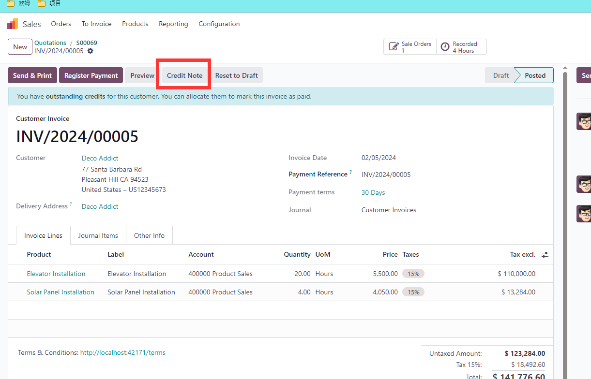
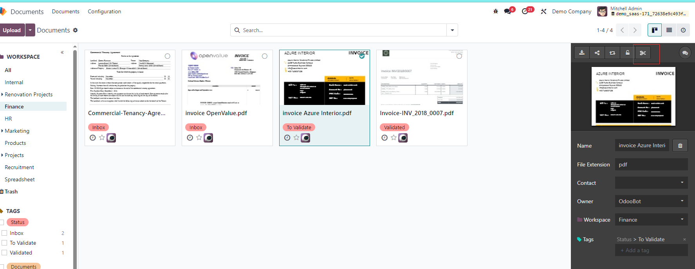
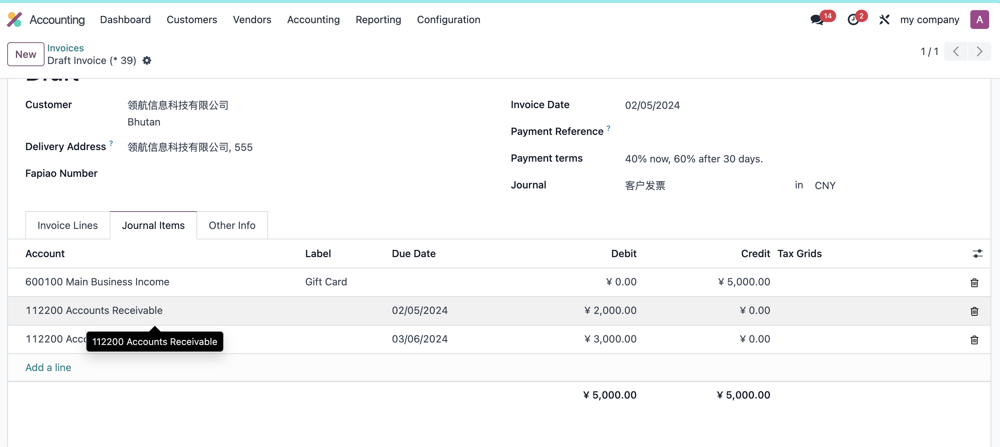
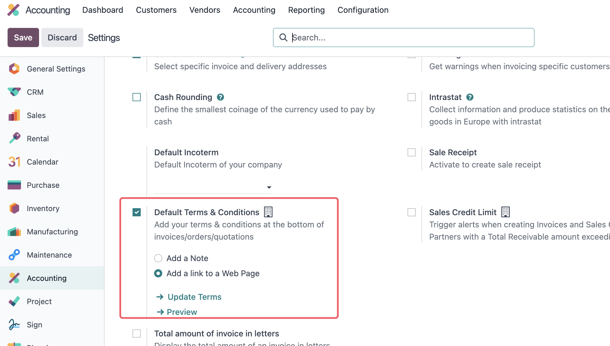
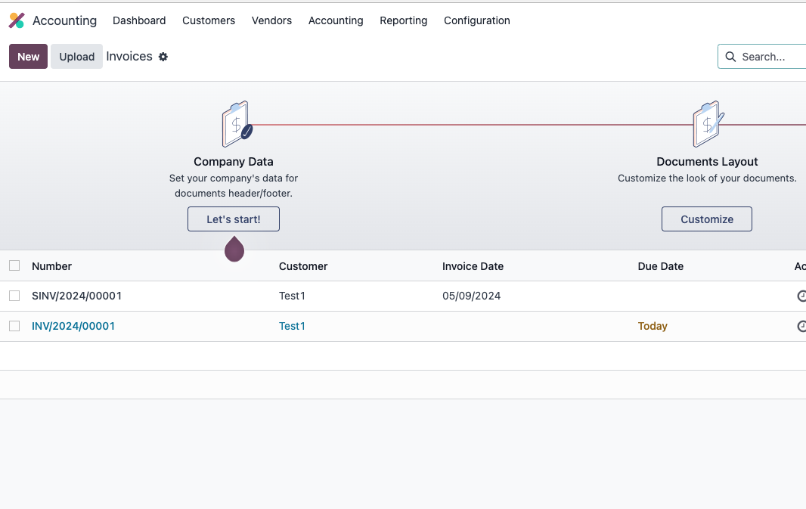

# 第二章 开票

本章我们将了解如何给客户和供应商开具发票，处理支付条款等。

* [客户开票](#客户开票)
  * [产品开票策略](#产品开票策略)
  * [注释](#注释)
* [退票](#退票)
  * [使用与INV不同的序号](#使用与inv不同的序号)
  * [部分退票](#部分退款)
* [使用OCR识别发票](#使用ocr识别发票)
* [供应商发票](#供应商发票)
* [支付条款](#支付条款)
* [查看客户的应付](#查看客户的到期应付)
* [默认的条款和条件](#默认的条款和条件)
* [发票号码](#发票号码)
* [基于日记账代码的生成规则](#基于日记账代码的生成规则)


## 客户发票

首先，我们在做一个销售订单：


我们在确定订单后开票，发票中生成的会计科目是由产品的设置决定的。具体来说是由产品属性、产品分类属性和日记帐中的设置决定的。


在产品设置的会计属性中有两个设置，收入科目和费用科目。如果产品设置中的科目为空，那么系统将根据**产品分类**的属性中进行设置。如果产品分类中的科目设置也为空，那么系统将根据**日记账**的科目设置进行设置。

### 产品开票策略

我们在销售相关章节中也提到过，销售的开票策略由产品的开票策略决定。如果产品开票策略设置为**根据订单数量**， 那么系统允许不发货进行开票。如果开票策略设置为**根据发货数量**，那么系统将要求再发货完成后进行开票。

在销售明细中，如果订单行为绿色文字表明改行可以进行开票，反之则表明不能开票。

### 注释

我们可以在明细行中添加文字块和备注，文字块和备注将根据最近的一条产品明细一同带入到发票行中。


## 退票

如果我们在业务中需要给客户进行退款，那么首先我们就需要给客户创建一个**退款发票(Credit Note)**。步骤是找到已经开具的发票，然后单击退款按钮。



确认生成的退款发票：


然后完成退款的支付即可。

### 使用与INV不同的序号

在日记帐中有一个设置可以让我们在创建退款发票时使用与客户发票不同的序列号：


> 关于客户发票的序号机制，请参考CookBook客户发票一章。


### 部分退款

在odoo16.0及之前的版本中，退款支持部分退款。


但17.0中已经移除部分退款，仅支持全部退款。


## 使用OCR识别发票

Odoo可以通过扫描将收到的发票上传到系统中，支持多个发票一同上传，并自动切割，还可以将不同的发票文件自动生成发票。


要使用OCR功能，我们首先需要在设置-会计-数字化设置中打开OCR功能。



借助文档功能，我们可以将一个多个发票在一起的文件分割成多个独立的发票。

然后再点击生成采购账单按钮自动生成采购账单。

## 供应商发票

供应商发票和客户发票操作类似，只不过方向相反。我们可以通过OCR功能，上传一个供应商发的PDF，odoo会自动帮我们创建供应商发票。


## 支付条款

支付条款用来设置客户的支付条款，创建新的支付条款位置在会计-设置-支付条款:


付款条款的默认公司为空，即所有公司都可以使用，如果设置了某个功能，那么只能由该公司使用。

这里我们举例来说，创建一个支付条款，立即支付40%，30天后支付60%，那么我们可以这么设置：


17.0与16.0不同的是，在16.0的明细类型中有一余额(Balance)类型，在17.0中被移除了。

接下来，我们使用这个付款条款创建一个客户发票:


然后我们咋看它生成的会计凭证:



从会计凭证中我们可以看到在付款日和30天后分别生成了两个到期的凭证行。

## 查看客户的到期应付

我们可以在报表-合作伙伴报表-到期的应收中看到客户的应付款:


## 默认的条款和条件

我们可以在给客户的发票中显示我们的支付条款和条件, 支付条款有两种显示方式，一种是以文本形式的留在客户发票中的，另外一种方式是在线的条款链接。

设置位置在会计-设置-客户发票-默认的条款和条件:



## 发票号码

默认情况下，发票的号码是**连续的**，如果某些条件下发票号码发生了断层，中间某个号码不存在了，那么它的下一个发票号码在列表视图中将以红色形式展示。


我们在**客户发票**的日记账中可以看到关于发票号码生成规则的设置:


> 在16.0及之前版本的发票号码使用序列对象来实现，17.0的序号生成方式发生了改变，本文基于17.0，其他版本请参考相关资料。

默认情况下发票的编码规则是以INV开头形式如下的编号:

```sh
INV/2019/0001
```

新生成的编号会根据当前数据中的最大的序列规则+1的方式递增。比如当前的发票的号码是INV/2019/001,那么新生成的号码将是INV/2019/002。

如果我们修改了发票号码的前缀，比如改成了FACT，即数据库中当前拥有的发票号码是INV/2019/001,FACT/2019/001，那么系统下一个生成的发票号码将是FACT/2019/002。

这可能符合我们的预期，也可能不符合我们的预期。

下面我们来详细看一下这个问题,首先我们在客户发票日记账中新建两个发票：


然后我们把发票INV/2024/00002重命名为SINV/2024/00001：



此时我们的发票中既有INV又有SINV，那么当我们继续生成新的发票时，生成的发票将是SINV/2024/00002。


**发票生成的规则会根据最近生成的序列进行递增**。

如果我们想要把序列生成的规则跟日记账绑定，不希望它根据当前的这种半智能式的规则进行生成，该怎么办呢？

### 基于日记账代码的生成规则

为了解决这个问题，我们在[解决方案](http://odoohub.com.cn)中增加了根日记账绑定的功能。首先，我们在设置-欧姆中激活财务拓展模块:


激活之后，我们在设置-会计中勾选基于日记账的发票编码选项:


然后我们再去创建发票就会发现新生成的发票编码始终跟日记账相关的代码序列:

