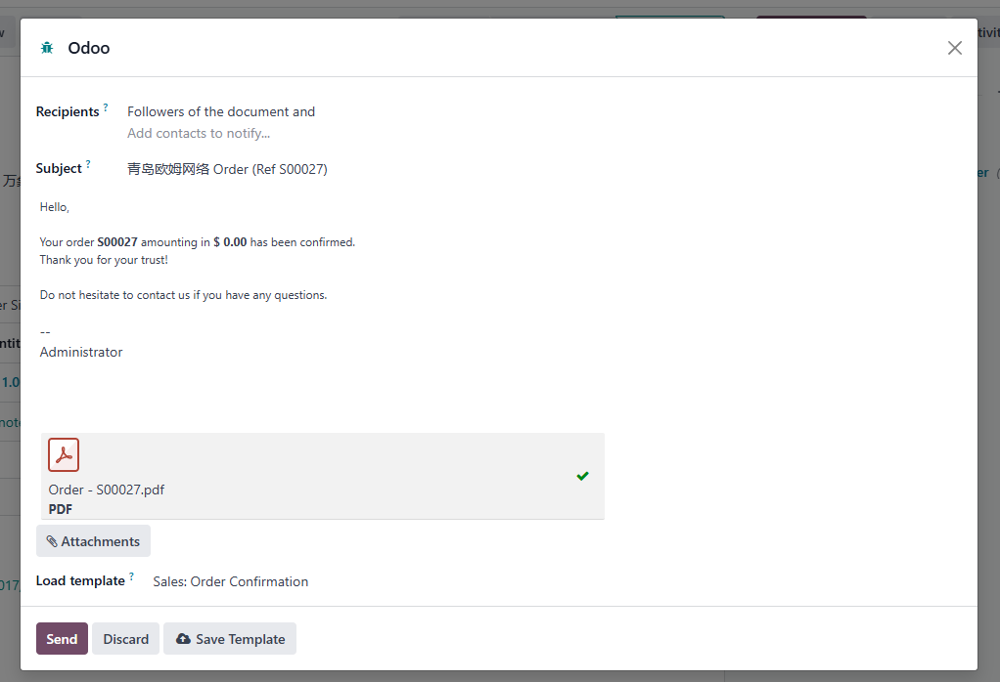

# 第六章 消息与讨论

在Odoo中如果数据模型继承了**邮件线程**类，那么它的表单视图中将会出现下面截图中的部分：

我们可以在这个区域对当前单据进行评论、留言或者给某些人发送电子邮件，安排一项活动等等。在截图的右侧，我们可以看到的三个图标分别是搜索、附件和关注者列表。本章，我们将就次区域的功能来进行介绍。

* [关注者列表](#关注者列表)
* [消息子类型](#消息子类型)

## 关注者列表

默认情况下，创建单据的人会自动添加到关注者列表中。关注者会接收到关于该单据的**事件**提醒，用户可以根据自己的情况调整自己想要关注的**消息子类型**。

## 消息子类型

Odoo根据邮件消息子类型来将消息精确地划分为不同的类型。我们可以在设置-讨论-子类型中查看系统中所有的子类型：

### 子类型的基本属性

我们以原生类型讨论为例来看一下子类型的基本属性：

* 消息类型： 子类型的名称
* 序列：子类型的序号
* 模型：应用的模型，如果为空则应用于所有模型
* 描述：子类型的描述
* 默认：订阅时激活与否
* 仅内部： 只应用于内部用户，其他用户不可见
* 隐藏： 在关注列表中隐藏
* 跟踪订阅者： 控制显示所有订阅者还是只显示关键订阅者

在右侧还有两个选项，用于处理自动订阅的设置：

* 父级： 指定子类型的上级，订阅了上级将自动订阅本子类型
* 关系字段： 当使用自动阅读时，将关联模型关联到子类型模型的关联字段

### 默认子类型

Odoo原生内置了三种类型的没有关联任何模型的子类型，也就是我们在前面截图中看到那三种：

* 讨论(mail.mt_comment)：默认订阅且跟踪订阅者
* 活动(mail.mt_activities)：内部可见
* 备注(mail.mt_note)：内部可见且跟踪订阅者

## 邮件撰写向导

Odoo为了方便我们在各个模型中给合作伙伴发送邮件，专门为此独立编写了一个邮件撰写向导。我们在后面的应用中会经常碰到它，这里我们先简单认识一下它。

邮件撰写向导的整体布局如上图，首先是收件人，然后是邮件主题，中间是正文，下面都是邮件模板的选择框，最后是发送按钮。

这里需要说明的是邮件撰写模板实际上有两种模式，但是在界面上并未展示。

* 评论模式(comment)： 将邮件贴到讨论区，并发送邮件
* 群发模式(mail_mass): 群发给接收者

在评论模式下，默认的邮件接收者是该文档的关注者和用户手动输入的接收地址，子类型这是讨论。

文档的关注者并没有提供取消的选项，如果不想要接收到提醒，那么需要在关注的子类型中将该类型取消。而群发模式不会使用子类型。