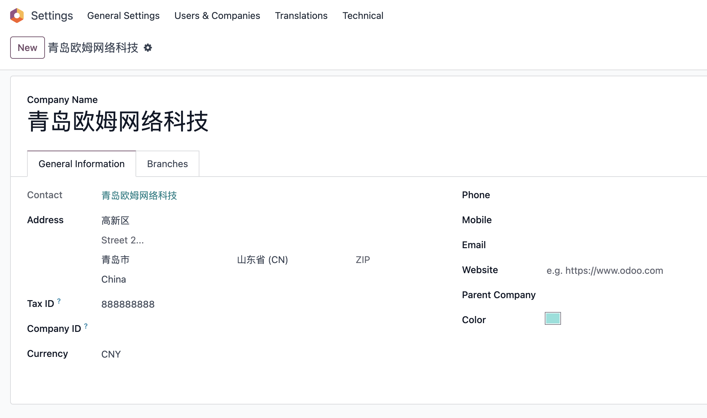

# 第三章 公司与用户管理

创建好数据库的第一步就是要配置基础数据，我们通常需要配置的基础数据有一下几个方面:

* 公司与用户
* 财务基础数据
* 产品基础数据
* 客户和供应商基础数据

如果是制造型企业可能还涉及:

* BOM数据
* 工艺中心
* 工艺流程
...

不过通常来说我们只需要配置好第一部分的几个基础数据就好了。本章及后面几章就将介绍如何这些基础数据的概念。

## 公司

我们在创建完数据后，就可以到**设置-通用设置-公司**里去填写我们公司的数据：

我们填写完公司的基础资料，点击保存就完成了公司的基础资料设置。我们在公司这里看到有一个联系人字段，关联的是后面我们要讲到的**联系人**对象。

### 多公司

Odoo支持多公司，我们可以根据需要创建不同的公司来完成不同的业务。多公司间也可以进行业务往来，具体内容我们在后面的章节会提到。

### 报表样式

我们在使用过程中会打印各种各样的单据给用户使用，odoo原生设置了几种报表的样式供我们进行选择。 在设置-公司-编辑布局:

odoo默认支持的4种风格的报表样式:

* Light
* Boxed
* Bold
* Striped

用户可以根据自己的喜好进行选择。

### 更改报表字体大小

默认情况下报表不支持字体大小的设置，我们的基础解决方案中提供了这一选项，我们在报表的配置页面中添加了字体大小字段，用户可以根据自己的需求设置合适的字体大小。

> 只针对报表主体内容生效，页眉和页脚无效。

### 安装会计包

我们在配置完公司的基础资料后，还需要再配置一个公司的会计包。在设置-发票-财务本地化：

用户需要根据自己所使用的国家选择相应的会计包进行安装。**会计包选择要慎重，一旦发生实际业务就将不能再修改**。

## 用户

设置完公司信息，接下来我们就要设置用户信息了。odoo的用户和用户组不像其他系统那样由系统管理者搭配好了，odoo的角色和权限管理相对比较松散，需要用户根据自己的需求进行灵活的配置。

### 用户的分类

在odoo中，用户可以分为三类：

* 内部用户： 公司内部用户。
* 门户用户： 给合作伙伴分配的账号，通常只有一小部分权限，仅可以访问门户的部分内容。
* 公共用户： 公共账号，只有小部分权限，只能访问有限的资源。

通常来讲，有管理员在后台创建的默认都是内部用户，由网站注册而来的默认都是门户用户。用户的分类默认是在开发者模式下可见。

### 用户账号和密码

一般来说，用户的账号应该是一个可用的邮箱，以便在用户忘记密码的时候由系统发出重置邮件。但odoo允许你不使用邮箱，而使用简单的字母或数字组合作为用户名，如admin。

用户名称则没有限制，可以任意输入。

用户密码在系统中是密文存储的，且不可反向解密，因此，密码一旦忘记则需要通过重置邮件或者由管理员重置密码来重新设置密码。

重置密码的操作为，点击用户-动作-重置密码，在弹出的对话框中输入新的密码，完成重设。

### 用户组

如果我们安装了几个应用，那么我们一般会在用户下面看到以该应用命名的角色分组。odoo中的用户所拥有的角色是多个，不想传统软件中的单一角色。因此，每个用户的拥有什么样的权限，完全取决于他所在的用户组。

举例来说，admin在销售模块的角色是经理，那么admin就拥有销售的所有权限。admin在采购拥有用户的权限，那么他在采购就只有用户而没有经理的权限。

对于同一个角色组来说，用户组A和用户租B通常是有继承关系存在的，因此才展示为下拉结构，也就是说，用户一旦有了更高权限组，那么他自动拥有了低层级用户组的全部权限。从感官上讲，这似乎是理所应该的，但是从技术上说，这样省去了我们重复设置一遍对象的访问权限和记录规则等操作。

### 非继承组

前面提到的同一角色组之间的用户组通常存在继承关系，如果不存在继承关系会怎样呢？答案是整个角色组会迁移到技术设置下面得角色分组中，每个用户组将变为单选框的形式。 这样就不存在了继承关系，用户组之间是"平等"的，如果需要，用户可能需要把每个权限都勾上。例如，原生的其他权限：

### 技术设置

技术设置是每个模块技术性的调整设置选项，一般只有对系统特别了解的人才会使用。

## 用户组

从前面我们知道了用户的权限是由用户组决定的，那么用户组的权限又是如何被组织的呢？

首先，我们需要了解odoo的权限机制。一般来说odoo的权限可以由上而下的分为四个层级：

* 模型层: 即odoo编程意义上的对象，实际上对应数据库中的表一级的控制，这一层级可以设置创建读写删除权限。
* 逻辑层：即odoo中的记录规则，实际对应数据库中行级别的读写控制。
* 视图层：即odoo中每个视图的权限控制。
* 字段层：即精确到视图中字段级别的读写控制。

模型层和逻辑层的控制可以由管理员在后台设置进行完成，视图层需要借助开发者工具在或者在视图页面上进行用户组的指定控制，只有字段层的权限是需要通过编程手段进行精确控制的，由于涉及开发内容，本书就不展开进行描述了，有兴趣的同学请参考笔者写的开发指南。

### 用户组的组成

这是一张用户组的截图，从截图上我们可以看到用户组大概由用户列表、继承关系、菜单、视图、访问权限、记录规则等方面组成。

#### 用户列表

本用户组所包含的用户列表

#### 继承关系

本用户组所继承的用户组列表

#### 菜单

本用户组所可以访问的菜单，需要注意的是，即便菜单可能不在此用户组内，用户也可能能够访问菜单下的内容，其原因是如果菜单没有指定任何一个用户组，那么这个菜单就是所有人都可以访问的。

#### 视图

本选项卡下显示的是该用户组有权限访问的视图列表。odoo中的每一个视图都有一个用户组的字段，用来标识哪些组的用户可以访问本视图。

#### 访问权限

显示了该用户组下所拥有的对象访问权限。每个对象一行，分别可以设置创建、更新、读取和删除四个权限。需要注意的是，对于拥有继承关系的用户组而言，继承的对象访问权限，是不在本组的访问权限选项卡中显示的。

#### 记录规则

记录规则是一种较为技术性的设置，它的含义是在访问权限的基础上进一步缩小用户的权限，从中筛选出部分符合条件的数据给用户读取或编辑，而不是把全部数据给用户。记录规则给用户提供了一种更为灵(fu)活(za)的权限配置方式。

鉴于记录规则的设置技术性成本太高，本书不进行详细介绍，读者可以到笔者的开发指南中寻找相应的章节进行学习。

#### 其他

额外需要说明的一点是用户和业务伙伴通常是有一对一的对应关系的。我们打开发开着模式以后，可以看到用户名下面有一个**关联的业务伙伴字段**。这说明，每个用户都有一个关联的业务伙伴在联系人表中，这也印证了我们在第五章的说明。

## 个性化你的Odoo

如果你安装了我们的基础解决方案模块，那么您可以对您的Odoo设置如下的个性化选项:

* 个性化标题: 让系统在浏览器页面显示您自定义的名称而不是Odoo
* 关闭快速创建编辑功能
* 移除个人选择中的文档/支持/odoo账户等菜单
* 登录页面去掉Odoo品牌广告
* 隐藏登录页面的数据库管理链接

## 结语

用户和用户组是odoo中权限设置的基础，本章我们简单介绍了用户和用户组的相关设置，但实际上用户的权限想要设置好还是需要费一般功夫的，不过相信随着学习的进一步深入，读者朋友们会越来越熟练。