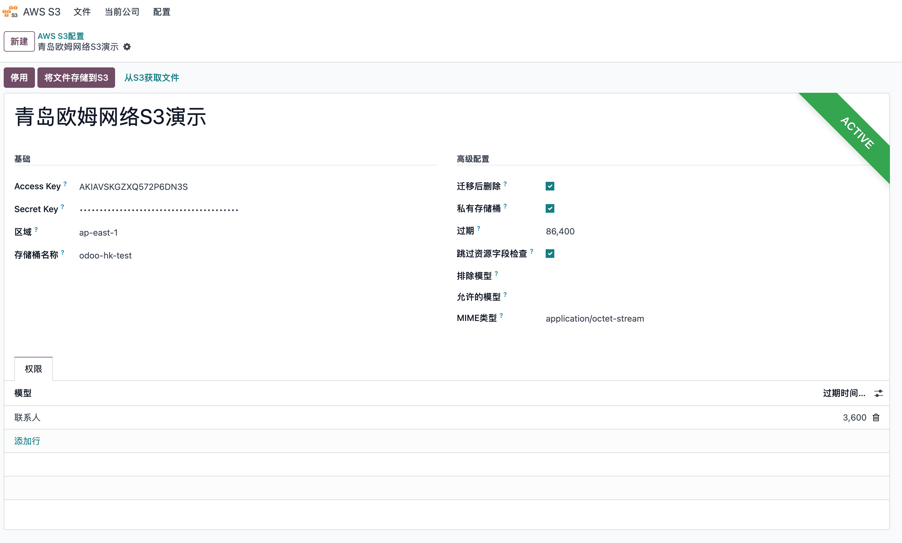
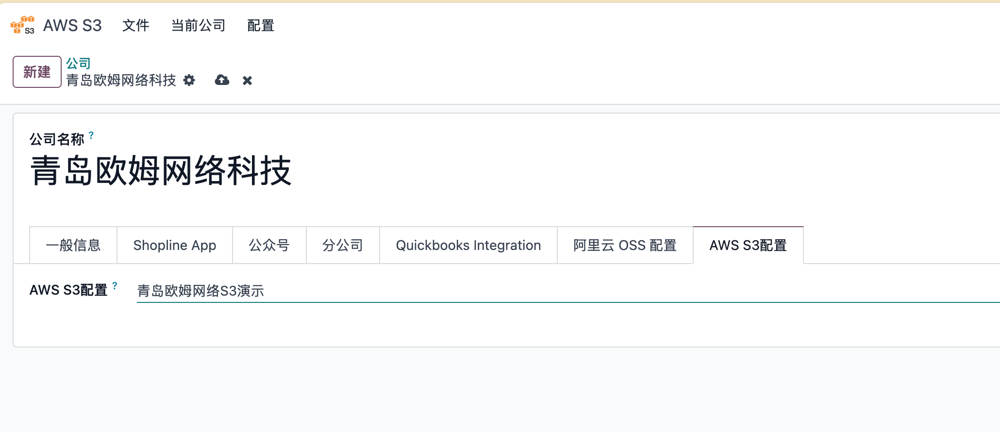
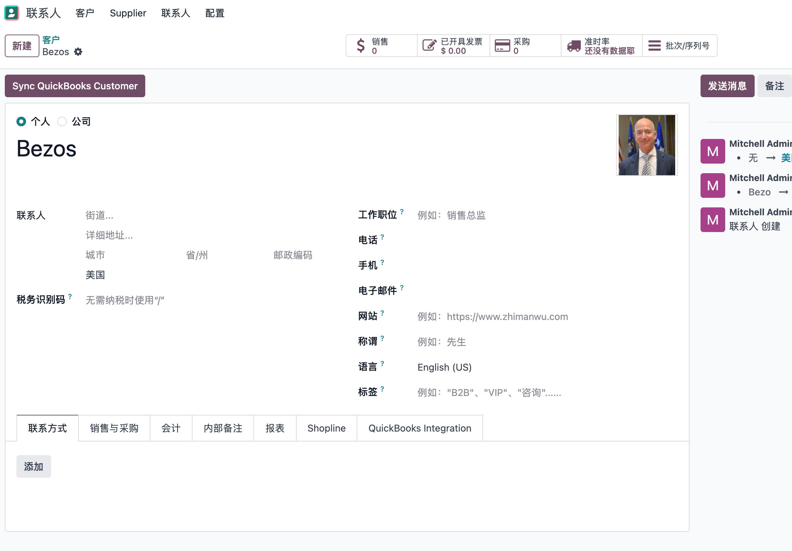
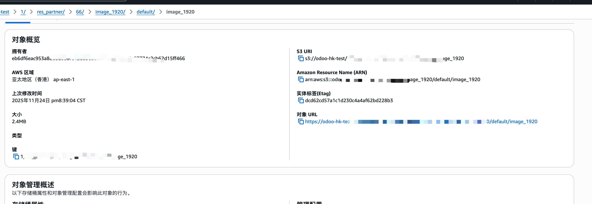
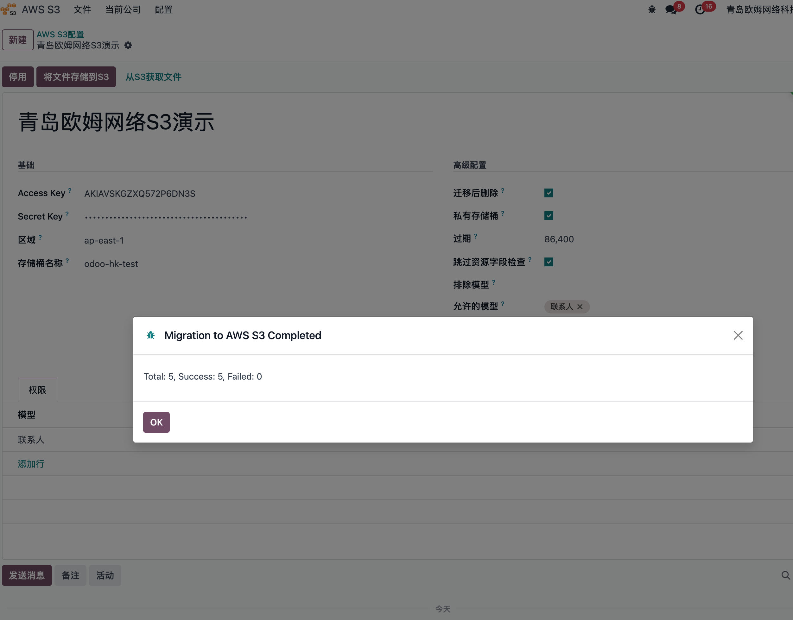
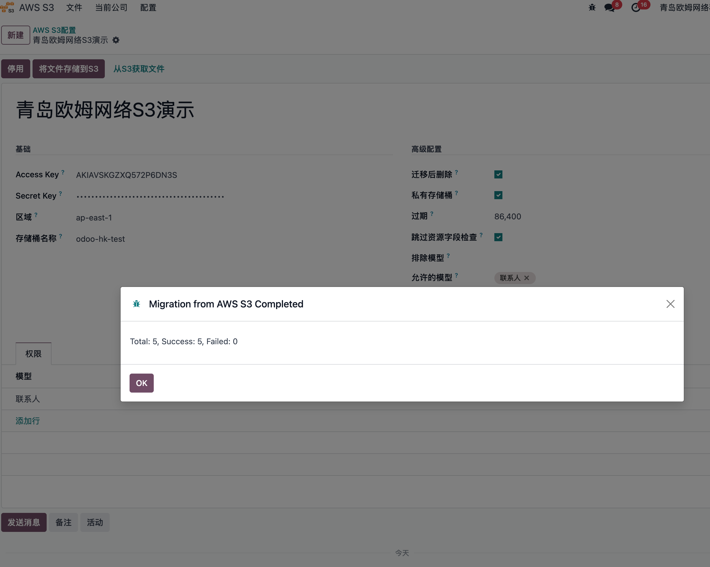
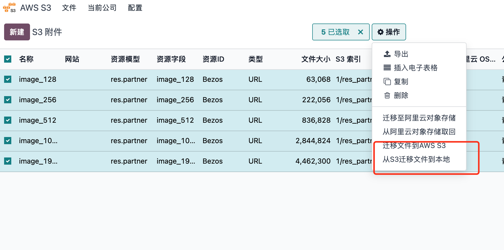
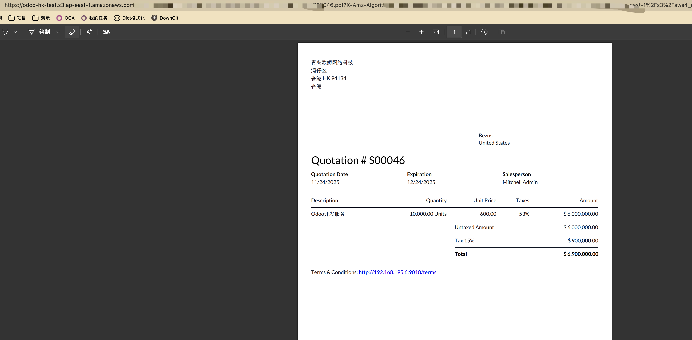

# AWS S3 简单存储

前面讲述了如何在Odoo中使用阿里云OSS，今天我们来看一下全球范围内更加流行的云服务AWS的对象存储服务S3如何在Odoo中进行操作。

## 注册S3服务

同样的，我们需要在开始之前注册一个[S3](https://aws.amazon.com/cn/s3)的服务，注册成功后，需要开通一个bucket，这里我们以香港为例：

注册成功后，我们需要拿到如下参数：

* Secret Key ID：密钥ID
* Secret Key: 密钥
* Bucket Name: 存储桶名字
* Regoin: 区域

拿到以上参数后我们就可以配置Odoo的应用了。

## S3在Odoo中的配置

同阿里云OSS一样，我们需要安装由青岛欧姆网络科技开发的AWS S3简单存储模块：

安装完成后，我们将在主界面看到一个与阿里云OSS类似的应用入口:

### 配置S3参数

点击这个应用，我们在**配置**中新建一个S3应用：

将我们前面在AWS中注册的几个参数分别填入相应的位置。

### 绑定公司

创建完S3应用之后，我们需要在公司设置中指定我们需要使用的S3应用。

这样我们就完成了基本配置，接下来就可以将我们的文件无感上传到S3了。

### 示例1 二进制字段文件的存储

我们还是以联系人的头像为例，我们新建一个客户：贝索斯，然后给他上传一个头像：

我们到附件中查看对应的文件类型：

可以看出文件类型已经变成URL，同时我们可以在S3的后台看到我们存储的文件：

### 批量迁移

同样地，S3也支持将存量数据批量上传到S3，以节省磁盘空间。方法是在设置-S3应用中，设置好数据范围，然后点**将文件存储到S3**按钮：

我们也可以把存在S3的文件取回到本地，点击旁边的从S3获取文件即可：

当然我们也支持手动选择要上传或者下载的文件，在文件列表中选择需要操作的文件，然后在动作中点击相应的动作即可：

### 示例2 单据附件的存储

odoo每个单据的聊天区是用户们最常上传文件的地方之一，我们当然也支持聊天区附件的云存储。这里假设将我们的Odoo服务卖给贝索斯，我们创建了一个销售订单：

我们给他发一份邮件附带报价单：

可以看到我们附件区的PDF报价单已经是链接而不是文档了，我们可以点击预览，看到直接打开的链接是S3上的链接。

### 删除

我们在Odoo中进行删除时，会同步删除S3上的文件，不需要额外的操作。

### 权限控制

为了方便用户对自己Odoo系统的内部的文件的灵活控制，我们在S3的设置中添加了可选范围的设置，用户可以根据自己的需求，灵活动态调整哪些单据的附件可以上传到S3（比如，产品文档、用户头像等），哪些留在Odoo本地（报价单，进货单、工资单等），同时我们也支持指定模型的数据公开访问，特定模型的数据私有化访问。

更多细节，请与我们取得联系获取更多资料。

## 结语

AWS时全球领先的云服务厂商，S3也在全球范围内有着极高的使用率。通过Odoo跟S3的打通，跨国贸易、电子商务行业的用户能够为他们公户提供更好的服务，同时也能保证自己的数据安全。
