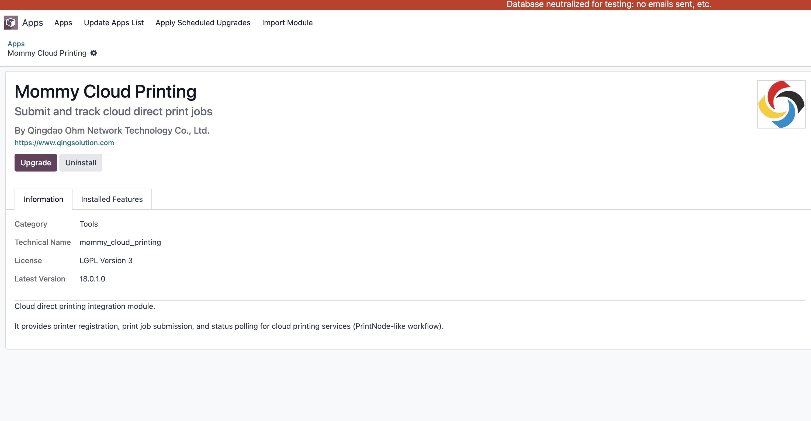
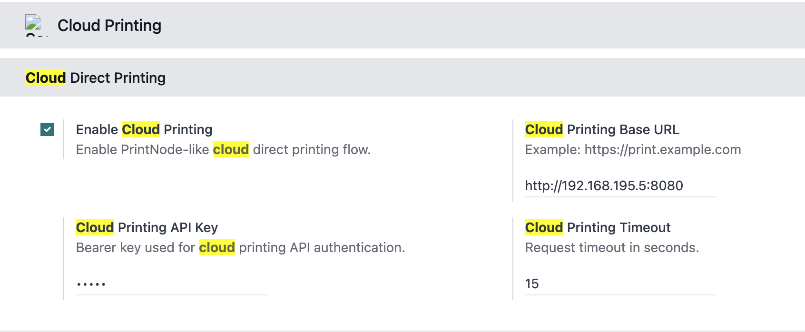
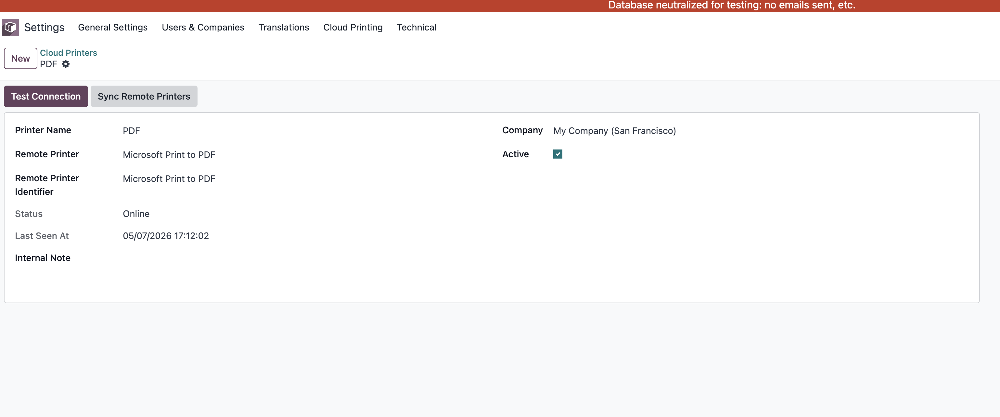
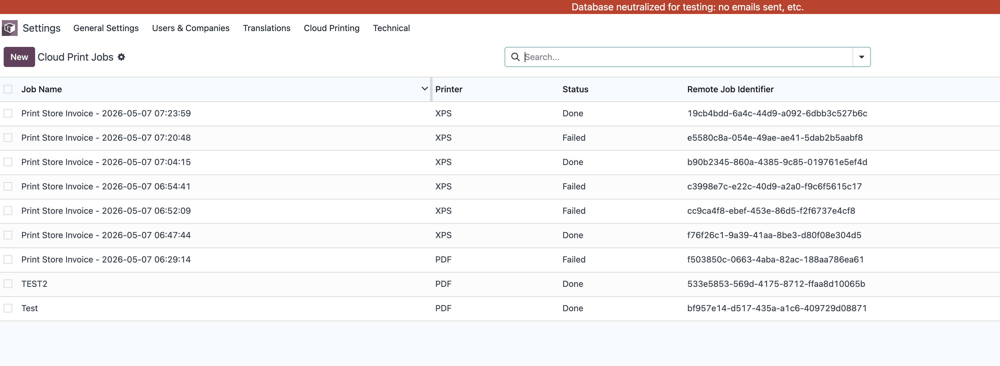
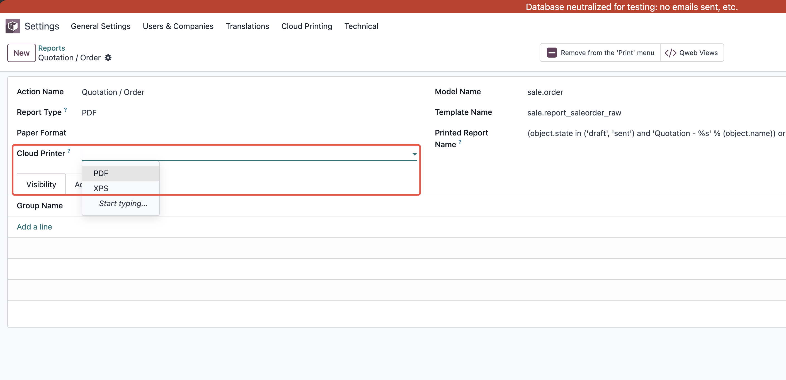

# 云打印

有时候我们需要将文档直接发送到打印机进行打印，而不需要用户手动下载和打开文档。这时候，云打印就派上用场了。云打印是一种基于云计算的打印服务，可以让用户通过互联网将文档发送到远程打印机进行打印。

## 安装云打印模块

云打印模块由青岛欧姆网络科技有限公司开发，在odoo中提供了一个界面用于注册和管理云打印服务。我们可以通过odoo的应用商店安装这个模块。

## 配置云打印服务

安装完成后，我们需要配置云打印服务。首先，我们需要在服务端配置一个API密钥。然后，在odoo中进入云打印模块的设置界面，输入API密钥和其他相关信息进行配置。

### 配置云打印机

配置完成后，我们需要在云打印模块中添加云打印机。我们可以输入打印机的名称、型号和其他相关信息进行配置。

点击测试链接按钮可以测试云打印机是否配置成功。如果测试成功，我们就可以在odoo中使用云打印功能了。

点击同步云端打印机按钮可以将云打印机的信息同步到odoo中，这样我们就可以在odoo中选择云打印机进行打印了。

### 打印队列

当我们使用云打印功能进行打印时，文档会被添加到打印队列中。我们可以在云打印模块的打印队列界面查看和管理打印任务。

### 设置报表自动云打印

我们还可以设置报表自动云打印功能。当我们需要指定Odoo中的某些报表自动发送到云打印机进行打印时，可以在报表的设置界面中选择云打印机进行配置。

这样我们在生成报表时，系统会自动将报表发送到云打印机进行打印，无需用户手动操作。