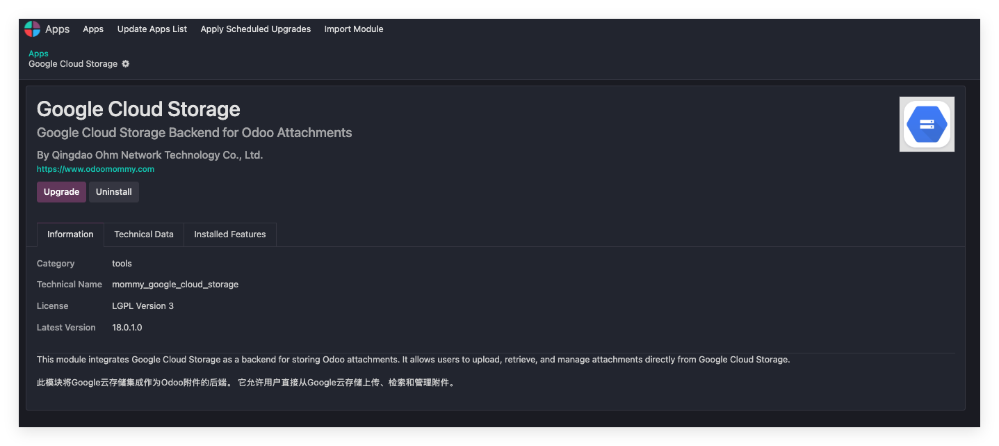
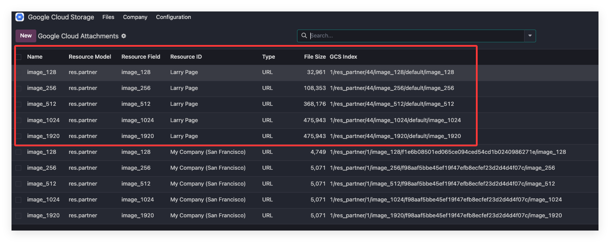
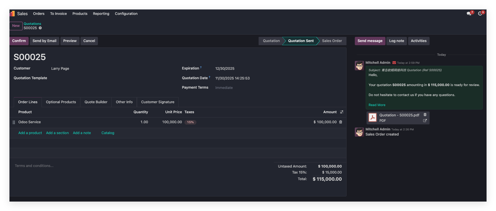
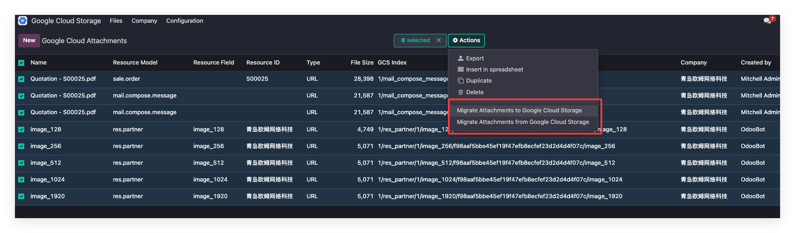

# Google Cloud Storage

本章来介绍如何在Odoo中使用Google Cloud Storage。

> Odoo原生有Cloud Storage模块，支持Google和Azure的云对象存储，但是仅至此Chater和附件的存储，且没有迁移功能，不能支持指定范围内的的对象存储。

## 注册Google Cloud Storage账号

同S3一样，我们在开始前需要先获取一个[Google Cloud Storage](https://console.cloud.google.com/storage/overview)的账号，然后创建一个存储桶：

然后拿到如下参数：

* Project ID: Google Project
* Bucket Name: 存储桶名称
* Location: 位置
* Servcie Account Json File: 包含服务账号的认证Json文件

然后我们就可以进行Odoo系统一侧的配置了。

## Odoo配置

同样地，我们需要先安装由青岛欧姆网络科技编写的Google Cloud Storage模块:

### 创建Google Cloud Storage应用

我们在Google Cloud Storage应用的设置中创建一个Odoo端的应用：

然后将我们在Google云上获取的几个参数分别填入相应的位置中。

### 绑定公司

然后我们在公司设置中，选择我们刚刚创建好的GCS应用：

### 激活应用

设置好了之后，我们点击应用中的启用按钮，将应用激活，然后就可以把文件上传到Googlge Clound Storage了。

## 二进制文件的上传

对于Odoo内部二进制类型的文件，我们可以直接上传，如果已经配置在GCS的可上传模型中，那么系统会自动使用Google Cloud Storage存储替代本地存储。

这里我们也是以联系人头像为例，我们创建一个名叫拉里佩奇的联系人:

我们在文件列表里可以看到图片已经上传到Google Cloud Storage:

然后我们再到Googlge Cloud Storage后台查看一下：

可以看到我们的图片已经成功上传到Google Cloud Storage后台了。

## 单据附件的上传

下面我们再来看一下单据附件的上传，假设我们将Odoo服务卖给拉里佩奇并给他开了一张报价单：

可以看到聊天区的附件已经没有下载按钮了，取而代之的是一个链接，当我们打开这个链接：

会弹出Google Cloud Storage的网址并打开我们的文件。

## 批量同步

同样的，我们的Google Cloud Storage模块也支持批量同步操作。操作步骤同阿里云OSS、AWS S3，这里就不多赘述了。

## 删除

当我们在Odoo中删除文件时，会自动将Google Cloud Storage中存储的文件自动删除。

## 结语

Google Cloud Storage的操作与阿里云OSS、AWS S3基本没有差别，用户可以根据所使用的云服务厂商自行选择使用哦。

