# 第三十四章 小程序商城

Odoo 擅长做企业内部管理，商品、客户、订单、库存、销售流程都可以在 Odoo 中统一运转。但在国内市场和华人用户群体中，很多业务触点并不发生在 ERP 里，而是发生在微信生态里。
客户习惯用微信沟通、看产品、咨询价格、提交需求；销售也常常通过微信维护客户关系。如果 Odoo 只停留在企业内部，客户侧仍然依赖聊天、表格和人工转述，业务流程就很容易断在前端。
小程序的价值，正好在于它足够轻。客户不用安装 App，也不用记住网址，打开微信就能使用。把 Odoo 和小程序连接起来，就等于把企业后端能力延伸到客户熟悉的入口中。
简单来说：
小程序负责触达客户，Odoo 负责管理业务。两者打通之后，前端下单和后端流程才能真正形成闭环。

因此，我们经过长时间迭代出了一套适用于大多数行业的通用版小程序解决方案。

## 通用商城基础能力介绍

我们基础版小程序商城不追求一开始就把所有营销玩法做满，而是先把商城最核心的业务链路打通：客户能看商品、能加入购物车、能提交订单，企业能在 Odoo 中继续处理订单。

### 1. 商品展示

商城首先要解决的是“客户看什么”。

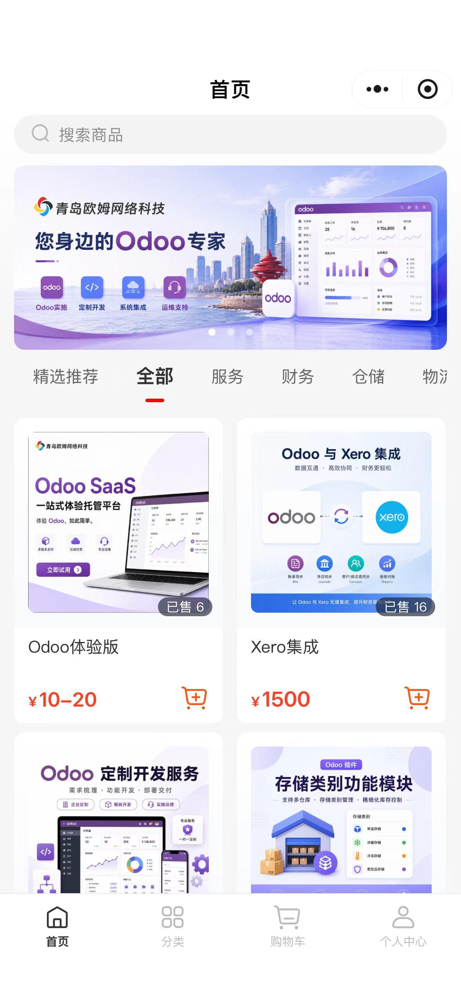

基础版支持商品列表和商品详情展示，客户可以在小程序中查看商品名称、图片、价格、规格说明等基础信息。企业可以围绕 Odoo 中的商品资料进行统一管理，减少多端重复维护带来的信息不一致。

### 2. 商品分类

当商品数量增加后，分类就变得很重要。

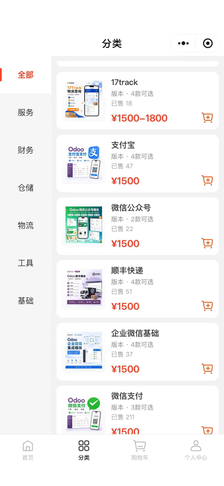

通过商品分类，客户可以更快找到自己需要的产品。对于企业来说，清晰的分类结构也能让商城更容易运营，不至于所有商品都挤在一起，让客户一边滑屏一边怀疑人生。我们的商城小程序支持后台设置使用Odoo原生分类或电商分类两套分类体系，企业可以根据实际情况选择适合自己的分类方式。

### 3. 购物车

客户浏览商品后，可以将感兴趣的商品加入购物车，统一确认数量和商品明细。

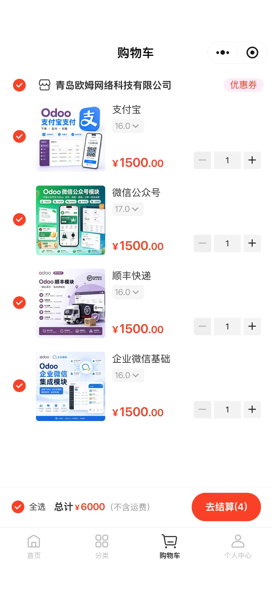

购物车的价值在于，它让客户有一个整理和确认订单的过程，也让下单信息更加标准，减少后续沟通成本。

### 4. 提交订单

客户确认商品后，可以在小程序中提交订单。

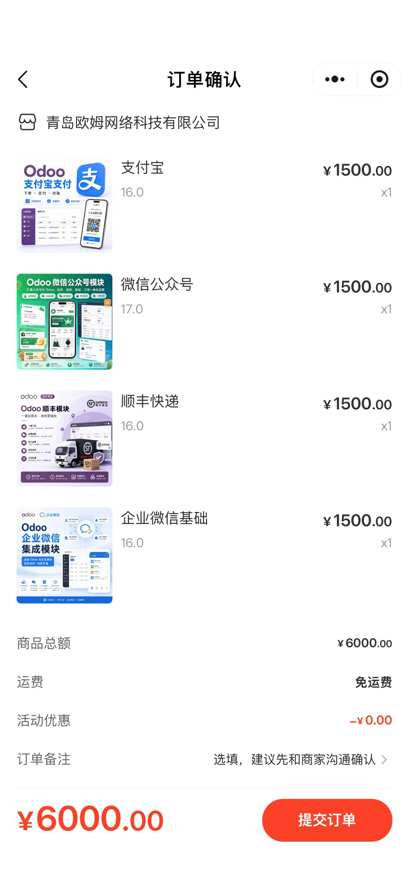

订单提交后，企业可以在 Odoo 后台继续处理相关销售流程。这样小程序不只是前台展示，而是成为 Odoo 订单来源的一部分。

### 5. 微信支付

原生支持微信支付，客户可以直接在小程序中完成支付流程。对于企业来说，微信支付的接入也能让订单闭环更完整，提升客户的购买体验。用户只要在微信商户平台绑定小程序即可。

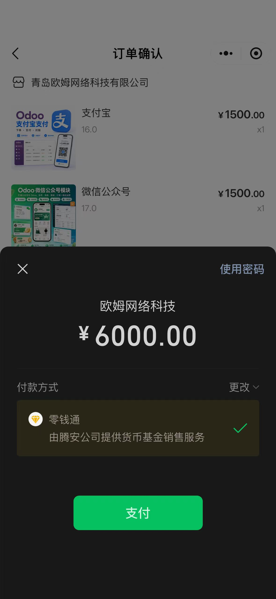

### 6. 订单查询

客户提交订单后，可以在小程序中查看自己的订单记录和基础状态。

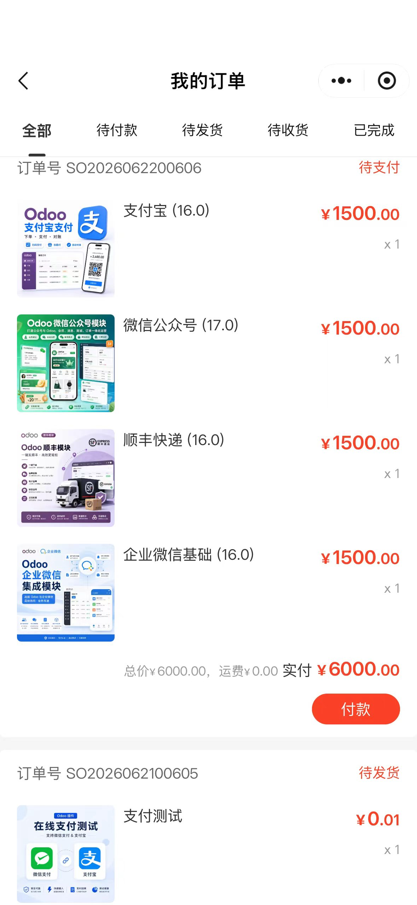

这能减少销售和客服的重复查询工作，也让客户对订单进展更有掌控感。

### 7. 售后支持

如果对订单有疑问，客户可以通过小程序直接联系销售或客服人员，进行售后咨询。

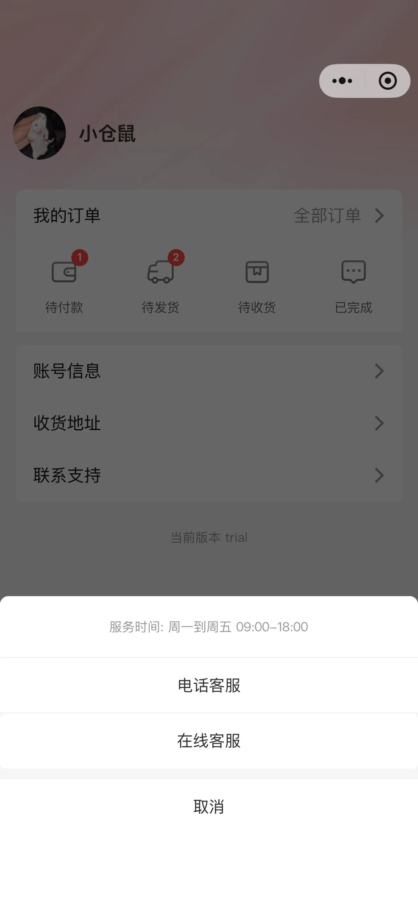

## Odoo端的支持

看完了客户侧的功能，我们再看看企业端。小程序虽然是客户触点，但它背后是Odoo在支撑业务流程的运转。

### 通用配置

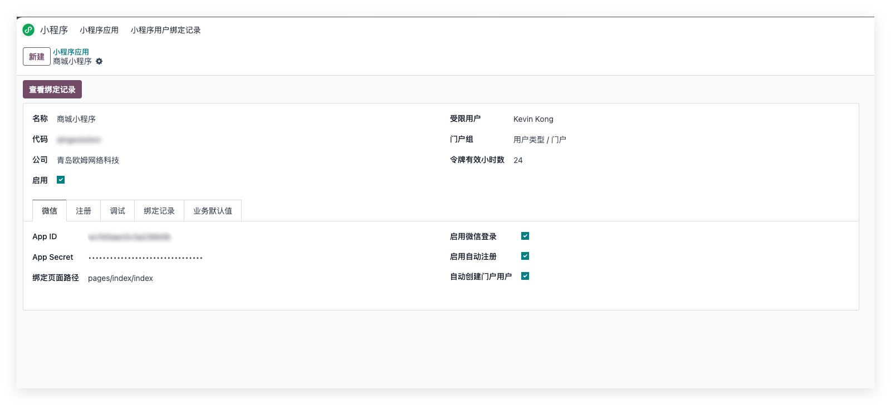

为什么我们的小程序与市面上的其他小程序解决方案不太一样？因为我们不想把小程序当成一个独立的系统来做，而是想把它当成 Odoo的一个可配置项来做。这样就要求我们在 Odoo 里做好配置，让小程序能无缝对接 Odoo 的业务流程。因此，我们在 Odoo 里设计了一个通用配置界面，企业可以在这里设置小程序的基本信息、商品展示规则、订单处理规则等。通过这个配置界面，我们的小程序能够适配不同企业的需求，而不需要每次都改代码。

### 灵活的配置

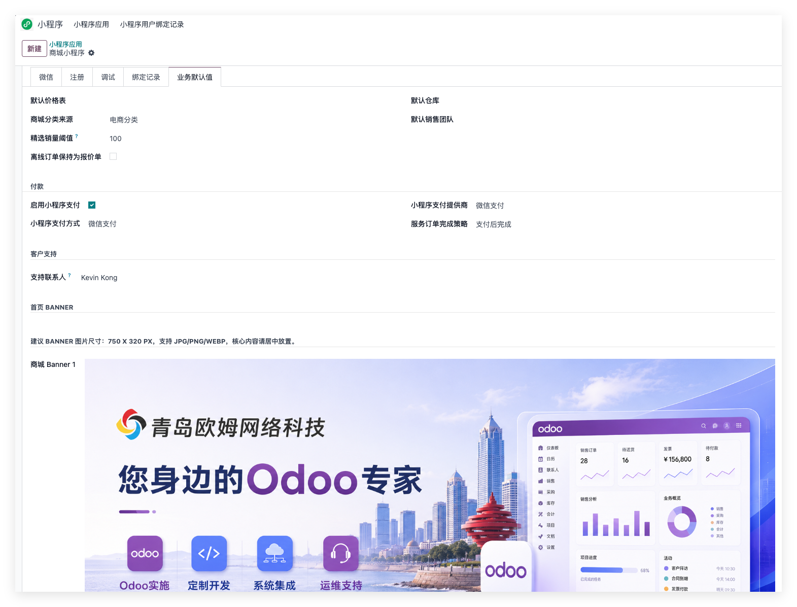

我们在设计小程序的一开始，就考虑到了很多企业不同的业务需求。比如，有些企业可能不需要在线支付(比如，欧洲的B端客户，微信支付受限)，但又想用小程序来展示商品和收集订单信息；有些企业可能需要更复杂的订单处理流程，比如，订单提交后需要先审核再确认；还有些企业可能需要在订单里添加一些特殊字段来满足自己的业务需求。针对这些不同的需求，我们的小程序都提供了灵活的配置选项，让企业可以根据自己的实际情况来调整小程序的行为。

### 欧姆生态的联动

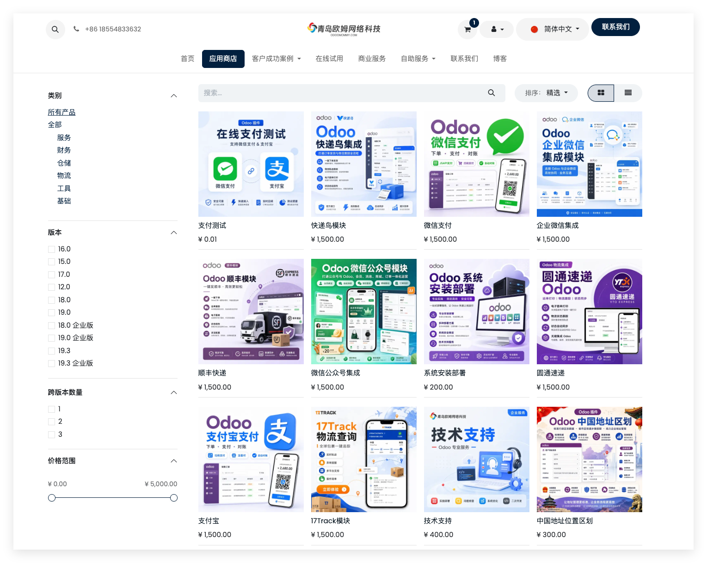

熟悉我们的朋友可能知道，我们围绕Odoo开发了很多生态模块，比如企业微信、公众号、顺丰速递、Google Cloud Storage等。这些模块和小程序之间也有很多联动的机会。比如，企业微信和小程序可以共享客户信息，企业在小程序里收集的订单信息可以通过企业微信推送给销售人员；顺丰速递和小程序可以打通物流信息，客户在小程序里提交订单后，可以直接查询物流状态；Google Cloud Storage和小程序可以结合使用，企业可以把小程序的图片资源存储在云端，提高访问速度和稳定性。通过这些联动，我们的小程序能够更好地融入企业的整体数字化生态中。

### 良好的可拓展性

最核心的，我们的这个小程序基础模块，不仅仅支持电商小程序，还同样支持其他类型的小程序。比如，我们也有一个基于同一套技术架构的预约小程序，客户可以在小程序里预约服务，企业在 Odoo 里管理预约信息。我们的小程序基础模块提供了一个通用的框架，企业可以在这个框架上开发不同类型的小程序来满足不同的业务场景。

## 你的小程序并不仅仅是一个小程序

正如本文开头所说，小程序的价值在于它足够轻，客户打开微信就能使用。但它的意义远不止于此。通过把小程序和 Odoo 连接起来，我们不仅仅是把一个新的客户触点接入了企业的数字化体系，更是把企业的后端能力延伸到了客户熟悉的入口中。小程序不再是一个孤立的系统，而是成为了 Odoo 生态中的一个重要组成部分，帮助企业更好地触达客户、服务客户、管理业务。

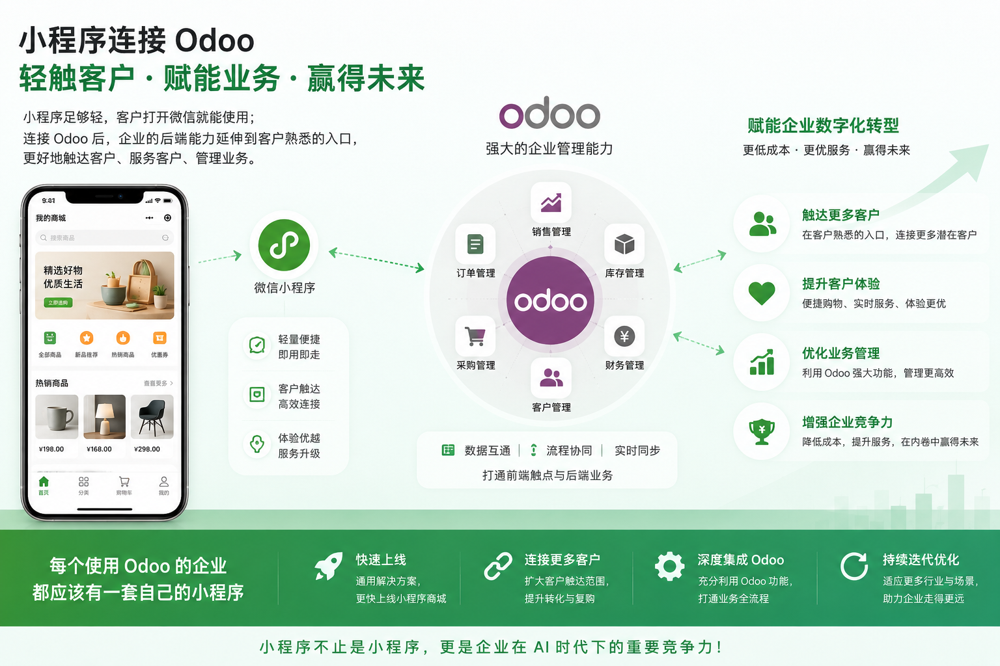

AI时代降临，企业数字化转型的步伐也在不断加快，内卷的程度只会越演越烈，谁的成本更低，谁的服务更优，谁就能获取客户，赢得未来。这就是我们为什么说，每个使用Odoo的企业都应该有一套自己的小程序，因为它不仅仅是一个小程序，更是企业在这个时代下的一个重要竞争力。不管您使用的是社区版还是企业版，都可以通过我们的通用小程序解决方案，更快地上线自己的小程序商城，连接更多的客户，提升客户体验，同时也能更好地利用 Odoo 的强大功能来管理业务流程。未来，我们还会继续迭代和优化这个小程序解决方案，让它能够适应更多的行业和业务场景，帮助企业在数字化转型的道路上走得更远。
