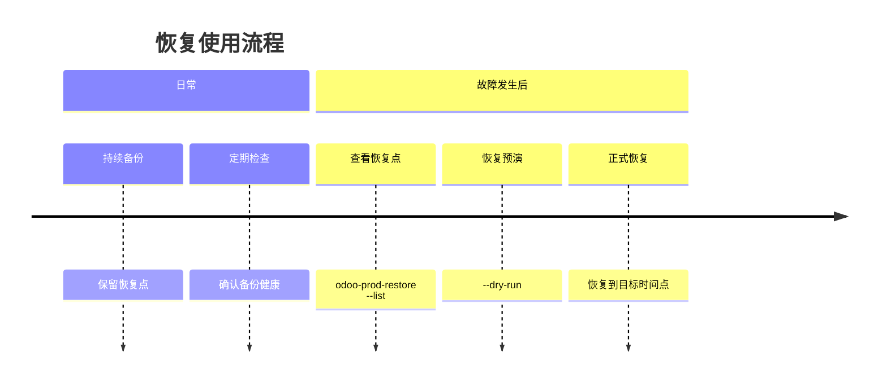

# Odoo-Prod-Backup方案

> 当 Odoo 备份不再意味着高成本：一套更省钱、可按时间点恢复的生产级方案

企业在使用 Odoo 进入正式生产后，真正需要担心的，往往不是系统能不能上线，而是数据一旦出问题，能不能快速、准确、低损失地恢复。

无论是误操作、升级异常、硬件故障，还是业务高峰期的突发问题，备份体系的价值都不在“有没有备份”，而在“能不能恢复到合适的时间点”。这也是为什么，越来越多企业开始重新评估自己的 Odoo 数据保护方案。

青岛欧姆网络科技推出的 `odoo-prod-backup`，正是面向 Odoo 生产环境的数据保护方案。它强调三个核心价值：**更低成本、更灵活恢复、更适合本地化企业长期使用**。


## 一、相较 Odoo.sh，更适合成本敏感型企业的备份选择

不少企业在考虑 Odoo 数据安全时，会首先接触到 Odoo.sh 这类平台化方案。它适合某些标准化场景，但对于已经自建 Odoo、已有服务器资源、或者更重视长期成本控制的企业来说，平台化方案并不一定是性价比最高的选择。

`odoo-prod-backup` 的优势，在于它不要求企业整体迁移运行方式，而是在现有 Odoo 生产环境基础上，增加一套独立的生产备份能力。这样企业可以继续沿用当前部署模式，同时建立更稳妥的数据保护机制。

从管理和投入角度看，这种方式通常具备几个明显优势：

- 不需要承担持续的平台型高成本
- 不需要改变现有 Odoo 部署结构
- 不需要额外重建整套业务环境
- 可以充分利用已有服务器资源
- 更适合希望掌握数据主动权的企业

对于制造、贸易、项目实施、渠道管理等对 Odoo 依赖较深的企业来说，数据安全必须要有保障，但保障本身也要讲究投入产出比。`odoo-prod-backup` 的意义，正是在数据安全和长期成本之间，提供一个更平衡、更务实的选择。

【配图建议1：服务器与数据备份主题横图】  
可配文：*不改变现有部署方式，也能建立专业的数据保护能力。*


## 二、支持实时同步，恢复不再只能“回到昨天晚上”

传统备份方式最常见的问题，是“看起来有备份，实际上恢复不够灵活”。

例如，系统每天只保留一次整包备份，那么如果当天下午发生误删、错误导入、异常升级，恢复时通常只能回退到前一天夜里或当天较早时间。这样虽然系统能恢复，但中间产生的大量业务数据也会一起丢失。

`odoo-prod-backup` 更适合生产场景的地方，就在于它提供了更连续的数据保护能力，并且在恢复时支持按时间点选择。

这意味着，企业在使用过程中可以获得这样的恢复体验：

- 关键数据持续同步到备份环境
- 文件、配置和代码会保留阶段性快照
- 恢复时可以选择最新可用状态
- 也可以选择某个更接近业务事故发生前的时间点

这对于生产系统来说非常关键。因为业务真正关心的并不是“有没有恢复”，而是“恢复后丢了多少数据”。


从使用层面看，这套方案并不复杂。实际操作时，常用的管理命令主要集中在“查看恢复点、预演恢复、执行恢复、检查备份状态”这几个动作。

### 1. 查看当前可用恢复点

```bash
odoo-prod-restore --list
```

这条命令适合在需要恢复前先查看当前可用的备份时间点，帮助运维人员确认可以回到哪些时刻。

### 2. 先做恢复预演，再决定是否真正恢复

```sh
odoo-prod-restore --dry-run latest <db_name>
```
    
或者指定一个目标时间点：

```sh
odoo-prod-restore --dry-run "2026-05-28 14:30:00" <db_name>
```

这一步非常重要。它不会真正改动当前环境，而是先告诉你：如果恢复到这个时间点，系统将使用哪一份备份、哪一个文件快照、以及对应的配置版本。对于生产环境来说，这是一种更稳妥、更专业的操作方式。

### 3. 执行正式恢复

恢复到最新可用状态：

```sh
odoo-prod-restore latest <db_name>
```

恢复到指定时间点：

```sh
odoo-prod-restore "2026-05-28 14:30:00" <db_name>
```
这让恢复工作从“被动抢救”变成“可判断、可选择、可执行”的标准动作。

### 4. 检查备份健康状态

```sh
/usr/local/sbin/odoo-prod-backup-check
```

通过定期检查备份状态，企业可以更早发现潜在问题，而不是等到真正需要恢复时才发现备份不可用。

【配图建议2：时间轴/数据恢复示意图】
可配文：支持恢复到更合适的业务时间点，尽量减少数据损失。



## 三、媲美Odoo.Sh的测试环境

得益于持续同步和阶段性快照的设计，`odoo-prod-backup` 还可以为企业提供一个非常接近生产环境的测试环境。我们可以随机利用这套备份环境，来做一些升级测试、模块测试、数据验证等工作。这样企业就不需要额外搭建一个独立的测试环境，也能在需要的时候，快速切换到一个和生产环境非常接近的状态进行测试。


## 四、青岛欧姆网络科技原创，为客户守住数据，也节省更多成本

真正成熟的备份方案，不只是“技术上可实现”，更要“业务上可落地、运维上可执行、成本上可接受”。

青岛欧姆网络科技推出 odoo-prod-backup，并不是为了把备份做复杂，而是为了帮助客户把数据保护这件事，真正做成一套长期可用的能力。

我们更关注客户在真实业务中的几个核心诉求：

- 既要保障数据安全，也要控制投入
- 既要支持恢复能力，也不能增加太多运维负担
- 既要适配现有 Odoo 环境，也要能服务未来扩展
- 既要有备份，更要确保备份真的能恢复

这也是为什么我们在方案设计上，强调“如何使用”和“如何恢复”，而不是让客户去理解复杂实现过程。对于企业管理者来说，最重要的不是背后的技术细节，而是以下几个结果是否成立：

- 生产数据是否有持续保护
- 出问题时是否可以快速恢复
- 恢复时是否能尽量减少数据损失
- 整体成本是否低于平台化长期投入
- 是否有本地服务团队可以持续支持

odoo-prod-backup 作为青岛欧姆网络科技原创方案，核心目标非常明确：让客户在不显著增加成本的前提下，获得更可靠的 Odoo 数据保护能力。

更低成本，不代表降低标准。
更灵活恢复，不代表增加复杂度。
真正专业的方案，是让客户在需要的时候，能恢复、敢恢复、恢复得更准确。

【配图建议3：企业服务/团队支持形象图】
可配文：青岛欧姆网络科技原创方案，帮助客户守住关键业务数据。

## 结语

如果你的 Odoo 已经进入正式生产环境，或者你正在考虑如何为现有 Odoo 系统增加一套更稳妥、性价比更高的备份机制，那么 odoo-prod-backup正是一个值得采用的方向。(现阶段签约客户专享)

青岛欧姆网络科技，您身边的Odoo一站式服务专家，期待与您一起守护数据安全，助力业务持续发展。