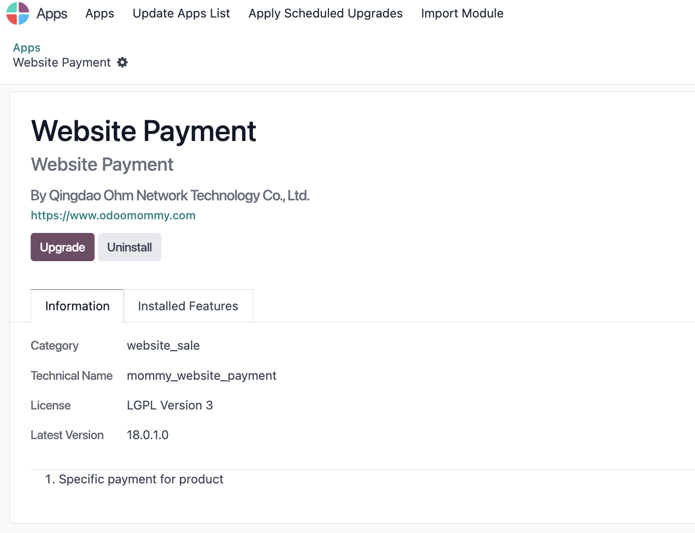
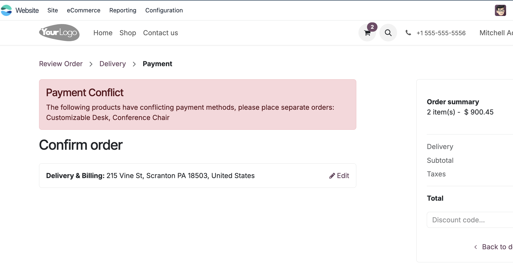

# 网站电商指定支付方式

Odoo在默认情况下不支持指定同一类型的多个支付方式，举例，客户A在电商网站上有Stripe1和Stripe2两种收款账号，想要针对不同类型的产品使用不同的收款账号，以方便在收款渠道的统计。为了解决这类需求，我们在网站支付解决方案中设计下了如下功能。

## 安装网站支付模块

想要使用我们提供的解决方案，首先要安装我们的支付模块。

## 产品指定支付方式

然后我们在我们的目标产品的销售属性中，指定支持的支付方式。

指定好了支付方式后，客户在网站进行下单的时候就会显示我们指定的支付方式。

## 多支付方式的提示

如果产品A指定了支付方式P1，产品B指定了支付方式P2，当我们在同一单中使用了两种支付方式，那么我们就会提示给客户，请将两种产品分开下单。

