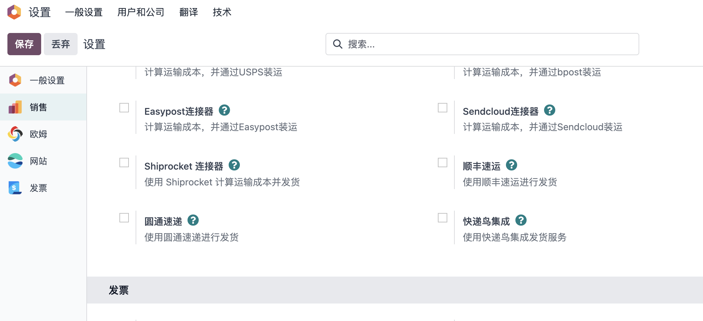

# odoo17.0 微信支付 支付宝 顺丰速递 圆通速递

随着odoo17.0的发布，新代码的架构变动，导致之前的一些模块已经不能使用，因此，我们集中把常用的这几个模块率先进行了升级。

本次发布的新模块有：

* [微信支付](https://odoohub.com.cn/shop/6#attr=1)
* [支付宝支付](https://odoohub.com.cn/shop/22#attr=5)
* [顺丰速递](https://odoohub.com.cn/shop/8#attr=3)
* [圆通速递](https://odoohub.com.cn/shop/21#attr=)

## 微信支付和支付宝支付

我们在安装了在线商城模块之后，在设置-支付提供商中就可以看到微信支付/支付宝支付的按钮。

点击安装即可，完成之后的设置同16.0版本步骤相同，不再赘述。需要的同学，可以查看我们之前的文章。

想要测试体验的同学点击[这里](https://odoohub.com.cn/shop)

> 支付宝有沙箱环境可以进行测试，微信支付只能在生产进行测试。

## 顺丰速递和圆通速递

快递鸟之后，我们也把顺丰速递和圆通速递的模块升级到了17.0，开启方法：在设置-销售-发货设置中，勾选顺丰速递和圆通速递，即可。

其他设置同16.0版本。

## 模块获取方式

可以在odoo官方应用商店搜索，也可关注公众号odoohub在在线商城选购。