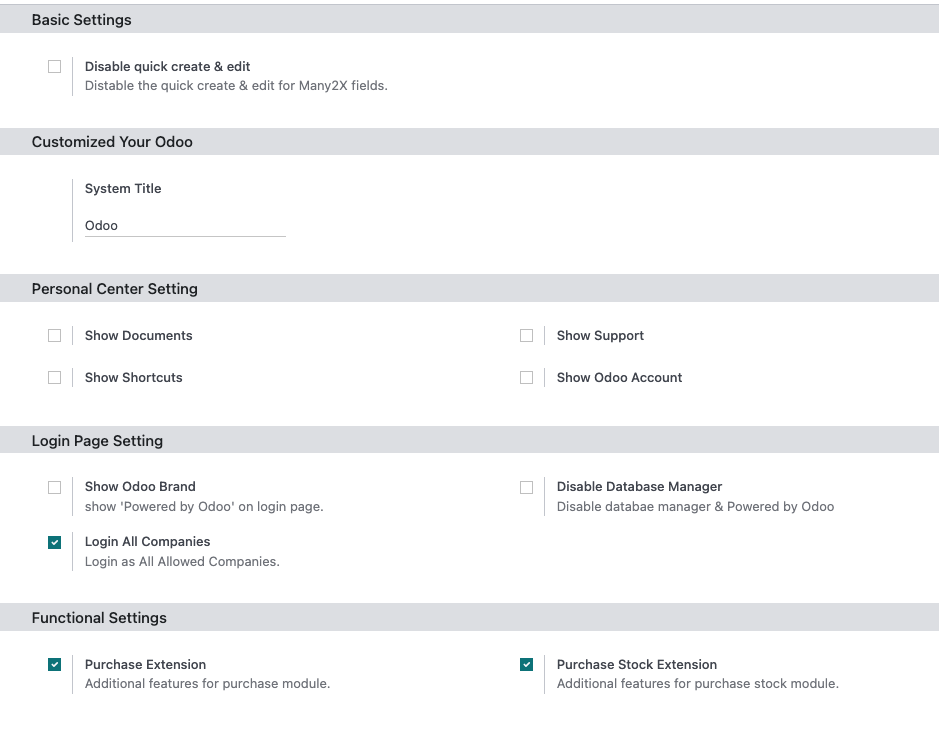
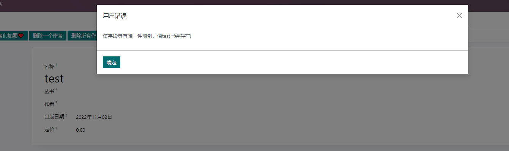
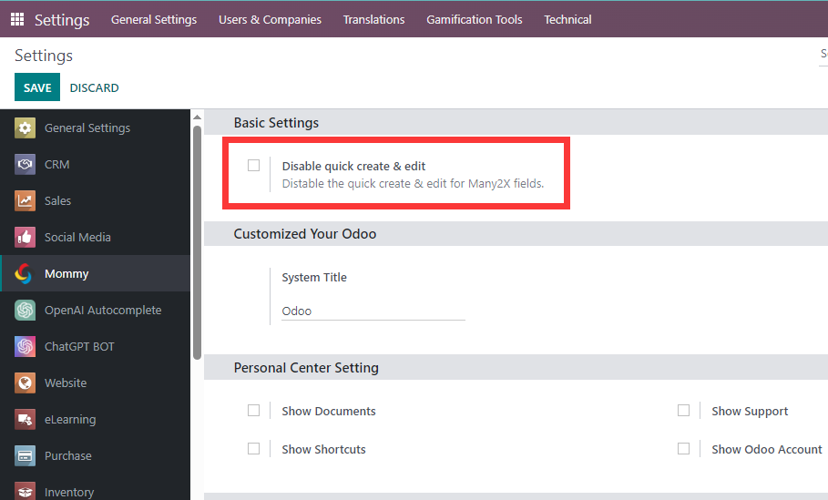
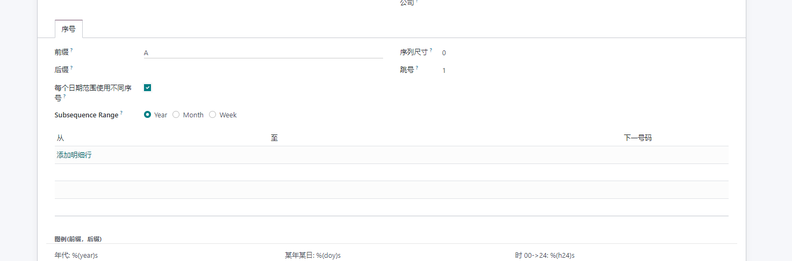

# 欧姆基础模块

本模块为[欧姆网络](http://www.odoomommy.com)开发的一系列解决方案的基础核心模块.

## 功能简介

* [1.快捷弹窗提示](#1-快捷弹窗提示)
* [2.唯一性限制关键字unique](#2-唯一性限制关键字unique)
* [3.支持指定计算字段分组汇总](#3-支持指定计算字段分组汇总)
* [4.表单页面状态按钮快速返回视图动作](#4-表单页面状态按钮快速返回视图动作)
* [5.控制表单视图中的x2many字段的列表分页数量](#5-控制表单视图中的x2many字段的列表分页数量)
* [6.快速编辑功能控制](#6-快速编辑功能控制)
* [7.qweb报表中货币类型字段去除货币符号](#7-qweb报表中货币类型字段去除货币符号)
* [8.过滤读取功能](#8-过滤读取功能)
* [9.列表视图分组根据模型设置排序](#9-列表视图分组根据模型设置排序)
* [10.序列号依据年月周生成](#10-序列号依据年月周生成)
* [11.报表动作支持第二名称](#11-报表动作支持第二名称)

## 配置类设置

为了方便用户使用，我们加入了一些普遍的设置，用户根据自己的需求自行设置即可。



具体功能如下列表:

* 禁用Many2X字段的快速创建和编辑
* 设置系统的名称
* 个人中心菜单设置
* 登录页面Odoo品牌展示的控制
* 拓展功能包

## 技术类设置

### 1. 快捷弹窗提示

> 适用于:13.0-17.0

为了解决odoo原生弹窗比较简单的问题, 本模块新增了已下两种弹窗方式:

#### 文本提示

应用场景为某些执行动作完成后弹窗提示.

```python
self.show_message("标题","提示文本")
```

#### 确认弹窗

如果需要用户确认是否完成的动作,就需要使用下面的这种确认对话框的方式:

```python
self.show_confirm_message("确认弹窗","确定要执行这个动作吗?")
```

如果确定, 那么会回调本模型的\_action_pops_up_confirm方法.

需要注意的是:

* 如果上下文模型中定义了回调方法,那么会优先使用上下文模型中的方法.
* 如果回调方法是类方法, 那么在返回时,需要使用with_context方法将active_model的类名放到环境变量中.

#### 关于回调方法

16.2+版本以后, 支持自定义回调方法, 用户可以在弹窗上下文中指定需要回调的方法:

```python
@api.model
def action_syn_wework_employees(self):
    """show confirm dialog sync employees"""
    return self.with_context(active_model=self._name,call_back='_sync_employees').show_confirm_message("Sync employees","Are you sure to sync employees from wework?")
```

例如我们在[企业微信](http://opensoft.taobao.com)模块中就使用了这样的回调方法, 如果用户没有指定回调,那么将会调用默认的回调方法: \_action_pops_up_confirm

### 2. 唯一性限制关键字unique

> 适用于:16.0

为了方便开发者快速添加唯一性校验, 本模块在Char类型得字段中新增了唯一性属性unique:

```python
name = fields.Char("丛书名称", unique=True)
```

使用了该属性以后, 如果新增或编辑了重复的值, 那么系统会给出提示:



如果想要替换提示文本,则可以在字段定义时使用exception属性指定定制化文本.

### 3. 支持指定计算字段分组汇总

在列表视图中，有时候我们希望可以对某些计算字段进行汇总，但是由于原生设计中非存储的字段是不能够进行汇总的，因此，我们在此模块中内置了对部分计算字段的汇总支持。

使用方法是在计算字段中添加group属性，并设置为True

```python
author_count = fields.Float("Author Count",compute="_compute_author_count",group=True)
```

### 4. 表单页面状态按钮快速返回视图动作

我们在表单视图中经常会碰到状态按钮(state button), 用来显示关联单据的数量, 以及快速打开相关的视图.

通常的写法如下:

```python
action = self.env.ref("stock.action_picking_tree_all").read()[0]
if self.picking_count == 1:
    action['res_id'] = self.picking_ids.id
    action['views'] = [
        (self.env.ref("stock.view_picking_form").id, 'form')]
else:
    action['domain'] = [('id', 'in', self.picking_ids.ids)]
return action
```

为了简化开发工作量提高代码复用率, 本模块将此类的动作进行了提炼, 直接使用get_view_action方法返回动作即可, get_view_action会自动根据传入的模型和记录集找到合适的页面及动作返回.

例如上面的代码在简化以后,可以写作:

```python
return self.picking_ids.get_view_action()
```

### 5. 控制表单视图中的X2many字段的列表分页数量

设置方法: 设置-欧姆-个性化中心-表单分页数量:


修改该分页数量以后，系统中所有的表单中的X2Many字段的分页数量将会改变。

### 6. 快速编辑功能控制

odoo默认针对X2Many类型的字段开放了快速创建和编辑按钮，提供了快速创建记录的实用功能。但是某些情况下，员工的误操作会导致数据库的混乱。

因此，我们加入了快速编辑功能区的控制功能。具体使用方法如下：

#### 全局控制

如果想要全局控制所有类型的X2many字段的快速创建功能，只需要到设置-欧姆-基础设置中，开启禁用快速创建按钮即可。



#### 部分控制

如果不想全局控制，例如只想控制某些模型的快速创建功能，那么可以到设置-技术-模型中，选择想要控制的模型，然后勾选禁用快速编辑选项：


#### 优先级

部门控制的优先级要高于全局设置。也就是说，

* 如果没有设置禁用快速编辑按钮，而部分模型设置了禁用，那么部分模型将不能使用快速编辑按钮
* 如果全局禁用了快速编辑按钮，而模型中的部门控制没有禁用，那么该模型将不能创建快速编辑。

### 7. QWeb报表中货币类型字段去除货币符号

在t-options中设置symbol为False即可。

```xml
<span t-field="line.price_unit" t-options="{'symbol':False}"/>
```

### 8. 过滤读取功能

默认情况下，使用read方法，如果碰到没有权限的数据记录，系统将进行弹窗提示。为了优化这个使用效果，我们改进了read方法，针对指定的模型，默认将过滤掉没有权限的记录，只显示有权限的记录。

使用方法： 到技术-设置-模型中，勾选过滤读取属性。

### 9. 列表视图分组根据模型设置排序

原生情况下，树形列表分组数据不会根据模型的\_order属性设置进行排序，我们这里对此进行了优化：

**没有特别指定的情况下，树形列表分组动作会根据模型的_order设置进行排序。**

### 10. 序列号依据年月周生成

默认情况下, 序号生成规则只能依据日期, 而不能根据年月周进行划分。为了解决此问题，我们新增了range type字段，用户将可以根据年月周进行分类生成。




### 11. 报表动作支持第二名称

> 适用于:14.0-17.0

本模块新增了动态修改报表名称的功能, 用户可以在报表动作中定义一个昵称, 对于要实现根据记录中某些条件而显示不同的报表名称, 则在对应的模型下重载_compute_action_show_nickname方法:

```python
def _compute_action_show_nickname(self):
    self.action_show_nickname = True
```

然后需要在显示的视图中新增action_show_nickname字段:

```xml
<field name="action_show_nickname" invisible="1"/>
```

### 12. 模型字段跟踪功能

odoo原生支持字段的修改跟踪，但是需要用户自行在每个需要设置的字段上添加属性设置，对于大批量字段跟踪的设置非常不友好，因此，我们在本解决方案中添加了根据模型设置的功能。


用户只需要在想要设置的模型中勾选Track All字段，即可实现对该模型下所有字段的跟踪(X2M除外)

### 13. 集成快速设置单据号码方法

在获取一个模型的序号时，可以直接使用next_by_code方法快速返回序号:

```python
name = self.next_by_code()
```

### 14. 设置字段标签颜色

> 适用版本：15.0

如果想要把某个字段的标签颜色改掉，那么可以在字段的属性中添加color属性:

```xml
<field name="name" attrs="{'color':'red'}"/>
```

对于16.0版本，使用label_color属性:

```xml
<field name="name" label_color='red'"/>
```

### 15. 报表打印前校验

在点击动作-报表动作执行前，嵌入校验逻辑，适用于权限校验等场景。

```python
def _pre_report_action(self,report=None):
    pass
```

在模型中重写\_pre_report_action方法，写入校验逻辑即可。

### 16. 获取Selection字段的描述快速方法

例如有Selection字段

STATES = [
    ('a','A'),
    ('b','B')
]

self.state = 'a'

那么在代码中获取描述A的方法如下:

```python
self.get_selection_desc(self.state)
```

### 17. 添加获取当前记录所有关联附件的方法

快速获取当前单据的所有附件:

```python
attachments = self.get_all_attachments()
```

### 18. company_dependent属性添加对Html字段的支持

原生HTML字段不支持company_dependent，我们加入了此特性。

### 19. name_create方法支持context指定关联字段默认值

在适用name_create方法创建的时候，可以通过context传入相关字段的默认值:

```python
self.with_context({'default_abc':1}).name_create("张三")
```

### 20. 货币金额快速转换

使用方法convert_monetory方法可以快速在不同货币币种之间转换:

```python
def convert_monetory(self, amount, from_currency, to_currency, date=None):
    pass
```

例如使用2024-01-01号的汇率将100美元转换成人民币:

```python
usd = self.env.ref("base.USD")
cny = self.env.ref("base.CNY")

self.convert_monetary(100,usd,cny,"2024-01-01")
```

### 21. 默认所有图片支持拖拽

原生模块不支持拖拽功能，我们在本解决方案中直接支持了所有图片支持拖拽上传。