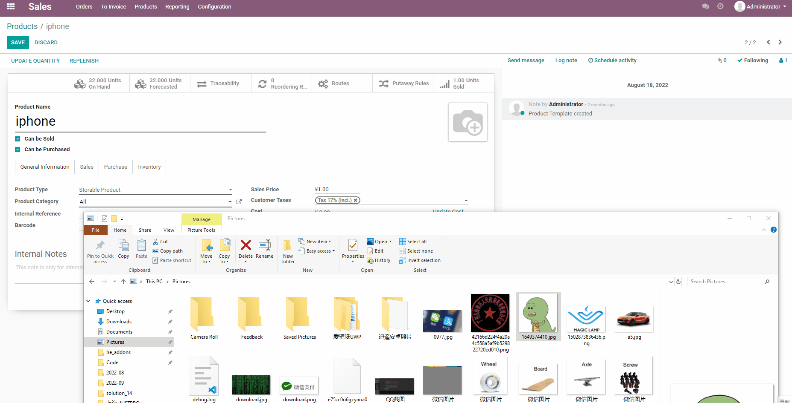

# 图片拖拽

最近客户提出了一个新的需求，就是希望能够在图片上实现拖拽效果。本着如果有现成的轮子就不在重复创建轮子的原则，我去网上找了一下，然后果然找到了一个类似的模块。

但是原模块只适用于12.0版本，而客户使用的版本是13.0。鉴于12.0和13.0版本的差异其实还没有那么大，于是决定使用12.0版本为基础改造成使其适用于13.0版本。

改造过程就不详细展开了，这里简单介绍一下该模块的使用方法，安装完此模块以后，系统中所有的图片都可以在编辑模式下实现拖拽效果：

本模块已开源(仅13.0版本)，如有需要请关注公众号并回复图片拖拽获取下载地址。