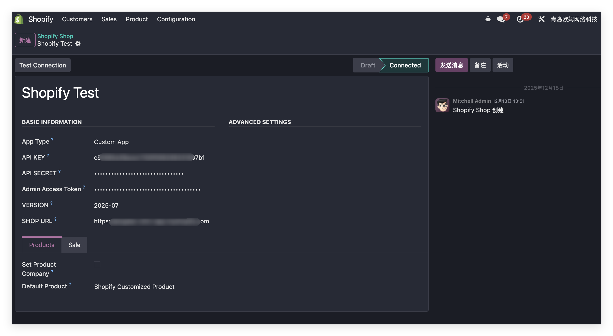
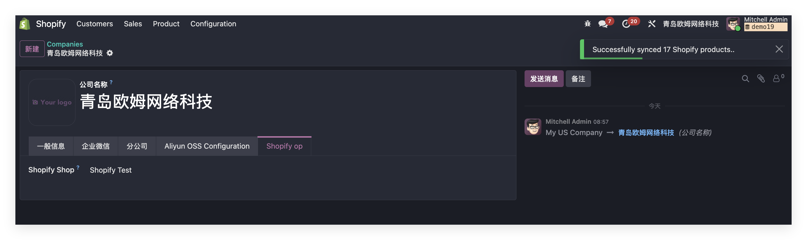
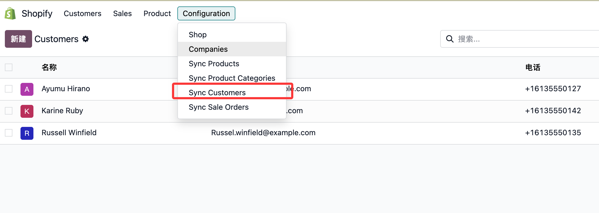
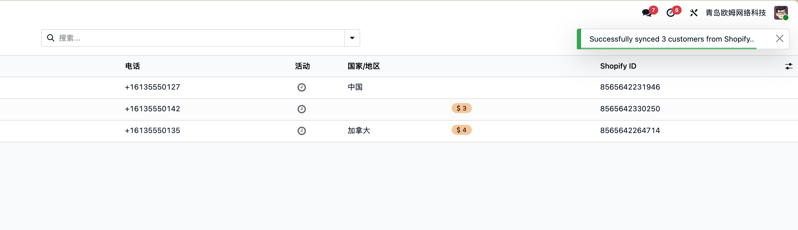
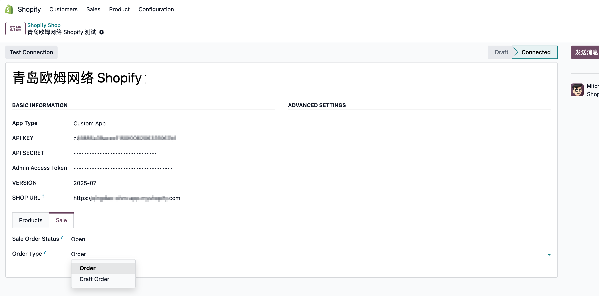
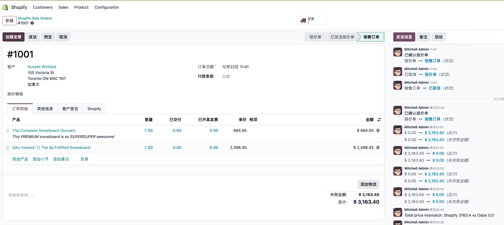

# Shopify与Odoo对接

> 适用于19.0

## Shopify配置

首先，我们需要在Shopify的后台创建一个**私有应用**:

然后获取到如下参数：

* App Key: 应用KEY
* Admin Access Token: Admin API访问Token

### 配置应用权限˚v

我们需要给我们的应用赋于需要的接口调用权限，在配置-Admin API对接-API访问权限中设置：

## Odoo配置

接下来我们就可以配置我们的Odoo应用了。首先，我们要安装由[青岛欧姆网络科技](https://www.qinglsolutin.com)自主研发的Shopify对接模块:

安装完成之后，我们在主界面上点击Shopify的图标，然后进入到Shopify应用中。

### 创建Shopify应用

我们在设置-商店菜单中新建换一个Shopify的店铺：

然后将我们在前面获取到的参数，填入到我们的基础信息中。配置完成后，可以点击测试连接来测试连接是否成功，如果配置无误，将看到提示配置成功。

### 绑定公司

创建好shopify应用后，我们可以将此应用绑定到我们想要使用的公司上。方法是点击设置-公司-选择你要使用的公司，在shopify的选项卡中，选择我们刚才创建的应用，然后完成保存。

接下来我们就可以正式使用Odoo来完成对接工作了。

## Odoo应用

首先，我们来看一下如何使用shopify模块来完成产品的同步：

### 产品同步

我们只需要点击设置-同步产品菜单，即可触发产品的同步动作。

同步成功后，将会提示同步了多少个产品:

我们在产品-产品模板/产品变体菜单中可以看到我们刚才同步的产品：

#### 变体同步

在同步产品的时候，如果Shopify中有配置变体，那么系统会自动将Shopify中的变体同步下来：

### 客户同步

同步完产品，我们就可以同步Shopify中的客户到Odoo，同样地，点击配置-同步客户菜单，即可开始同步过程：

同步完成后，系统会提示同步了多少条数据：

### 订单同步

客户同步完成后，我们就可以同步Shopify中的订单到Odoo了。这里我们首先需要明确一个概念，在Shopify中草稿订单和订单是两个不同类型的数据，而在Odoo中，草稿订单和订单则是同一个模型的不同状态。因此，我们在设置中做了区分：

* Draft Order: 当选择了此项时同步的订单是SHopify中的草稿订单。
* Order: 当选择了此项时同步的订单则是Shopify中的有效订单。

然后我们点击设置中的同步订单菜单，系统将会将数据同步到Odoo中：

同步后的订单：

