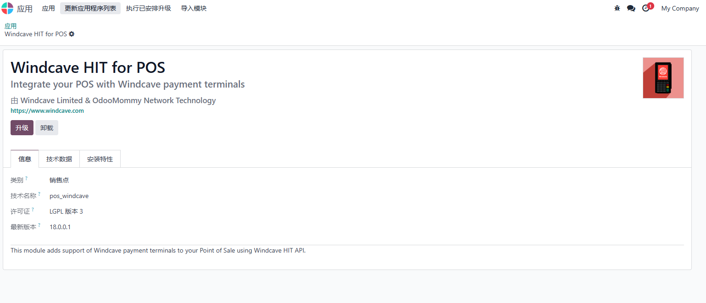
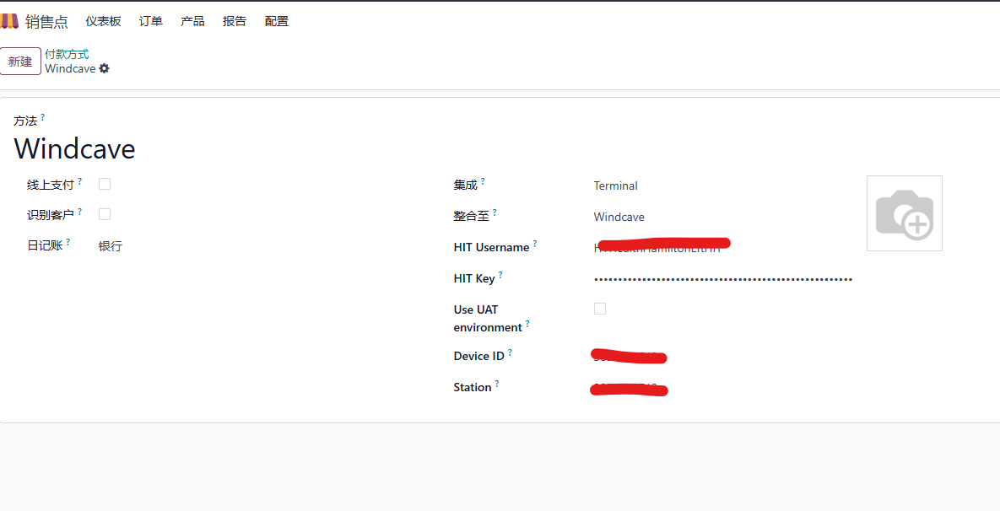
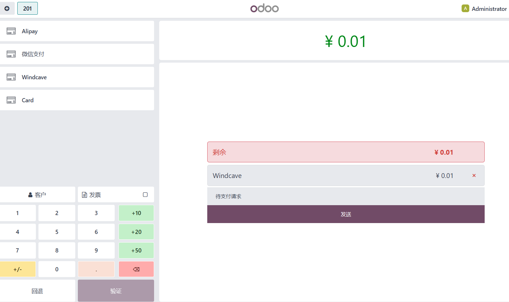
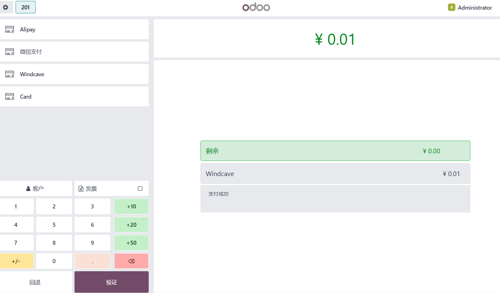

# WindCave 支付

Windcave 是新西兰的一家领先支付技术公司，专注于提供支付解决方案和技术，帮助企业接受各种电子支付方式。该公司原本名为 Payment Express，后来在2020年更名为 Windcave，旨在体现其为全球支付行业带来创新和便捷的愿景。

本文将介绍如何在Odoo18.0门店系统(POS)中接入Windcave支付，以方便新西兰的零售客户更加方便地收款。

## 安装WindCave模块

安装好Windcave模块，我们就可以在odoo中进行配置了。

## 配置

首先，我们要在支付方式中添加一项Windcave，打开的POS-设置-付款方式，新建：

然后，日记账选择银行，支付终端选择Windcave。最后将我们在Windcave官方申请到的支付凭证填入到相应的设置中。

然后我们在要设置的门店中添加windcave的支付方式。

## 在POS中进行收款

完成这两项配置，我们就可以到POS中使用windcave进行收款了。打开一个新会话，然后下一单：

点击发送按钮，门店的HIT设备上会显示要支付的金额，客户使用扫码或银行卡的方式进行付款，完成付款后，我们的POS会自动完成订单。

客户支付完成后，我们点击验证，然后把小票打印交给客户即可。

## 结语

Odoo18.0的pos前端与17.0相比又进行了大幅改动，导致很多插件都必须经过一番升级才能跟新版本进行适配。
