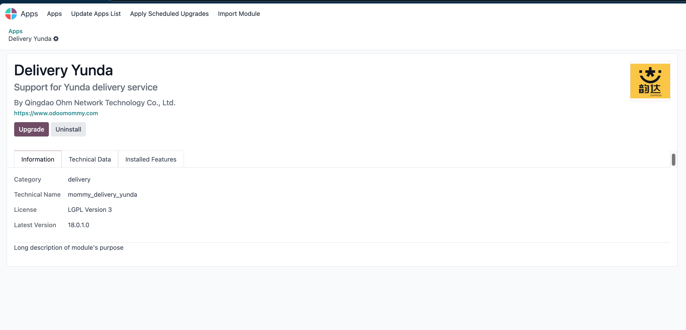

# 韵达速递

本文给大家带来的的是odoo与韵达速递的免费对接方案。

## 注册韵达开放平台

想要使用韵达速递，首先我们就需要注册一个[韵达开放平台](http://open.yundaex.com/)的账号，并创建一个开放平台应用。

创建完应用之后，我们需要以下4个参数：

* AppKey: 应用的key
* AppSecret： 应用的密钥
* PartnerId： 韵达网点分配的客户编码
* Secret：与客户编码对应的密钥

## 在Odoo中使用韵达速递

首先，我们在Odoo安装由[青岛欧姆网络科技](https://www.odoohub.com.cn)编写的韵达速递模块。

模块会自动帮我们在运输方法中添加一个韵达速递的物流方式：

然后我们将前面获取到的几个参数填入到配置中即可。

## 运费预估

首先我们创建一个销售订单，然后添加韵达速递为发货方式，然后我们点击运费预估按钮，可以看到韵达给我们估算的运费。

## 下单和电子面单

我们确认订单，生成的发货单会自动使用韵达速递作为默认的承运商。我们验证货物出库后，就可以看到系统自动帮我们填写了韵达的快递单号，并在聊天记录中输出了电子面单。

## 物流跟踪

我们点击发货单上的跟踪按钮，页面会直接跳转到韵达官网并将我们的单号默认填写到查询框中。

## 订单取消

如果我们发货错误，那么直接点击取消按钮即可取消发货。

