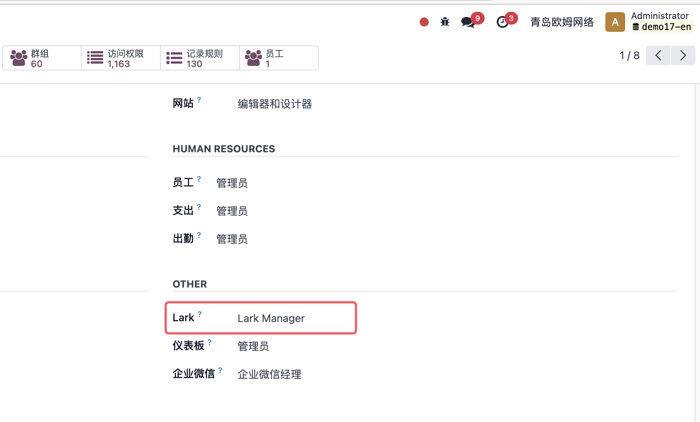
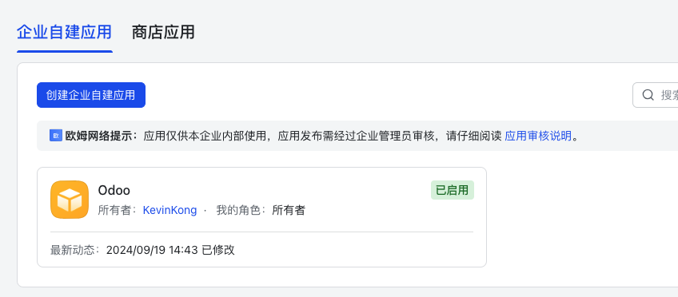
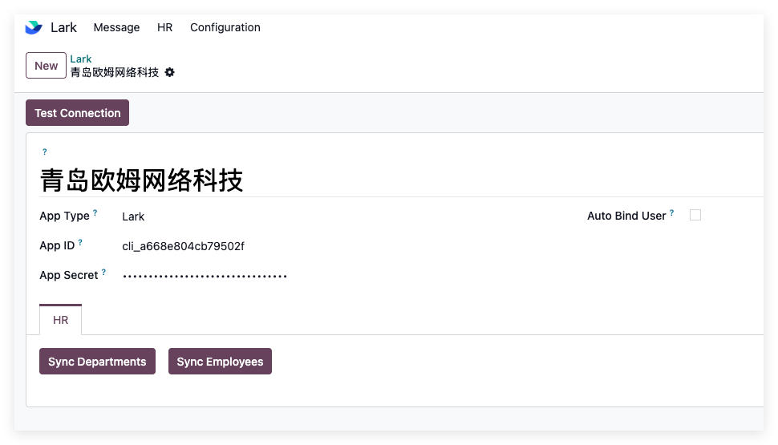
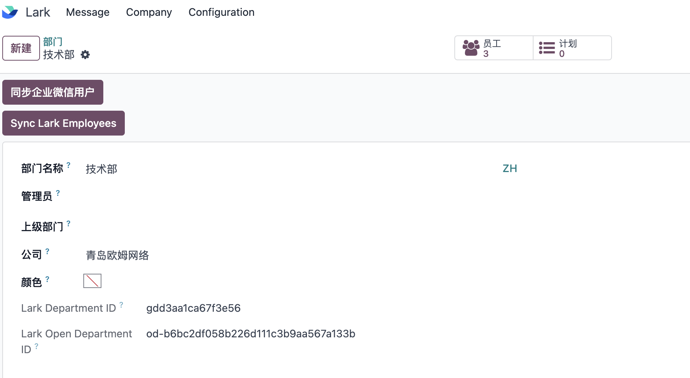
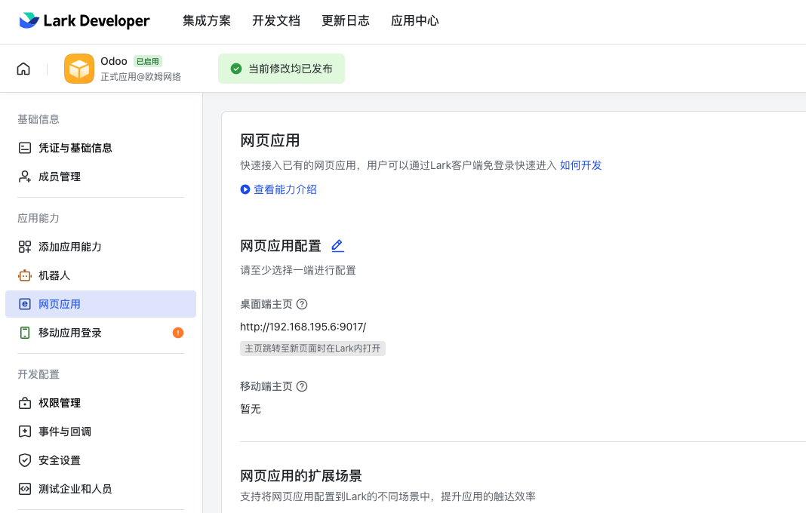
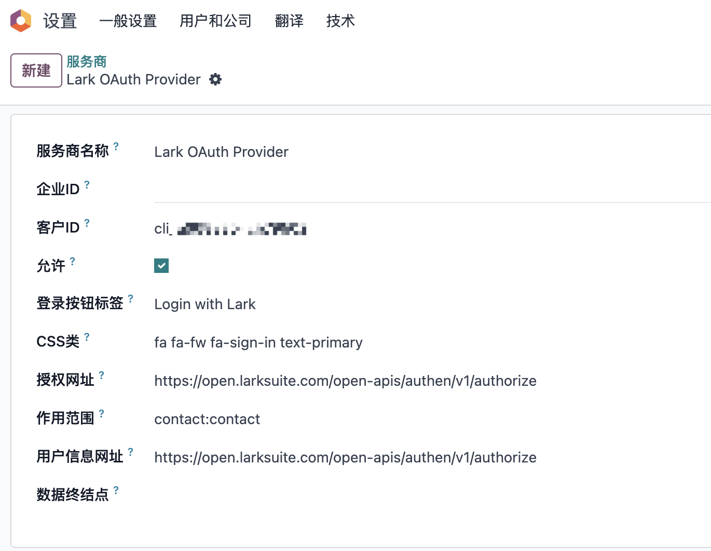

# Lark

> 当前版本：17.0.1.0

## 模块安装

1. 在应用列表中，找到Lark应用，然后点击安装。

2. 安装成功后，把自己的在用户组中设置成Lark管理员。

    

## 基础配置

1. 首先到lark的[开放平台](https://open.larksuite.com/)创建一个lark应用：

    

    然后拿到以下连个个应用参数:

    * AppID: Lark应用ID
    * AppSecret: Lark应用密钥

2. 拿到这个两个应用以后就可以在odoo中创建应用了：

    

### 绑定公司

1. 创建好应用之后，我们要在使用的公司设置中绑定应用。

    

这样我们的基础配置工作就完成了，下一步进行基础数据的同步。

## 基础数据同步

1. 同步部门数据：点击设置-同步部门菜单，完成后提示同步成功。

    

2. 同步员工数据：打开同步的部门，然后在上方按钮点击同步员工，即可完成该部门员工的同步。

    

这样基础数据同步完成。

## 扫码登陆

Odoo也支持Lark扫码登陆，下面我们看一下如何实现。

1. 登陆开放平台，给应用添加**网页应用**的能力，并设置网页端URL:

    

2. 在开发配置-权限管理中，给应用设置contact:contact权限：

    

3. 在odoo中，打开开发者模式，在用户和公司-OAuth提供商菜单下，激活Lark登陆:

    

这样用户就可以在odoo登陆界面使用lark扫码登陆。实际效果：

## 机器人消息

Lark同样支持企业微信般的消息通知。

[Todo...]()