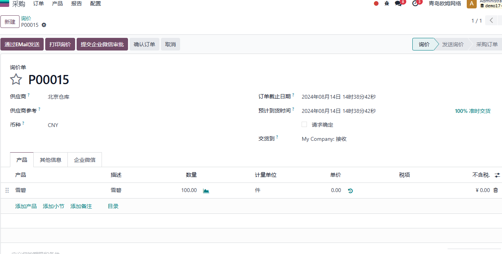
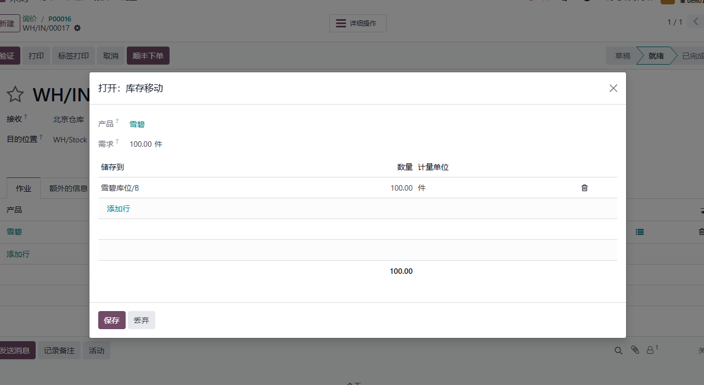
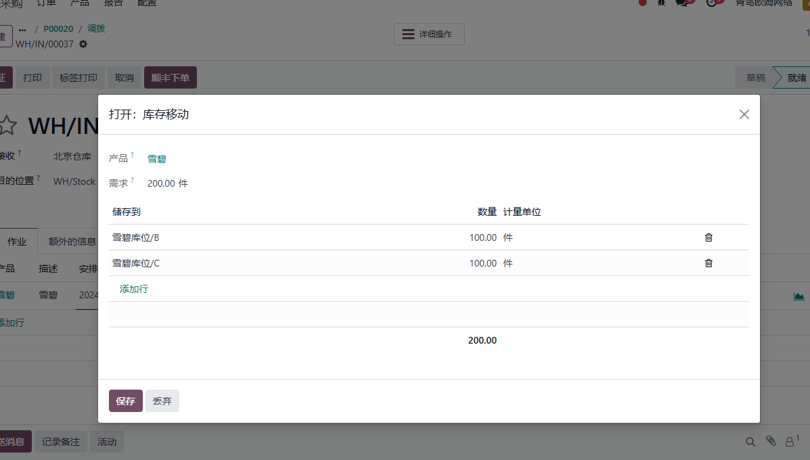

# 第十章 存储类别

* [存储类别](#存储类别)
* [上架规则](#绑定上架规则)
* [存储类别的使用规则](#存储类别的使用规则)
* [超库存分配](#超库存分配)

在开始本文之前，请读者思考如下一个问题，假设当前仓库有库位A/B/C/D，它们拥有共同的上级库位S，每个库位能够存储产品P的最大数量是100，现在有一个采购单共采购了200个P，我们该如何在odoo中进行设置，以满足库位最大存储容量的要求呢？

**存储类别**（storage.category）就是用来解决此类问题的，下面我们来了解一下存储类别的使用方式。

## 存储类别

要使用存储类别功能，首先我们要在系统中开启存储类别选项，在设置-库存-仓库-存储类别中选中存储类别选项。

开启此选项之后，我们就可以到仓库-设置-存储类别中使用存储类别功能了，下面是一个存储类别的截图示例：

* 存储类别：存储类别的名称
* 最大重量：该存储类别能够接收的最大重量
* 允许新产品：接收产品的策略(当库位为空、允许相同产品和允许混合产品)

针对同一个库位，不同产品可能能够存储的数量是不同的，因此，我们需要在下面的能力列表中指定产品的能够接收的产品数量。

* 产品： 能力指定的产品
* 数量： 能力的数量
* 计量单位： 能力的计量单位

然后我们在库位上绑定此存储类别：

存储类别不能单独使用，创建好了存储类别之后，我们要绑定上架规则才可以使用。

## 绑定上架规则

我们以产品雪碧为例，创建要一个上架规则：

该上架规则的意思是，如果产品到达Stock库位，那么将它上架到雪碧库位(虚拟库位)，因为雪碧库位下拥有4个库位ABCD，因此这4个库位都可以进行存放。

这样，当产品抵达Stock库位后，系统将根据绑定的上架规则和库存类别，将符合规则的产品调拨到存储类别指定的库位的子库位中。

举例来说，在做好了前面所述的存储规则之后，我们再创建一个100个雪碧的采购单入库。

确定之后，我们可以看到系统自动帮我们将库存放到了雪碧库位下的A库位中。

如果这时候我们再次下单，将会发现系统会自动帮我们放到第二个库位B库位中：

这是因为虽然我们的第一单还没有入库，但是已经预留了A库位。第二单入库的时候发现已经有调拨使用了A库位，因此系统自动帮我们顺延到了B库位。

## 存储类别的使用规则

前面介绍了存储类别的基本用法，那么现在来思考一个问题，如果4个库位都已经满了，那么系统将把第5单采购存储到哪里呢？

答案是存到Stock库位。

这里就牵扯到了上架策略的使用规则问题，我们在前面的测试中可以看出，存储类别的库位使用规律是依次是使用。当存储类别找不到合适的库位时，使用调拨类型默认的目的库位。

## 超库存分配

现在我们来考虑最开始提出的问题，当我们入库数量是200时，想要系统自动分配给下面的子库位该如何处理呢？

因为超过存储分类指定的库存量时，系统会使用默认的库位，因此达不到我们想要实现的效果。为了解决此问题，我们在库存解决方案中添加自动分配的选项，当用户选中了此选项时，系统将根据存储类别中的数量自动将200的入库明细分成2个100的明细，并调拨到指定的目的库位。

首先，我们在设置中打开**存储类别拆分**功能:

然后我们再去采购一个200件的产品：

当我们确认采购订单后，就可以发现，系统自动帮我们将200个产品按照每个库位放100个的规则拆分好了。

