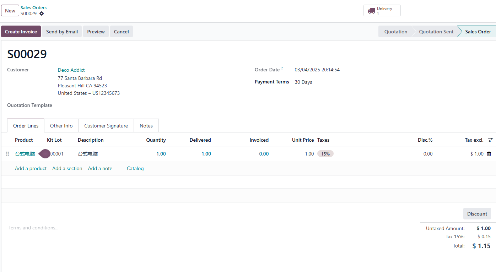
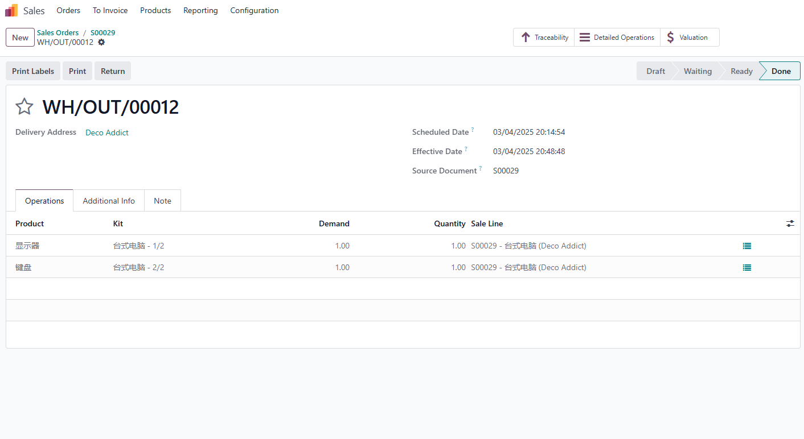

# 套件生产

## 基于序列号的套件产品追溯

我们知道odoo原生的套件BOM类型并不会产生真正的库存，从而导致了某些情况下我们想要对套件进行追溯的困难性。基于这样的一个背景，我们在欧姆生产解决方案中新增了对套件产品的追溯拓展，下面我们就来看看如何使用吧。

### 产品设置

假设我们这里一台组装电脑产品，它的BOM包含两个产品一个键盘、一个显示器，我们把这个BOM设置成套件类型。

这台电脑路线设置为生产

### 销售订单

然后我们去销售单中做一个销售订单

我们可以看到销售订单明细行中有一个套件批次，我们将该电脑的序列号填入其中，然后确认订单。

### 发货

然后我们到发货单中进行发货，可以看到，此组装电脑在发货单中被拆分成了两个组件进行出库：

我们在发货单中分别将两个组件的批次号填入，然后点击验证，完成发货。

### 组件追溯

发货之后，我们到组装电脑的批次中，可以看到关联的的两个组件的批次。

我们在组件的批次中也可以看到关联的成品的序列号。

这样我们就实现了虽然套件产品在库存中没有实际库存，但也根据对此套件进行追溯的功能。