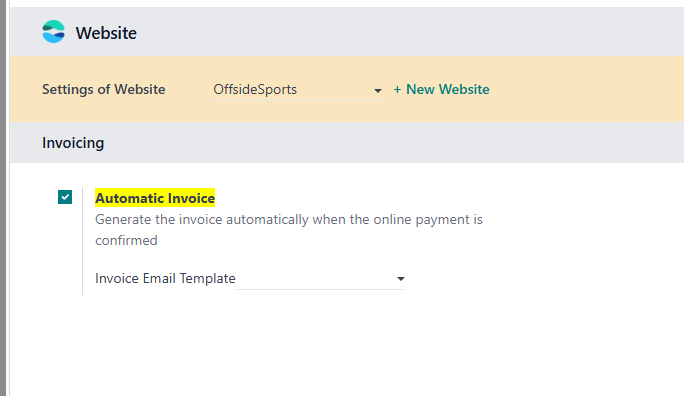

# 第二章 商城

## 发票模板

当客户在商城中完成下单并且支付成功后，系统可以自动发送发票(Invoice)到客户注册的邮箱中。具体的设置位置在: **设置-发票-自动开票**

### 基于多公司的发票邮件模板

但是当我们的系统中拥有多个网站的时候，会碰到一个问题就是邮件模板默认并非跟公司关联的，因此当我们创建的第二个网站拥有第二个域名和标题的时候，用户收到的邮件还是第一个网站的模板，就变得有点尬尴。

我们在[欧姆网络网站解决方案(mommy_website_sale)](https://odoohub.com.cn)中添加了对此项的支持，用户安装了这个模块以后即可使用多公司下多发票模块的功能，详询客服。