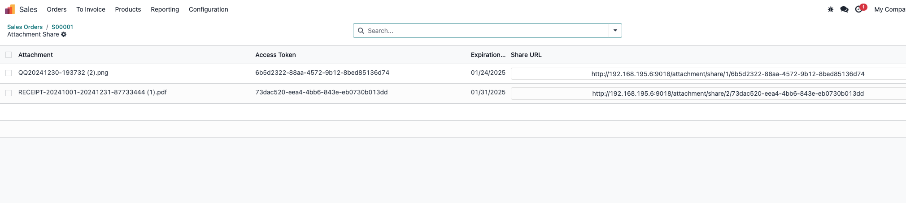

# 第三章 附件共享

虽然odoo官方提供了文档的门户访问功能，但是某些情况下，我们希望外部用户只能有限地能访问我们指定的附件，而不是能够访问整个文档和全部附件。本章即是为了解决此问题而开发的功能。

## 销售附件管理

这里我们以销售订单的附件管理功能为例，来看一下具体的操作。首先，我们打开一个销售订单。

这个订单中有两个附件，我们希望能够单独管理和共享每个附件，并且限制它他们的过期日期。

我们点击上面的附件共享快捷按钮，进入附件共享管理页面：

系统会帮我们自动创建每个附件的共享条目，我们编辑它的过期日期就可以控制该附件的共享时效。

## 共享给外部用户

我们复制文档中的共享链接，然后把它发送给外部用户即可。

用户可以预览图片，也可以点击下载按钮把文档下载到本地。