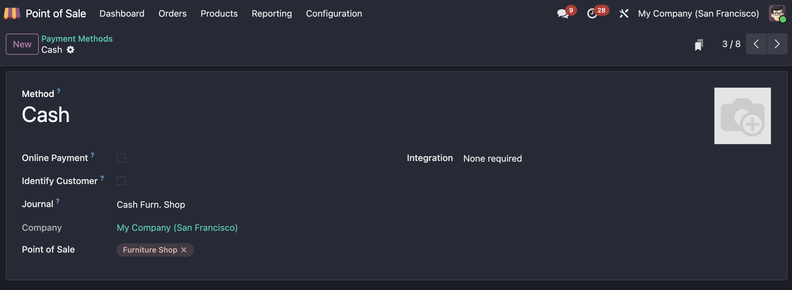

# 支付方式

本章我们来介绍销售点(POS)中的支付方式的配置。

## 添加支付方式

在POS应用-设置-支付方式中，我们可以添加支付方式：

先看一个现金的支付方式示例：

* 在线支付： 集成在线支付供应商的支付方式，需要在网页上完成支付
* 识别客户： 强制绑定客户
* 日记账： POS的日记账
* 销售点： 使用此支付方式的销售点
* 集成终端：可以选择集成终端、也可以选择不集成

> 支付方式的现金日记账必须新建，因为不同的现金支付方式不能共用同一个日记账。但是银行类型的日记账支持多个支付方式共享。

## POS支付

当我们设置好支付方式后，就可以在POS收银端选择配置的支付方式完成收银了。

## 二维码支付

除了最常见的现金和银行外，Odoo也支持二维码收款。

> 这里的二维码为银行APP中支持的二维码，与国内微信支付宝银联等不同。

### 配置

二维码支付根据不同国家的**税务本地化**政策不同而不同，具体不同的国家配置方式请参考官方说明文档。

配置了二维码支付之后，前端在收银的时候会在客户屏幕上显示二维码供客户进行扫描完成支付。

