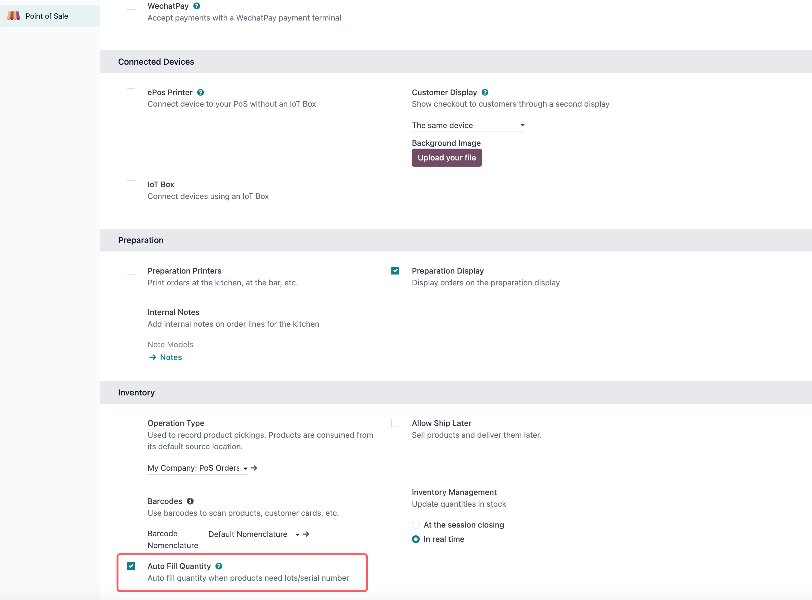
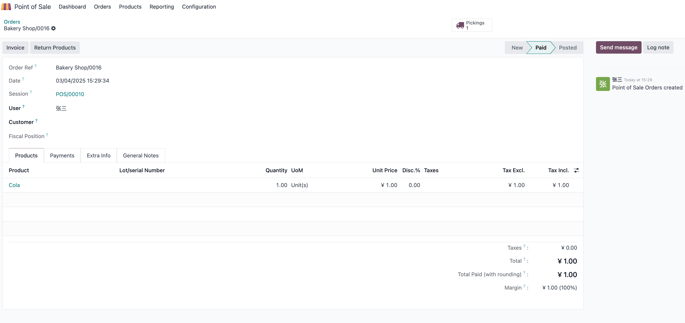
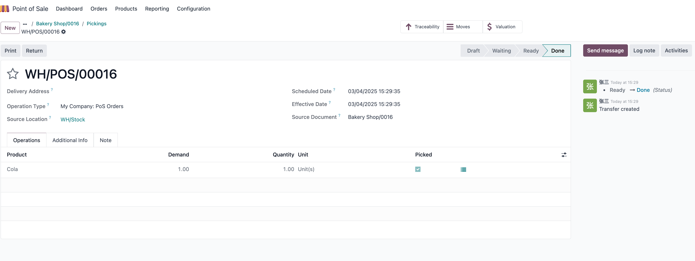

# POS批次产品自动出库

> 基于odoo18.0

当POS生成订单的时候，系统会自动根据POS订单的明细生成出库单，如果订单明细的产品不是根据批次或者序列号追溯的，那么系统可以将会自动锁定库存，并自动出库。

但是当产品是根据序列号或批次跟踪的时候，自动出库动作将失败，原因是生成的调拨单要求用户手动确认数量。

如果我们希望系统在序列号和批次跟踪的时候依旧可以正常锁库存并出库，该怎么做呢？本章就是为了解决此问题。

## 开启批次自动出库

为了解决此问题，我们在欧姆POS解决方案中新增了批次/序列号自动出库的功能单元。首先，用户需要在POS-设置-库存中开启此选项:

## 批次自动出库

开启了此选项之后，我们在POS中生成订单的之后，如果有足够的库存，那么系统会自动分配并完成出库。

