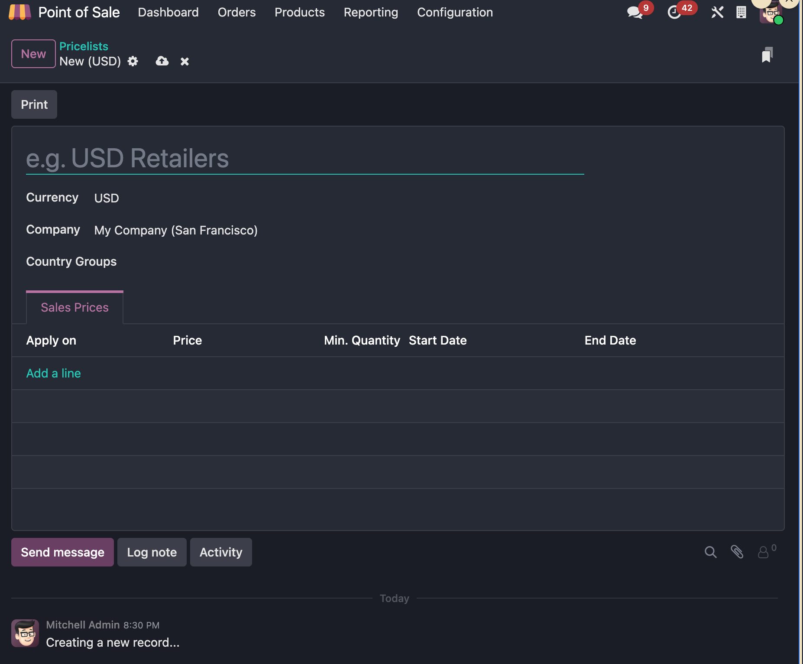
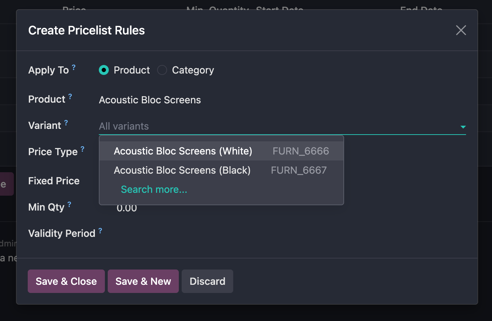
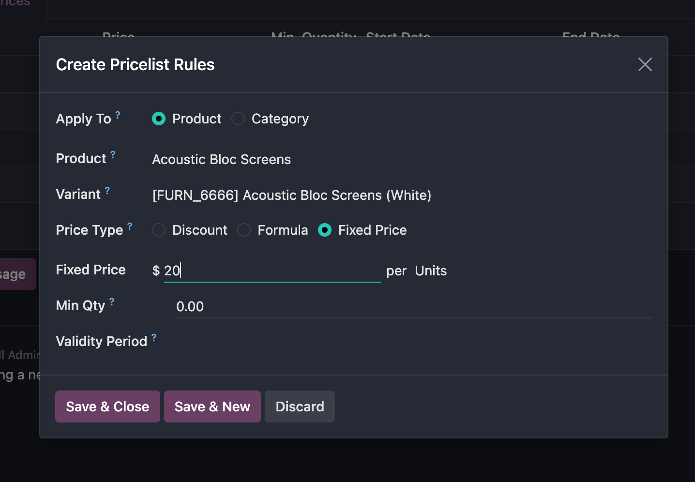
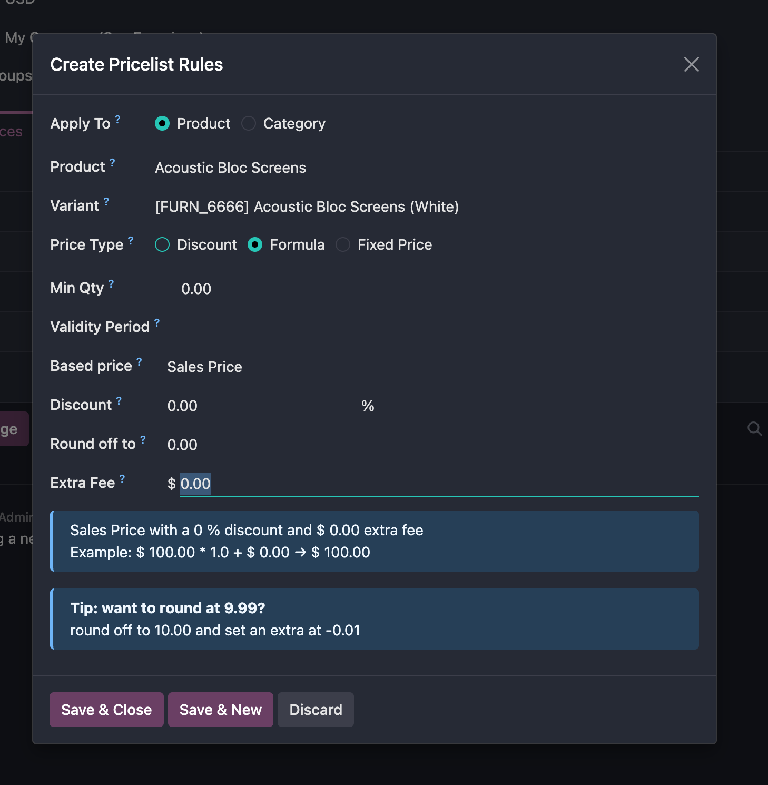
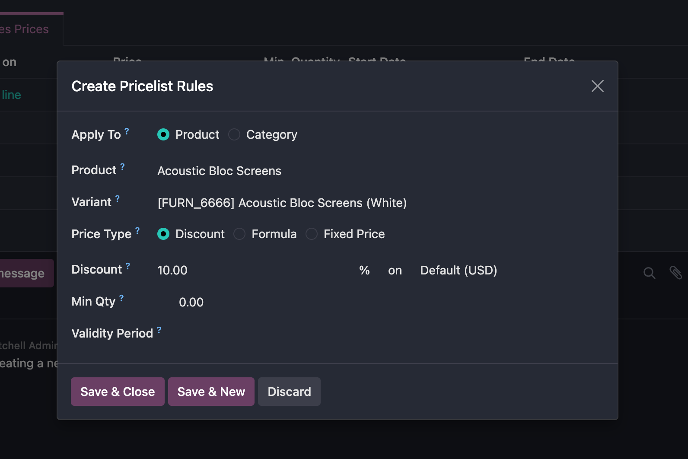

# POS中的价格表

Odoo中的价格表可以让我们根据各个不同的情况来自动对产品进行定价。比如，我们可以给客户指定价格表、设置价格表的有效期、设置折扣以及设置会员规则、折扣等等功能。

本章我们就来看一下如何在Pos中设置价格表。

## 配置

首先我们要在设置中激活价格表设置，具体路径在POS设置-可适应价格表，确保此选项已经勾选。

这里可以设置可选的价格表和默认的价格表

> 在17.0及更早版本中价格表有两个策略：一个是每个价格表明细行一个产品，一个是高级的价格表规则。18.0版本起已经合并。

## 创建价格表

下面看一下如何创建一个价格表，我们在POS-产品-价格表菜单中，点击左上角的新建：

这里我们可以给价格表设置名称、应用的国家或者国家组。

## 设置价格表规则

* 价格表可以针对产品、产品分类进行设置
* 价格表的类型分为折扣、公式和固定价格三种

下面我们分别看一下这几种设置的区别和应用场景。

### 产品和产品分类

首先我们来看价格表的范围选择，价格表的范围有两种一种是指定单一产品、另外一种是指定一个产品分类。

如果我们选择产品，那么我们还可以选择此产品下面的某种产品变体。

如果我们选的是产品分类，那么我们只需要选择一个产品分类就可以了。

### 价格表类型

价格表的类型分为三种，我们先来看最简单的固定价格。

顾名思义，固定价格即产品在此价格表中具有固定的一个价格，只要选择了此价格表，那么该产品的价格就是一个固定值。

第二种就是公式类型，公式意味着此价格表中的价格可以依赖于另外的一张价格表，并在这张价格表的基础上进行额外的逻辑计算。

我们可以在另外一张价格表的基础上进行涨价或折扣、设置有效期、舍入精度和额外价格等操作。

最后一种就是折扣，意思是在另外的一个价格表上打折，如果不选价格表那么默认的基础价格就是产品中的销售价格。

## 给POS指定默认价格表

我们在POS设置中可以设置可用价格表和默认价格表，当我们指定了默认价格表的时候，POS中的价格将使用默认价格表的价格。如果想要切换价格表，那么POS将从设置中的可用价格表中进行选择。

