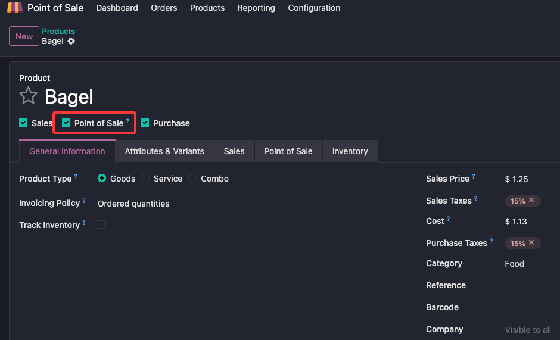
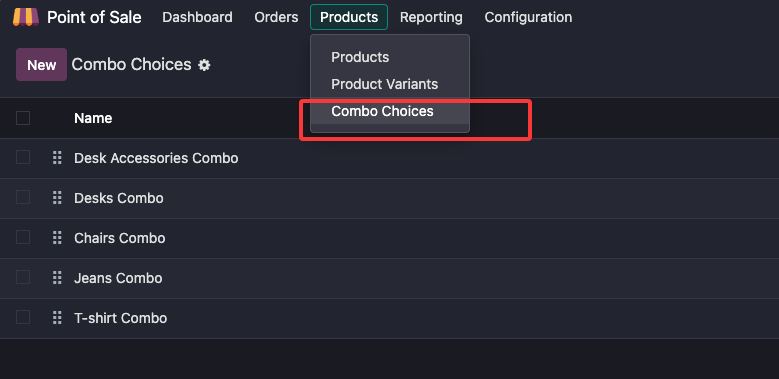
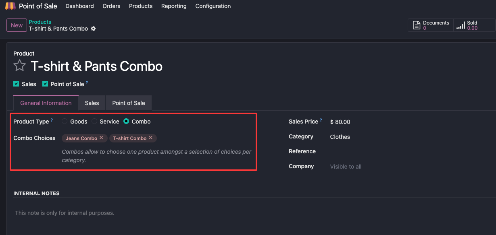
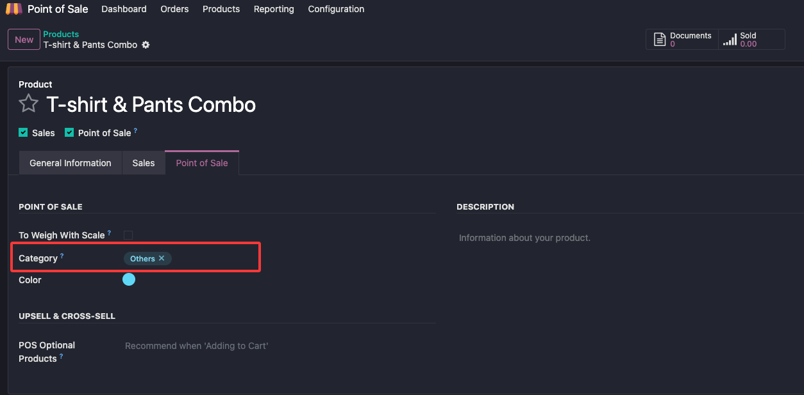
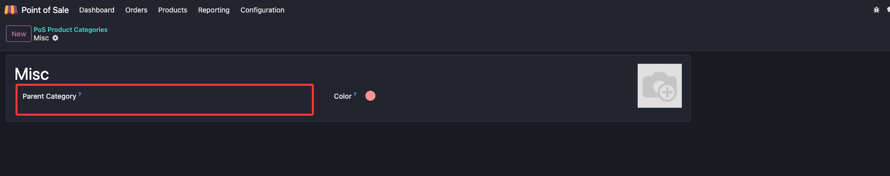

# 产品管理

本章介绍POS中的产品管理

## 产品创建

如果想要把一个产品设置为Pos可销售的产品，只需要在产品信息页中，勾选POS可用选项即可。

### POS产品的快速创建

有一种快速创建POS产品的方法，即在POS界面，点击右上角的创建产品菜单，快速创建产品：

使用这种方式创建POS产品时，Odoo会在POS界面弹出快速创建产品的对话框，用户可以通过扫描条形码，快速添加产品。

如果用户扫描的条形码在全球数据库中，那么系统会自动将此条码匹配的产品名称、价格和产品图片自动填入。当然，用户可以根据自己的实际情况进行调整。

## 产品类型

产品的类型可以分为如下三个类型

* 货物(goods): 可库存的产品
* 服务(servcie): 服务类虚拟产品
* 组合(Combo): 有多个产品组合而来的产品类型

## 产品变体

产品属性有三种选项：

* 立即创建：添加的属性理解在产品库中进行创建
* 动态创建：当产品属性在销售单中使用时创建
* 从不创建：不进行产品变体创建

> 产品属性一旦被使用，产品属性的类型将不再可以更改

## 组合产品

组合产品(Combo)的定义： 允许用户使用多种产品组合成一种产品。比如，餐厅里的套餐、自己组装台式机等等。

### 定义Combo选项

首先我们在产品-组合选项中定义产品组合选项：

### 定义Combo产品

然后我们在产品的信息选项卡中定义Combo产品，步骤是：

1. 将产品的类型选择为组合品
2. 在组合选项中选择组合类别

### 额外的价格

对于不同的组合选项，我们可以设置不同的价格：

## POS类别

Odoo支持对产品在Pos中使用不同于产品分类的一套类别，在产品信息的POS选项卡中选择相对应的POS分类即可:

### POS上下级分类

POS分类当然也是支持上下级关系的，在设置-POS分类中，点开一个POS分类后，我们可以通过设置它的上级POS分类来完成。

同时我们也可以设置分类的颜色。
