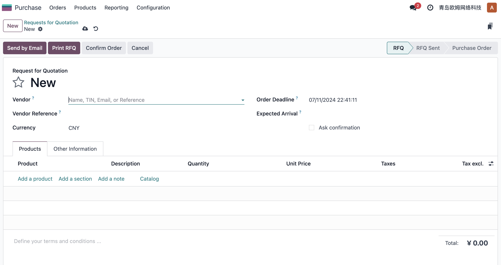
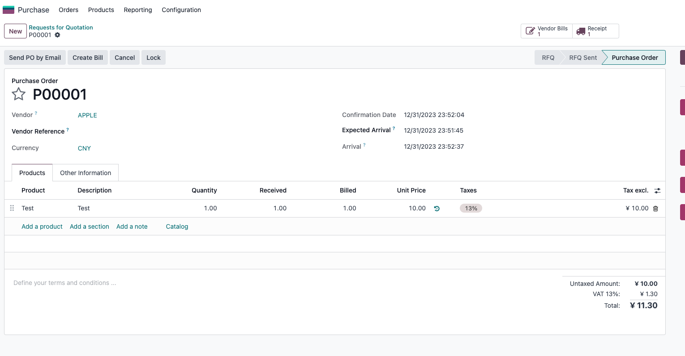
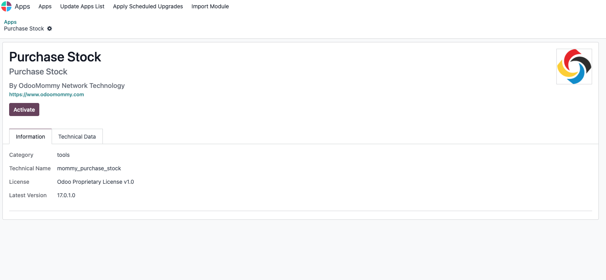
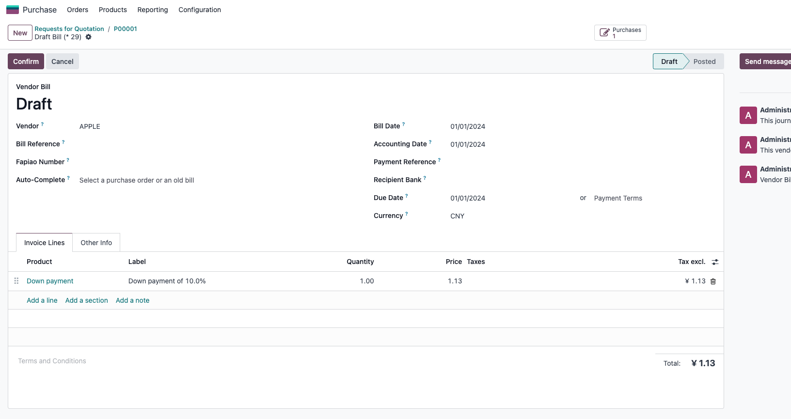
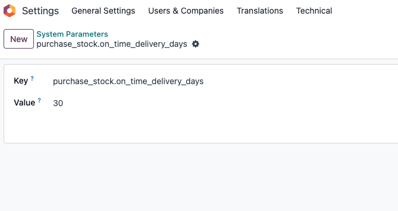

# 第一章 采购管理

* [询价单和采购订单](#询价单和采购订单)
  * [期望到货日期](#期望到货日期)
  * [交货提前期](#交货提前期)
  * [采购审批]()
* [高级开票](#高级开票功能)
* [到货及时率](#到货及时率)

采购分为**询价单**和**采购订单**，本质上是一个模型，询价单(RFQ)是草稿状态的采购订单(PO)。本章将介绍采购单的基础知识和概念。

## 询价单和采购订单

询价单是草稿状态的采购订单，一个典型的询价单界面如下:



我们在创建的一个询价单的时候需要知道供应商信息、采购日期和具体采购明细等关键信息。当我们信息填写完成后，点击**确认订单**按钮就可以把草稿状态的询价单(RFQ)转换成采购订单(PO)。

采购订单确认后，根据订单明细里的产品的属性是否是可库存产品会决定是否自动生成入库单。如果采购明细中包含**可库存产品**，那么系统将会自动生成入库单。

> 入库可以根据需求分为一步入库、两步入库和三步入库，具体参考仓库一章。

如果产品是可库存产品，那么我们在确认订单后，系统会自动生成入库单。一个典型的入库单如下图:


仓库管理人员验证入库即可，然后财务人员基于采购的**开票策略**进行开票，这样一个采购的基本流程就结束了。

### 期望到货日期

企业在采购原材料的过程中，有时候需要制定采购计划，以便能够满足销售或生产等需求部门的需要。我们在创建询价单的时候可以选择我们期望的**到货日期**。


默认情况下，询价单的期望到货日期跟明细行中的期望日期是一致的。如果明细行中多个产品的期望日期不同，那么询价单将以**明细行中最早到货**的日期作为整单的期望日期。如果手动修改询价单的期望日期，那么已经存在的明细行日期将自动同步询价单中的日期。

### 交货提前期

同时，我们可以在供应商资料中预先设置**前置时间**(单位天)。


例如，我们在13寸MAC Pro电脑的采购选项卡中将供应商海森堡信息技术的前置时间设置为2天，那么当我们在询价单中选择海森堡信息技术作为供应商，期望的到货日期时2024/07/20，当我们确认订单时，系统将会把期望的到货日期修改为2024/07/22，同时入库单的预计日期也是2024/07/22。


### 采购审批

Odoo原生支持简单的采购审批功能，首先要在采购-设置中开启采购金额审批功能：


勾选了开启采购金额之后，我们在最小审批金额设置里填写我们希望开启审批的金额下限。


假设我们这里设置的审批金额是5000，那么当采购金额大于5000的时候，系统将提示必须经过经理审批才可以进行确认订单操作。


然后采购经理审批之后才会变成确认的采购订单：


odoo原生并不支持复杂的OA流程，如果企业内部使用的IM是企业微信，那么可以使用我们的[企业微信](../chapter10/WeWorkPlus.md#审批)插件进行复杂的审批流程设置。

## 重订货规则

重订货规则是odoo根据系统中的需求来创建采购订单的**订货规则**。下面是一个订货规则的例子:


## 高级开票功能

原生功能中，如果我们想要开票,直接点击**创建账单**按钮即可完成开票动作。



开票的结果:


虽然能够完成基本功能，但是遗憾的是原生的模块并未提供像销售模块那种可以开具预付款功能的开票向导功能。因此，我们在解决方案中添加到了对采购模块的支持。下面我们就看一下如何在采购模块像销售模块一样使用开票向导完成开票。

首先，我们需要安装[采购仓库模块]():



安装完成后，我们再次到采购订单中创建账单:


可以看到采购订单的账单创建向导也已经出现了跟销售订单一样的向导，我们可以开具

* 全额账单
* 根据百分比的预付款账单
* 根据固定金额的预付款账单

开具的账单示例如下:



## 到货及时率

在供应商资料中，有一个到货及时率(On-time Ratio)来标识此供应商的供货效率。其计算公式是：
过去的N天中，非服务类型产品，

```sh
此供应商的供货及时到货的数量 / 总的订货量 * 100%
```

如果没有数据，那么此值将被负值为-1。

N的默认值是365天。如果想要修改这个N的值，需要到（开发者模式）设置-系统参数中新增一个参数对(purchase_stock.on_time_delivery_days):


