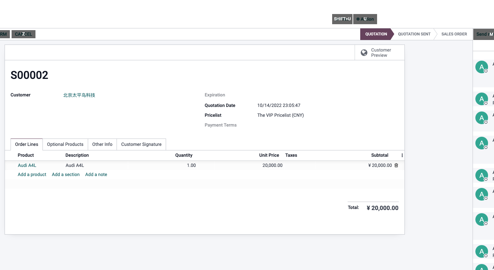

# 第五章 折扣与价格表

## 销售订单上的价格表

开启价格表之后，在销售订单上面，用户将可以选择特定的价格表参与运算。

### 切换价格表

切换价格表之后，系统会在价格表旁边显示一个更新价格表按钮。点击更新价格表之后，系统将使用更换后的价格表价格替换掉原来的价格。

这里我们举一个例子，假设一台奥迪A4L的售价是250000人民币，我们在公开价格表上设置A4L的价格：

然后，我们又新建了一个价格表专门给VIP客户使用，设置为所有产品打8折：

然后我们回到报价上单上面，切换价格表到VIP价格表以后，我们可以看到价格表旁边出现了一个更新价格表的按钮：

点击此按钮，系统将提示我们是否将明细中的产品明细都更新为该价格表的价格体系。我们选择确定，结果如下：

我们可以看到A4L的价格由公开价格的250000变成了200000。