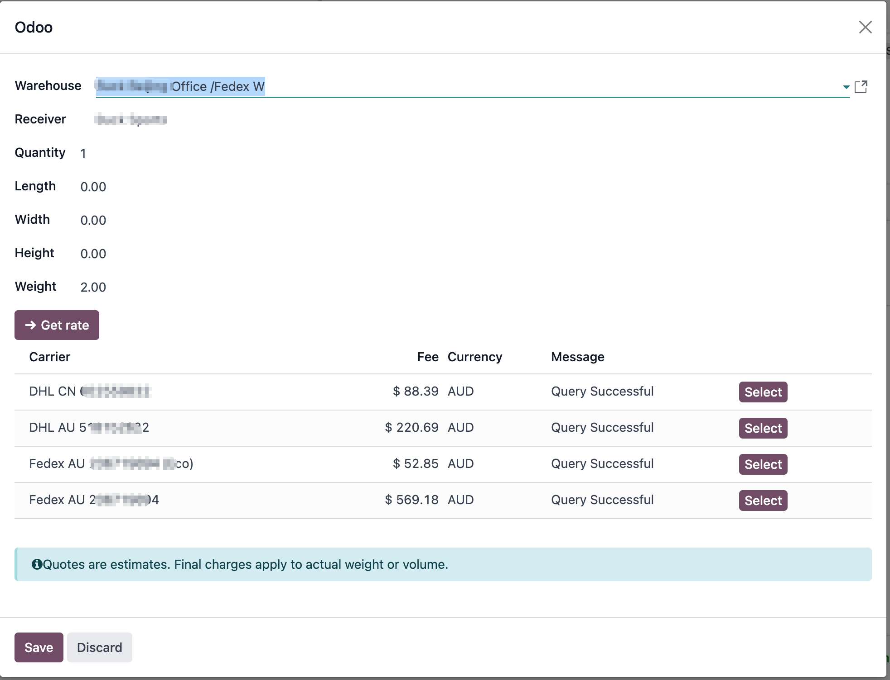

# 外贸发货

对于外贸行业来说，通常会用到例如DHL、Fedex、UPS等国际贸易中的物流承运商。其中有一部分Odoo官方已经支持，而另一部分还没有适配。本章我们就来看一下如何在Odoo中使用常见的物流商来简化发货操作。

## 运费预估对比

外贸企业在决定选择物流承运商的时候费用通常是比较重要的一个参考标准，操作员通常要手动根据发货地和收货地，在不同的承运商那里依次查询运费，然后再对比，选择结果。

为了解决这个问题，我们在外贸解决方案中开发了一个运费预估对比的功能，借助此功能，操作员只需要选择发货地和收货地地址，填写包裹的长宽高以及重量即可，系统会根据输入自动查询预先配置好的承运商，然后批量给出查询结果，一目了然。

