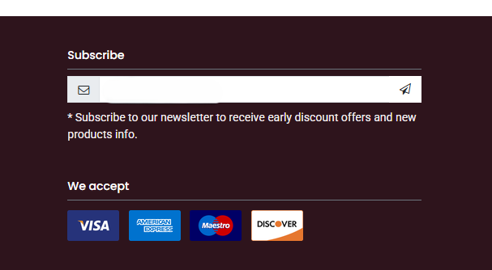
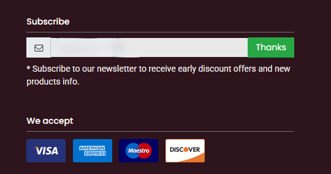
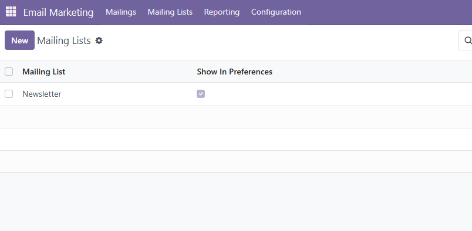
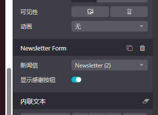

# 邮件营销

## 邮件订阅

> 基于17.0

用户在访问我们的网站的时候可以使用邮件订阅功能来订阅我们的最新资讯。具体使用方法为：在网站编辑器中添加邮件列表组件:

用户在订阅了我们的邮件频道后，我们可以选择设置感谢按钮提醒用户已经订阅。

### 自定义邮件列表

默认情况下，网站中并没有默认的邮件订阅列表，如果想要添加自己的邮件列表，首先要到后台邮件营销模块中，创建一个自己的邮件列表，同时将其设置为公开。

然后，我们要在网站编辑器中，选中邮件订阅组件，然后设置我们想要用户订阅的列表。

