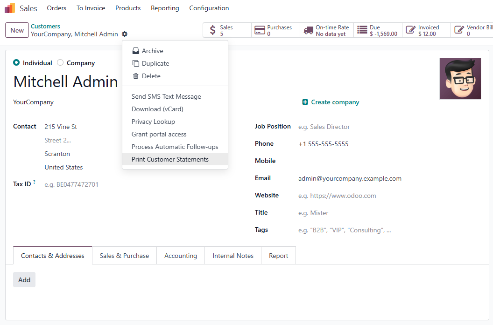
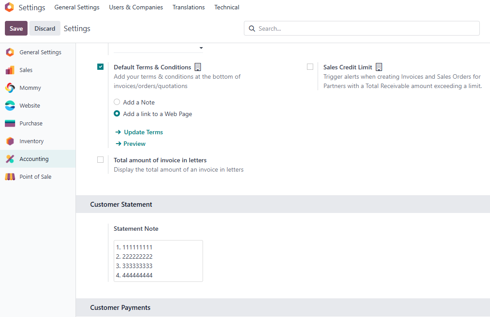

# 对账单

## 客户对账单

对于澳大利亚、印度和新西兰的客户，通常会有给客户发对账单的需求，odoo会针对这几个区域的客户安装**客户对账单模块**(l10n_account_customer_statements)。

安装完成之后，用户可以方便地在客户资料中打印客户的对账单。

### 对账单条款

如果我们想要在客户对账单中添加一些备注或条款，可以在我们的[财务解决方案](https://odoohub.com.cn)中进行设置。

在会计-设置-客户对账单：

在这里输入我们想要填写的条款和内容。

然后我们在打印出来的对账单文件中也可以看到：

