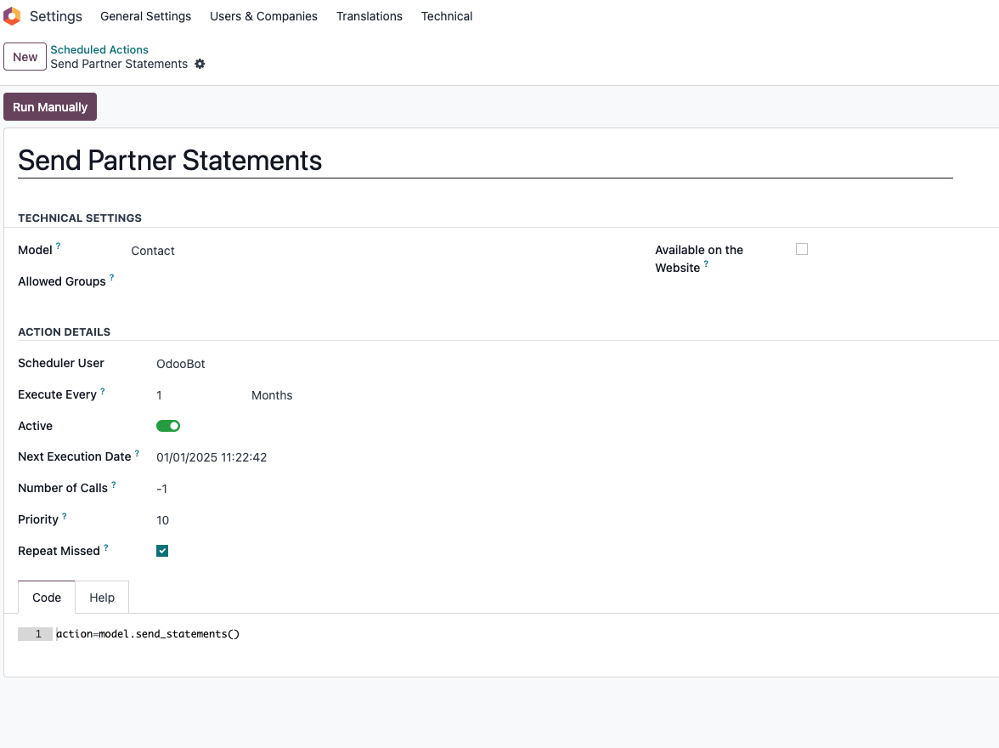

# 客户对账单

对于澳大利亚、印度和新西兰的客户，通常会有给客户发对账单的需求，odoo会针对这几个区域的客户安装**客户对账单模块**(l10n_account_customer_statements)。

* [使用邮件发送对账单](#使用邮件发送对账单)
* [使用定时任务发送对账单](#使用定时任务发送对账单)
* [对账单添加条款](#对账单添加条款)

安装完成之后，用户可以方便地在客户资料中打印客户的对账单。


原生模块只提供了这么一个打印对账单的功能，而且局限于点击打印日期所在的月份。比如说，今天是11月30日，那么我们可以打印出11月1号到11月30号，该客户的对账单。

但是如果我们是12月1日打印的对账单，那么该对账单就只显示了12月1日的对账单，并不会显示之前月份的对账单。

## 使用邮件发送对账单

为了方便用户给客户发送账单，我们在客户对账单解决方案中添加了使用邮件发送对账单的功能，用户可以给想要发送对账单的客户手动发送对账单。


## 使用定时任务发送对账单

通常情况下，我们都有周期性给客户发送对账单的需求。因此，我们在对账单解决方案中添加了定时任务，以方便用户对使用系统周期性给客户发送对账单。



默认情况下，将给所有客户发送当前日期下的上个月的对账单。如果想要发送指定月份的对账单，则传入moth参数即可。

```python
model.send_statements(month=-2)
```

如果想要指定客户范围，则可以传入partner_ids来指定客户的id列表。

```python
model.send_statements(partner_ids=[1,2,3..])
```

## 对账单添加条款

如果我们想要在客户对账单中添加一些备注或条款，可以在我们的[财务解决方案](https://odoohub.com.cn)中进行设置。

在会计-设置-客户对账单：


在这里输入我们想要填写的条款和内容。

然后我们在打印出来的对账单文件中也可以看到：


