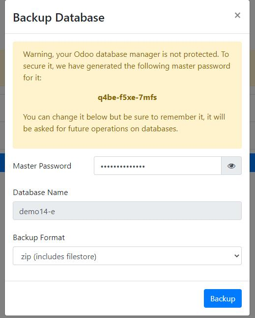
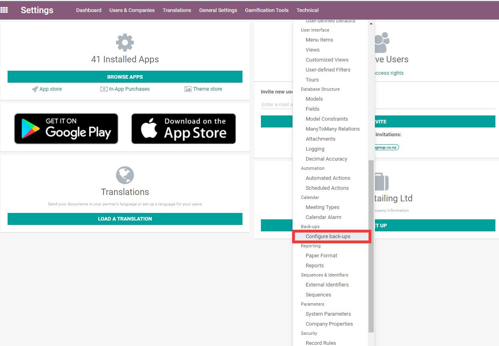
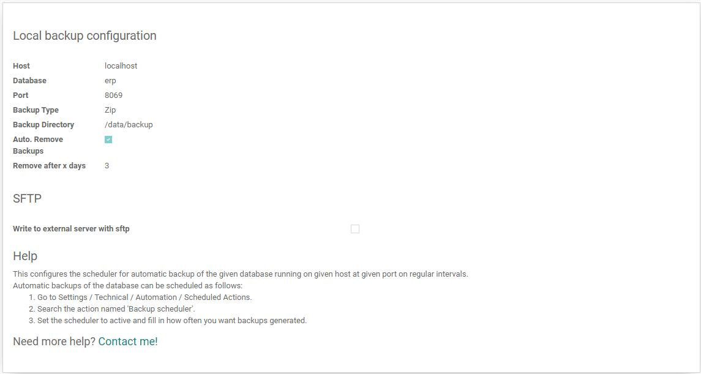

# 第二章 数据库管理

* [数据库的创建](#数据库的创建)
* [数据库的管理](#数据库的管理)
  * [删除](#删除)
  * [复制](#复制)
  * [备份](#备份)
  * [还原](#还原)
* [定时备份](#定时备份)
* [跨版本升级](#跨版本升级)
* [总结](#总结)

我们安装好odoo之后，可以在机器上创建多个数据库，以方便我们进行数据隔离或者测试备份之用。

odoo提供了一种简易的数据库管理方式，这使得系统管理员即便不是专业的IT从业人员，也能够在简单地学习之后，可以轻松地管理自己的数据库。本章即介绍，作为非IT人员，如何管理我们的数据库。

## 数据库的创建

我们第一次访问安装好的odoo时，系统会自动帮我们跳转到数据库管理页面，引导我们创建第一个数据库。

odoo会在第一次加载时显示一个自动生成的随机密码作为数据库的**主控密码**。主控密码的作用是创建、删除和备份数据库的认证密码，因此，读者朋友要牢记住这个密码。在13.0之前的版本，此处的主控密码是用户自己输入的，没有自动生成的功能，而且，现在的主控密码在配置文件夹中进行了加密，因此再次提醒朋友们一定要妥善保管这里的主控密码。

输入完主控密码之后，再依次输入数据库的名字，Email和管理员密码，选择系统需要的语言和国家之后，点击创建数据库按钮，就进入了数据库创建流程。这里需要提到的一点是，Email不必是邮箱，也可以是admin这样的字符。

## 数据库的管理

数据库的管理路径为host:/web/database/manager。其中host为你的URL，例如，作者本地的URL为192.168.1.232，那么数据库的管理地址就是:192.168.1.232:8069/web/database/manager。

一个典型的数据库管理页面如下：

这个页面上有备份、复制、删除等功能。

### 删除

删除数据库很简单，点击删除按钮，它会弹窗让你输入主控密码，主控密码输入正确以后，数据库就删除了。

### 复制

复制数据库的目的是将选中的数据库复制为另外一个名字的数据，通常用来备份或者测试使用。

### 备份

备份数据库是将数据库备份到本地，有两种格式可以选择。

* zip: 包含附件的数据库格式。
* dump: 不包含附件的数据库备份。

当数据库比较小的时候可以选择zip文件，优点是文件完整，不会丢失样式文件。当数据库很大的时候，应该使用dump格式，这样能缩短备份的时间，缺点是这样恢复的数据库会丢失文件附件和样式文件。作者这里提供大数据库的[不丢失样式服务](opensoft.taobao.com)，欢迎有需要的同学选购。

### 还原

还原操作就是将备份下来的数据库恢复，通常用于数据库的迁移场景。

## 定时备份

企业实际使用中，通常都会有容灾的措施，很明显，我们不可能每天定时去人工手动备份数据库，这样既费时又费力。通常的做法是使用第三方的备份模块[AutoBackup](https://apps.odoo.com/apps/modules/14.0/auto_backup/)。

安装完备份模块以后，到设置-技术-备份-配置备份菜单中打开备份设置：

这里的参数有：

* host: 备份的数据库host
* database: 要备份的数据库
* port: 端口
* backup type: 备份格式
* backup directory: 备份路径
* Auto remove backups: 是否定时删除备份
* Remove after x days: 几天后的数据库应该被删除

配置完这个参数以后，我们再到定时任务里找到定时备份这个任务：

在定时任务里，我们可以设置备份操作每隔多长时间执行一次。

## 跨版本升级

总体来说我们不推荐在非必要情况下进行跨版本升级，如果实在是想要升级，我们提供**企业版用户的升级服务**，详讯客服。

<iframe src="//player.bilibili.com/player.html?isOutside=true&aid=665798439&bvid=BV1Fa4y1B79b&cid=1395612050&p=1" scrolling="no" border="0" frameborder="no" framespacing="0" allowfullscreen="true"></iframe>

## 总结

本章介绍了数据库的基本操作和定时备份的模块，经过本章的学习，详细读者已经可以掌握数据库的管理操作了。