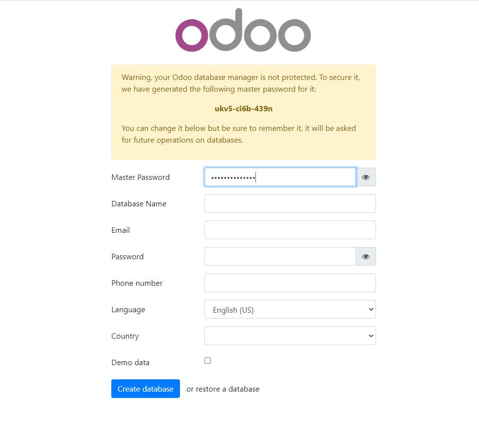
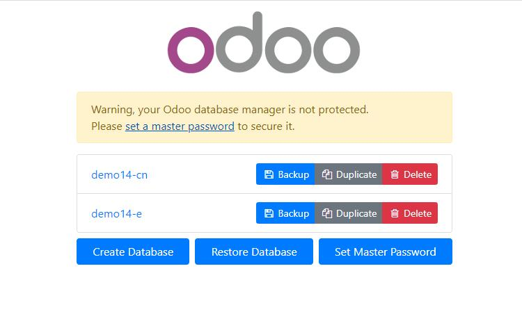
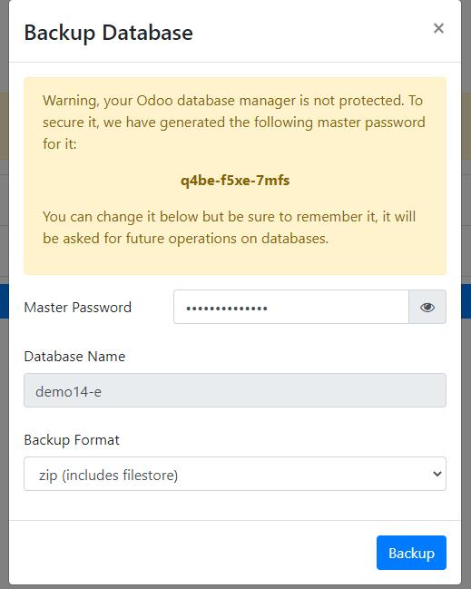
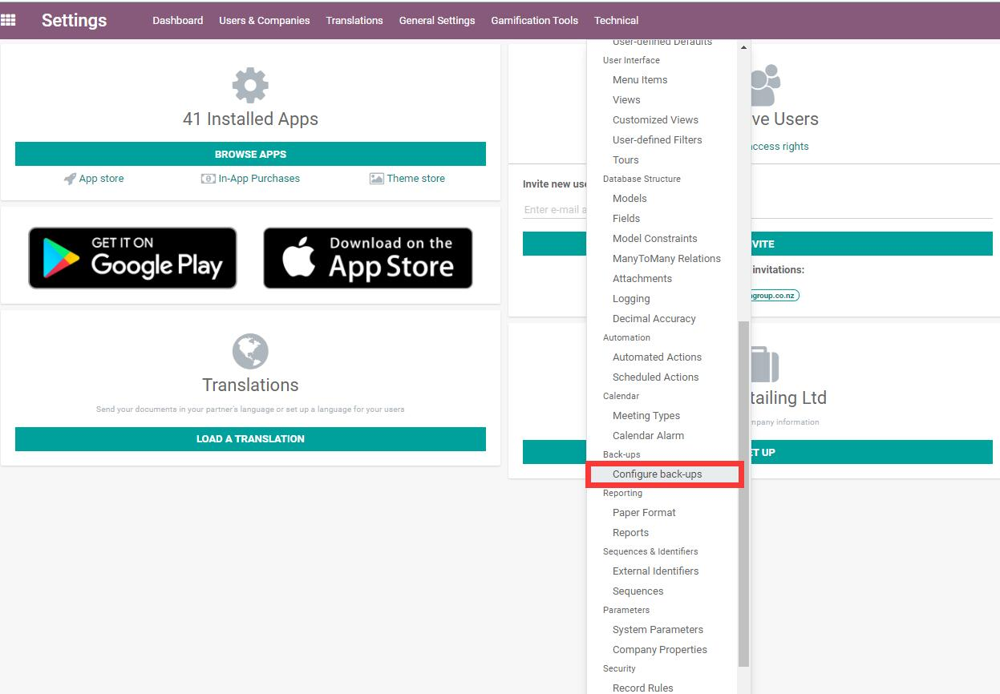
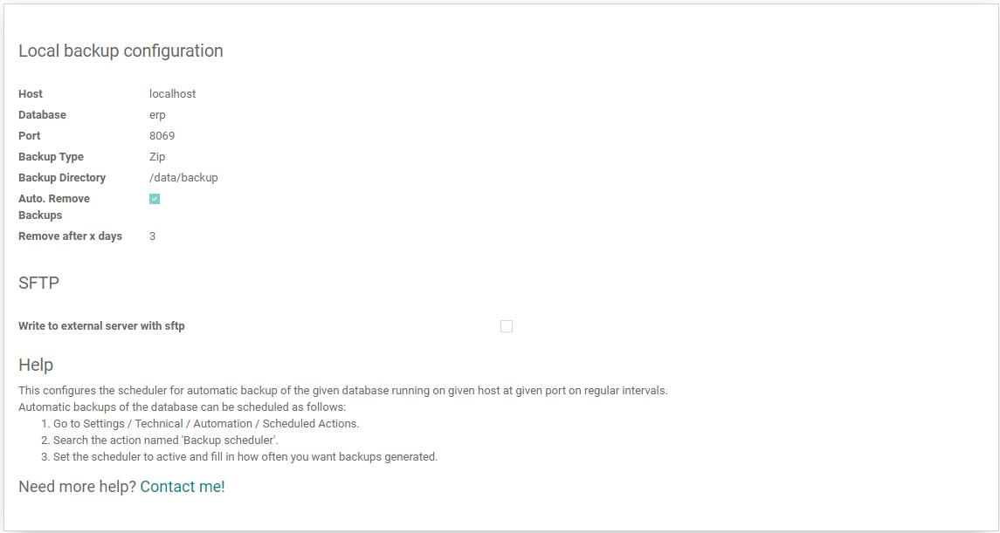
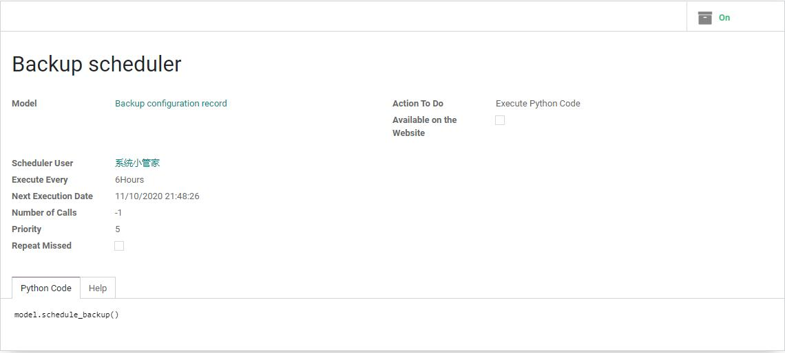

# 第二章 数据库管理

数据库是 Odoo 系统的核心。客户、产品、订单、库存、发票、附件和系统配置，最终都保存在数据库和文件存储中。

对自主实施客户来说，不一定要会写数据库命令，但必须理解测试库、正式库、备份和恢复。否则一旦误操作，就很难挽回。

## 什么是 Odoo 数据库

可以把一个 Odoo 数据库理解成一套独立账套或独立业务环境。

一个数据库里通常包含：

- 公司资料；
- 用户和权限；
- 客户、供应商、产品；
- 销售、采购、库存、财务单据；
- 邮件、附件、图片；
- 模块安装状态和系统配置。

不同数据库之间数据互不相通。测试库里的订单不会自动进入正式库，正式库里的客户也不会自动出现在测试库。

## 测试库和正式库

实施 Odoo 时，至少应该区分测试库和正式库。

| 数据库 | 用途 | 注意事项 |
| --- | --- | --- |
| 测试库 | 试流程、试配置、试导入、培训员工 | 可以反复清理和重来 |
| 正式库 | 录入真实业务数据 | 不要随意删除、导入和测试 |
| 备份库 | 临时恢复备份检查数据 | 不要让员工误当正式库使用 |

测试库可以大胆试错，正式库要谨慎操作。不要在正式库里测试删除、批量导入、模块卸载和权限实验。

## 数据库管理入口

自部署 Odoo 通常可以通过下面地址进入数据库管理页面：

```text
http://你的域名/web/database/manager
```

数据库管理页面通常支持：

- 创建数据库；
- 备份数据库；
- 还原数据库；
- 复制数据库；
- 删除数据库。

如果线上环境访问这个地址返回 404 或无法进入，可能是管理员关闭了数据库管理入口。这在生产环境中是常见的安全做法。

## 数据库管理界面怎么看

看到数据库管理入口后，先不要急着点按钮。这个页面上的每个操作都会影响整套系统数据。下面是一组传统自部署 Odoo 的数据库管理截图。不同版本和不同部署方式界面会有差异，但核心动作基本一致。

第一次访问新安装的 Odoo 时，系统可能会引导创建数据库。



数据库管理页面通常可以看到备份、复制、删除等操作。



备份时常见格式包括 zip 和 dump。zip 通常包含附件，dump 更偏数据库本体。



如果使用第三方自动备份模块，通常会有备份配置菜单。



备份配置中一般需要设置数据库地址、数据库名、端口、备份格式、备份目录和自动清理规则。



自动备份最终还要依赖定时任务执行，所以配置后要检查定时任务是否正常启用。



这些截图适合自部署或社区版运维场景。Odoo Online 和 Odoo.sh 的备份方式不同，应以对应平台能力为准。

## 主控密码

数据库管理页面通常需要主控密码。主控密码不是 Odoo 用户密码，它用于创建、备份、还原、复制和删除数据库。

主控密码非常敏感。

建议：

- 只由系统管理员或项目负责人保管；
- 不要发在微信群、邮件和公开文档里；
- 离职交接时必须更新；
- 不要和 admin 用户密码相同；
- 正式环境不要让普通员工知道。

如果主控密码泄露，别人可能可以下载数据库备份或删除数据库，风险非常高。

## 创建数据库

创建数据库一般用于：

- 新项目初始化；
- 建立测试环境；
- 演示不同业务方案；
- 培训员工。

创建时通常要填写：

| 字段 | 说明 |
| --- | --- |
| 数据库名称 | 建议使用英文、数字、下划线 |
| 邮箱或登录名 | 默认管理员账号 |
| 管理员密码 | 登录 Odoo 的 admin 密码 |
| 语言 | 国内客户通常选择中文 |
| 国家/地区 | 影响本地化、税率和会计设置 |
| 演示数据 | 测试学习可以启用，正式库不要启用 |

正式库不建议加载演示数据。演示数据适合学习和测试，不适合真实上线。

## 备份数据库

备份是生产环境的生命线。

常见备份格式：

| 格式 | 说明 | 适用场景 |
| --- | --- | --- |
| zip | 包含数据库和附件文件 | 最完整，适合中小数据库 |
| dump | 主要是数据库内容，不一定包含附件 | 适合技术人员处理大数据库 |

Odoo 的附件、图片、PDF、邮件附件等通常保存在 filestore 中。只备份数据库、不备份附件，恢复后可能出现图片和附件丢失。

自主实施客户至少要做到：

- 正式上线前备份一次；
- 每天自动备份；
- 重要批量导入前备份；
- 大版本升级前备份；
- 定期下载备份到服务器以外的位置。

## 还原数据库

还原数据库是把备份恢复成一个可访问的 Odoo 数据库。

常见用途：

- 误删数据后恢复；
- 把正式库复制成测试库；
- 迁移服务器；
- 升级前建立验证环境；
- 排查历史问题。

还原时要特别注意数据库名称。不要把备份误恢复到正式库名称上，否则可能覆盖正式数据。

建议规则：

```text
正式库：company_prod
测试库：company_test
备份恢复库：company_restore_20260704
```

名字清楚，可以减少误操作。

## 复制数据库

复制数据库常用于把正式库复制成测试库。

适合场景：

- 用真实数据验证新流程；
- 测试新模块；
- 测试批量导入；
- 培训员工；
- 升级前预演。

复制后要注意：

- 测试库最好关闭自动邮件发送，避免误发给客户；
- 测试库名称要明显；
- 测试库不要接入真实支付、真实物流或真实短信；
- 测试库里的订单不要当正式业务处理。

很多事故不是系统问题，而是员工进错数据库。

## 删除数据库

删除数据库是高风险操作。

删除前必须确认：

- 已经有可用备份；
- 删除的是测试库，不是正式库；
- 数据库名称确认无误；
- 没有员工正在使用；
- 项目负责人已经同意。

如果不确定，宁可先停用或改名，也不要直接删除。

## 自动备份

正式环境不要依赖人工手动备份。人工备份一定会忘。

推荐备份策略：

| 项目 | 建议 |
| --- | --- |
| 频率 | 每天至少一次 |
| 保留 | 至少保留最近 7 到 30 天 |
| 位置 | 服务器本地 + 异地备份 |
| 内容 | 数据库 + filestore + 配置文件 + 自定义模块 |
| 验证 | 定期做恢复演练 |

备份不是“有文件就行”，还要确认真的能恢复。

## Odoo Online、Odoo.sh 和自部署的区别

不同部署方式，数据库管理方式不同。

| 部署方式 | 数据库管理方式 |
| --- | --- |
| Odoo Online | 由 Odoo 官方托管，数据库管理入口受限制 |
| Odoo.sh | 通过 Odoo.sh 平台管理备份、分支和环境 |
| 自部署 | 由企业或服务商负责备份、恢复和服务器维护 |

如果客户使用 Odoo.sh 或 Odoo Online，不要照搬自部署的数据库管理入口。应按对应平台的备份和恢复方式操作。

## 上线前数据库检查

正式上线前，建议确认：

| 检查项 | 通过标准 |
| --- | --- |
| 测试库 | 已完成流程测试和员工培训 |
| 正式库 | 没有演示数据和测试单据 |
| 备份 | 已完成一次完整备份 |
| 恢复 | 至少验证过备份可以恢复 |
| 邮件 | 测试库不会误发真实客户 |
| 权限 | 普通员工不能访问数据库管理入口 |
| 命名 | 测试库和正式库名称清楚 |
| 切换 | 已确定旧系统停止录入时间 |

数据库管理看起来是技术问题，但它直接决定项目是否安全。不会备份的系统，不建议正式上线。

## Odoo体验库

为了简化客户的试用难度，优化客户的试用体验，我们特地提供了[Odoo SaaS](https://odoo.qingsolution.com)体验环境，可以先为客户开通一个独立的 Odoo体验库。客户拿到访问地址后，就可以直接进入系统，测试销售、采购、库存、财务、POS、网站等模块。

这种方式适合：

- 第一次接触 Odoo，想先看看系统长什么样；
- 还没有确定是否正式实施，只想低成本试用；
- 想让销售、仓库、财务先参与流程演练；
- 想用真实业务场景测试原生 Odoo 能做到什么；
- 想先整理客户、产品、库存等基础数据；
- 想比较社区版、企业版、自部署和定制开发的差异。

SaaS 体验库的价值不是替代实施，而是降低试错成本。客户可以先通过体验库回答几个关键问题：

| 问题 | 体验库能帮助确认什么 |
| --- | --- |
| Odoo 是否适合我的业务 | 主流程是否能跑通 |
| 我需要哪些模块 | 哪些模块第一期必须启用，哪些可以放到二期 |
| 需要多少定制 | 原生功能和业务差距在哪里 |
| 员工能否接受 | 销售、仓库、财务是否能学会操作 |
| 数据准备难不难 | 客户、产品、库存、财务数据缺什么 |

体验库通常不建议直接当正式生产库长期使用。等流程确认、模块范围确认、数据清洗完成后，再决定正式环境采用哪种部署方式：继续使用托管方案、迁移到自部署、使用 Odoo.sh，或者进入更完整的企业级实施。

从数据安全角度看，体验库也应该和正式库分开。体验阶段可以大胆测试、删除、导入、重来；正式库则要按生产标准管理权限、备份、邮件、支付、物流和财务数据。
