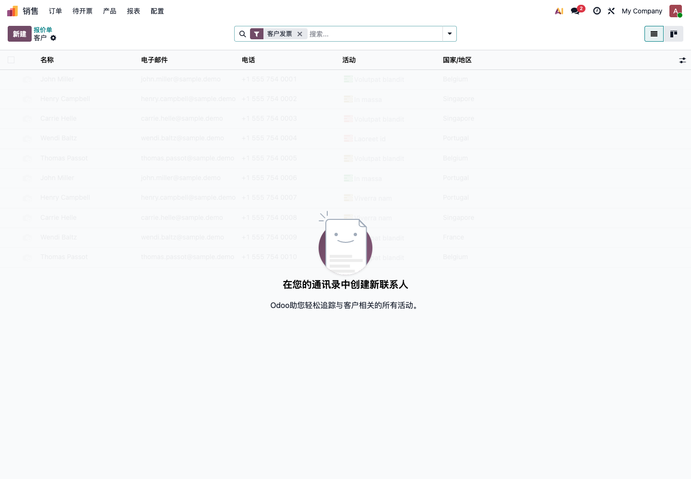
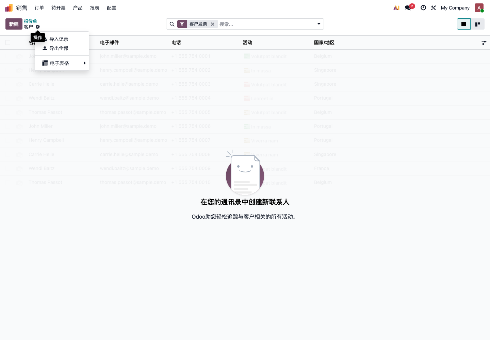
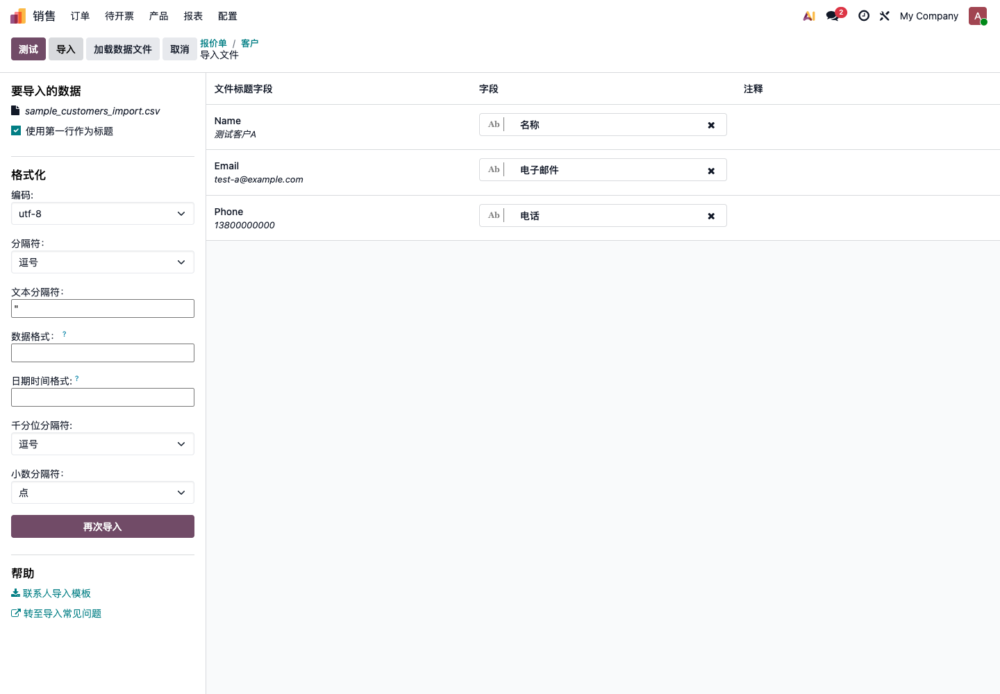
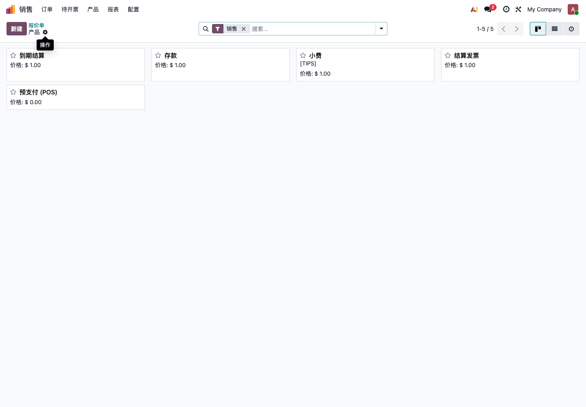

# 第六章 导入与导出

Odoo原生支持数据的导入与导出。企业在上线前通常需要把客户、供应商、产品、库存和财务期初数据整理进系统；上线后，也经常需要通过导出数据进行检查、清洗和批量更新。本章我们就来看一下如何使用Odoo原生的导入导出功能，以及导入前后需要注意哪些风险。

导入不是复制粘贴。导入前要先清洗数据、准备字段、在测试库试导入，确认没问题后再进入正式库。

## 导入导出在哪里

Odoo的导入导出通常出现在列表视图中。以客户列表为例，进入 **销售 -> 订单 -> 客户**，可以看到客户列表。

点击左上角操作菜单，可以看到 **导入记录**、**导出全部** 等功能。

不同模型的菜单略有不同。客户、产品、供应商、销售订单、采购订单、库存调整等列表，大多都可以通过类似方式导入或导出。

## 什么数据适合导入

适合导入：

- 客户；
- 供应商；
- 产品；
- 产品类别；
- 价格表；
- 供应商价格；
- 期初库存；
- 期初应收应付；
- 未完成销售订单；
- 未完成采购订单。

不建议第一期导入：

- 多年前的无效客户；
- 已停用产品；
- 已结清的历史单据明细；
- 无法确认来源的库存；
- 重复严重的联系人；
- 没有负责人确认的旧系统字段。

第一期导入的目标不是“搬空旧系统”，而是让新系统能从上线日开始稳定运行。

## 导入前准备

导入前先做四件事：

1. 确认导入范围；
2. 清洗 Excel；
3. 准备测试导入文件；
4. 在测试库中先试导入。

不要直接在正式库第一次导入。哪怕只是客户和产品，也应该先在测试库试一次。

## 下载导入模板

进入导入页面后，Odoo会提示上传 Excel 或 CSV 文件。部分模型会提供导入模板，例如联系人导入模板。

建议第一次导入前先下载模板。模板的价值是让客户知道Odoo期待哪些字段，以及字段名称应该怎么写。

模板不是强制要求。只要 Excel 字段能正确匹配Odoo字段，也可以使用自己整理的文件。但对小白客户来说，从模板开始最稳。

## 导入文件字段

导入文件的列名最好和Odoo字段含义一致。

客户导入常用字段：

| 字段 | 示例 |
| --- | --- |
| 名称 | 青岛欧姆网络科技 |
| 公司/个人 | 公司 |
| 邮箱 | info@example.com |
| 电话 | 0532-xxxxxxx |
| 手机 | 13800000000 |
| 街道 | 市南区某某路 |
| 城市 | 青岛 |
| 省份 | 山东 |
| 国家 | 中国 |
| 税务识别码 | 统一社会信用代码 |
| 标签 | VIP, 批发客户 |

产品导入常用字段：

| 字段 | 示例 |
| --- | --- |
| 产品名称 | A001 手机壳 |
| 内部参考 | A001 |
| 条码 | 697000000001 |
| 产品类型 | 实物 |
| 可销售 | 是 |
| 可采购 | 是 |
| 销售价格 | 99 |
| 成本 | 45 |
| 产品类别 | 成品 |
| 销售税 | 13% |
| 采购税 | 13% |

导入前先确认字段含义，不要看到名字相似就随便匹配。

## 上传文件和字段匹配

上传 Excel 或 CSV 后，Odoo会进入字段匹配页面。

左侧是导入文件和格式设置，右侧是字段匹配结果。

需要重点检查：

| 区域 | 要检查什么 |
| --- | --- |
| 文件标题字段 | 第一行是否作为标题 |
| 编码 | 中文是否乱码，通常使用 utf-8 |
| 分隔符 | CSV 文件常见为逗号 |
| 字段 | Excel 列是否匹配到正确Odoo字段 |
| 注释 | 是否有错误、警告或无法识别字段 |

上图中，文件里的 `Name`、`Email`、`Phone` 分别匹配到了Odoo的名称、电子邮件、电话字段。这种匹配是正确的。

如果字段没有自动匹配，可以手动选择对应字段。不要为了通过导入，随便把不确定的列匹配到看起来相似的字段。

## 先测试，再导入

字段匹配完成后，先点击 **测试**，不要直接点 **导入**。

测试会检查：

- 字段是否存在；
- 数据格式是否正确；
- 关联字段是否能匹配；
- 必填字段是否缺失；
- 日期、数字、金额是否能解析；
- 是否有明显错误。

测试通过后，再点击 **导入**。如果测试不通过，要根据错误提示修改 Excel，再重新上传。

正式库导入前，最好先备份。尤其是客户、产品、库存、财务余额这类核心数据。

## 产品导入示例

产品也可以从产品列表进入导入导出。

产品导入比客户导入更敏感，因为产品会影响销售、采购、库存、POS、生产和财务。

产品导入前要特别确认：

- 产品类型是实物、服务还是组合；
- 是否可销售、可采购；
- 单位是否正确；
- 销售税、采购税是否正确；
- 产品类别是否已经创建；
- 条码是否唯一；
- 内部参考是否唯一；
- 成本和售价是否经过确认。

如果产品导错，后续订单、库存和成本都会受影响。

## 关联字段

导入时最容易出错的是关联字段。

例如产品导入中的产品类别、税率、单位，客户导入中的国家、省份、标签，都不是普通文本，而是要关联到Odoo已经存在的资料。

建议做法：

- 先在Odoo中创建好类别、税率、单位等基础资料；
- Excel 中使用和Odoo完全一致的名称；
- 不确定时先导出一份Odoo示例数据；
- 不要在同一列里混用简称、全称和别名。

如果关联字段匹配失败，导入会失败，或者生成错误的新资料。

## 外部 ID

外部 ID 是Odoo用来识别导入记录的技术编号。

小白客户可以先这样理解：

- 没有外部 ID 时，导入通常会创建新记录；
- 有外部 ID 且匹配已有记录时，导入可以更新已有记录；
- 外部 ID 适合后续反复更新同一批数据。

如果只是第一次少量导入，可以先不使用外部 ID。但如果要长期通过 Excel 更新产品价格、客户资料，建议让实施人员设计外部 ID 规则。

## 导出数据

导出常用于：

- 批量检查数据；
- 在 Excel 中清洗资料；
- 做备份和留档；
- 批量修改后再导入更新；
- 给其他系统或人员使用。

在列表中选中记录后，可以从操作菜单导出。也可以使用 **导出全部** 导出当前模型数据。

导出时要注意数据权限。普通员工不一定应该导出全部客户、价格、财务数据。

## 导出后再更新

常见操作是：

1. 从Odoo导出产品或客户；
2. 在 Excel 中修改价格、电话、标签等字段；
3. 再导入Odoo更新。

这种方式很方便，但也有风险。

注意事项：

- 不要删除关键识别字段；
- 不要修改外部 ID；
- 不要改变产品编码规则；
- 不要用空值覆盖已有重要字段；
- 导入前先备份；
- 先在测试库试导入。

如果要更新价格，建议只保留产品识别字段和价格字段，不要把不相关字段一起导入。

## CSV、Excel 和中文乱码

Odoo支持 Excel 和 CSV。对国内客户来说，优先建议使用 Excel 文件，因为格式更稳定。

如果使用 CSV，要注意：

- 编码建议使用 utf-8；
- 分隔符通常是逗号；
- 中文不要乱码；
- 日期格式要统一；
- 金额不要混用中文符号；
- 数字不要被 Excel 自动改成科学计数法。

如果上传后中文变成乱码，优先检查编码设置。

## 导入后的抽查

导入完成后必须抽查。

| 数据 | 抽查内容 |
| --- | --- |
| 客户 | 名称、邮箱、电话、地址、标签 |
| 供应商 | 名称、付款条件、联系方式 |
| 产品 | 编码、类型、价格、成本、税率 |
| 库存 | 产品、仓库、库位、数量 |
| 财务 | 客户、供应商、金额、日期 |

抽查不是看导入成功提示，而是打开实际记录确认业务能用。

## 常见错误

| 错误 | 后果 |
| --- | --- |
| 客户重复 | 应收账款和销售历史分散 |
| 产品重复 | 库存和销售统计混乱 |
| 产品类型错误 | 实物不扣库存，服务要求发货 |
| 税率错误 | 发票金额和税额错误 |
| 单位错误 | 库存数量和采购数量不一致 |
| 编码缺失 | 后续无法准确匹配更新 |
| 日期格式错误 | 单据日期导入异常 |
| 空值覆盖 | 原有资料被清空 |
| 关联字段匹配失败 | 类别、税率、国家等无法正确关联 |
| 直接正式库导入 | 错误数据进入生产环境，回滚困难 |

导入失败不可怕，可怕的是导入成功但数据是错的。

## 导入验收标准

| 检查项 | 通过标准 |
| --- | --- |
| 数量 | 导入数量和 Excel 数量一致 |
| 字段 | 关键字段进入正确位置 |
| 关联 | 类别、税率、单位、国家等匹配正确 |
| 去重 | 没有明显重复客户或产品 |
| 抽查 | 随机记录打开后内容正确 |
| 业务测试 | 导入的客户和产品可以创建订单 |
| 权限 | 只有合适的用户可以导入和导出敏感数据 |
| 备份 | 正式导入前已有备份或可回滚方案 |

导入导出是好工具，但它会放大数据质量。数据越干净，导入越省心；数据越乱，导入越容易变成项目事故。
