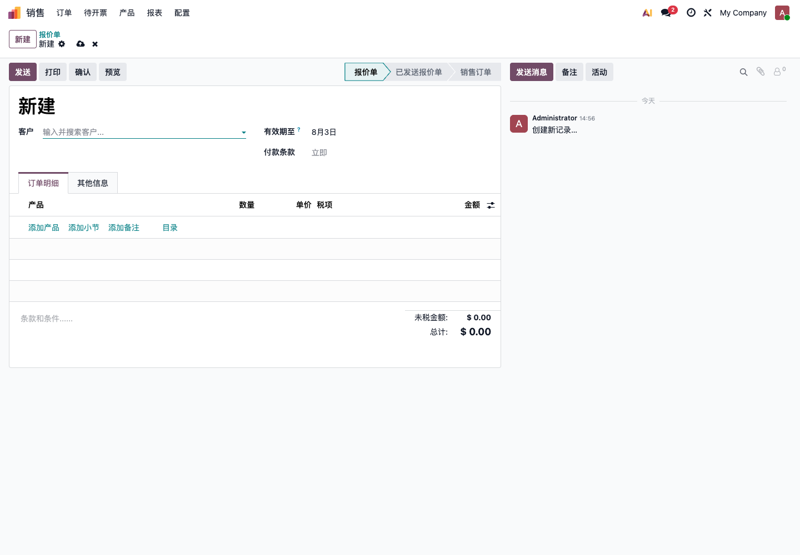
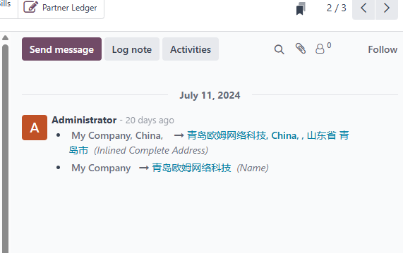
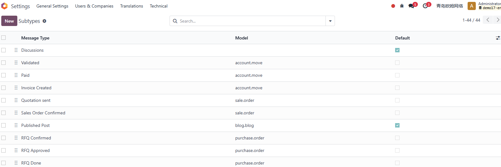
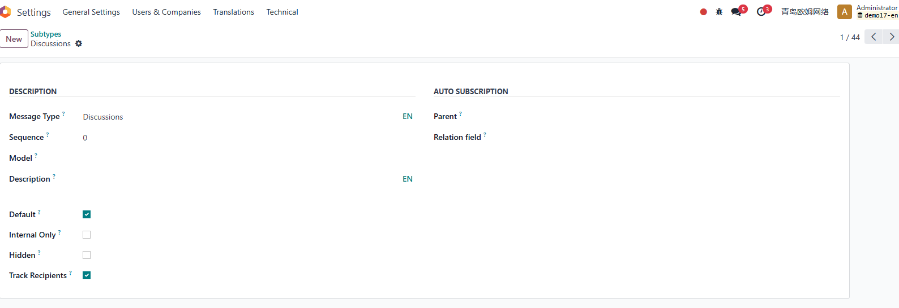
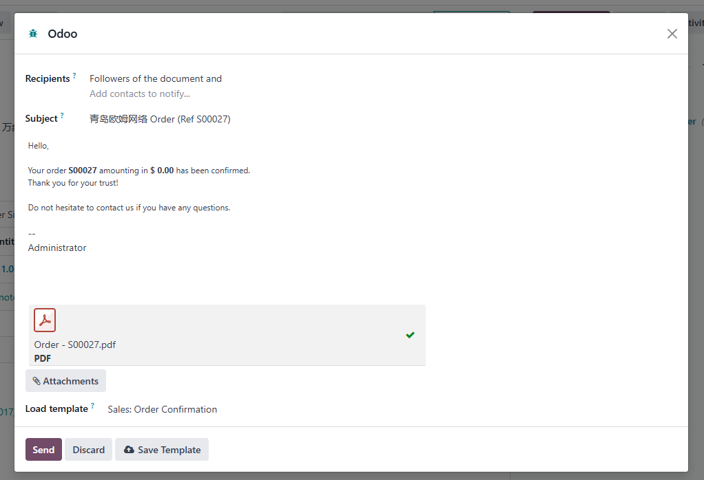
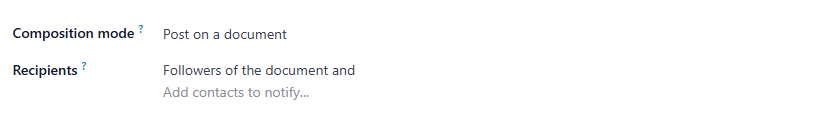

# 第八章 消息与讨论

Odoo 很多单据右侧都有消息区。这个区域常被称为 Chatter，可以用来记录沟通、发送邮件、添加备注、安排活动和查看附件。

消息区不是装饰，它是 Odoo 协同工作的核心。

## 消息区在哪里

在报价单、销售订单、客户、发票、项目任务等表单右侧，通常可以看到 **发送消息、备注、活动**。

常见按钮：

| 按钮 | 用途 |
| --- | --- |
| 发送消息 | 给客户或关注者发送邮件，并记录在单据上 |
| 备注 | 只记录内部备注，通常不发给客户 |
| 活动 | 安排待办事项，例如电话、邮件、会议 |
| 附件 | 上传或查看单据附件 |
| 关注者 | 谁会收到这张单据的相关通知 |

不同模块的消息区样式可能略有差异，但基本逻辑一致。

## 发送消息和备注的区别

这是小白客户最容易混淆的地方。

| 类型 | 是否对外 | 典型用途 |
| --- | --- | --- |
| 发送消息 | 可能发给客户或关注者 | 发送报价、解释订单、回复客户 |
| 备注 | 通常仅内部可见 | 内部说明、风险提示、交接记录 |

如果内容不希望客户看到，优先使用 **备注**。如果要正式发给客户，使用 **发送消息**。

在正式上线前，建议测试不同角色发送消息后，客户是否真的收到邮件。

## 活动是什么

活动是 Odoo 的待办提醒。

常见活动：

- 打电话；
- 发送邮件；
- 安排会议；
- 上传文件；
- 跟进报价；
- 催收付款；
- 审核资料。

活动适合把“记得跟进一下”变成系统可追踪的任务。

例如销售创建报价后，可以给自己安排一个 3 天后的跟进电话。到期后，系统会提醒销售处理。

## 关注者

关注者是会收到单据消息或提醒的人。

默认情况下，创建单据的人、客户、负责人或相关用户可能会被自动加入关注者。

关注者适合：

- 销售关注自己的报价；
- 财务关注客户发票；
- 项目成员关注任务；
- 客户通过门户收到订单和发票更新。

关注者太多会造成邮件轰炸。上线前要测试哪些消息会通知哪些人。

## 附件

消息区也可以管理附件。

常见附件：

- 客户合同；
- 报价 PDF；
- 发票 PDF；
- 送货签收单；
- 客户图片；
- 项目文件；
- 沟通记录。

附件上传后，通常会挂在对应单据上。不要把大量无关文件都上传到一个单据里，否则后面很难查找。

## 消息记录的价值

消息区最大的价值是留痕。

它可以回答这些问题：

- 这张报价是什么时候发给客户的；
- 客户是否回复过；
- 谁修改过单据；
- 内部谁备注了风险；
- 哪些附件和这张单有关；
- 哪个员工应该继续跟进；
- 客户是否收到门户链接。

对于销售、项目、售后、财务催收，这些记录很有价值。

## 邮件和消息区的关系

如果邮件配置正确，通过单据发送的邮件会记录在消息区。客户回复邮件后，也有机会回到同一张单据。

但是这依赖邮箱配置、回复地址、邮件服务器和 Odoo 邮件路由。邮件配置不完整时，消息区仍然可以记录内部备注和活动，但客户回复不一定能自动回到单据。

所以邮件和消息区要一起测试。

## 常见使用建议

- 客户能看到的内容要谨慎写；
- 内部讨论用备注，不要误发给客户；
- 重要电话沟通后写一条备注；
- 报价发出后安排跟进活动；
- 财务催款时记录沟通过程；
- 上传附件时命名清楚；
- 离职交接前检查关键客户的消息记录。

消息区用得好，可以减少微信群、个人邮箱和口头交接带来的信息丢失。

## 常见问题

| 问题 | 原因 | 建议 |
| --- | --- | --- |
| 客户没收到邮件 | 邮箱配置、垃圾箱、模板或收件人错误 | 先测试邮件配置 |
| 员工收到太多提醒 | 关注者过多或子类型订阅太多 | 清理关注者和通知设置 |
| 内部备注发给客户 | 使用了发送消息而不是备注 | 培训员工区分按钮 |
| 找不到附件 | 上传到错误单据或命名混乱 | 统一附件命名规则 |
| 活动没人处理 | 没有负责人或到期提醒 | 明确活动负责人 |

## 上线前测试

上线前建议测试：

| 测试项 | 通过标准 |
| --- | --- |
| 发送消息 | 客户可以收到邮件 |
| 内部备注 | 客户不会收到内部备注 |
| 活动 | 到期后负责人能看到提醒 |
| 附件 | 上传后可以正常下载 |
| 关注者 | 只有需要的人收到通知 |
| 客户回复 | 如果启用收件，回复能回到对应单据 |

消息区是 Odoo 的“业务记忆”。如果团队愿意把关键沟通记录在单据上，后续管理会轻松很多。

## 消息通知为什么能自动跟随单据

当团队开始大量使用消息区后，经常会遇到一个问题：为什么有些消息会通知客户，有些只在内部显示？这背后和 Odoo 的邮件线程、关注者、消息子类型有关。从技术上看，很多 Odoo 单据之所以有消息区，是因为模型继承了邮件线程能力。表单右侧会出现发送消息、备注、活动、附件、关注者等功能。

### 消息子类型

Odoo 会通过消息子类型区分不同类型的消息和通知。

消息子类型配置示例：

常见字段含义：

| 字段 | 说明 |
| --- | --- |
| 消息类型 | 子类型名称 |
| 序列 | 显示顺序 |
| 模型 | 该子类型适用的模型，空值表示更通用 |
| 默认 | 关注时是否默认订阅 |
| 仅内部 | 是否只对内部用户可见 |
| 隐藏 | 是否在关注者设置中隐藏 |
| 父级 | 订阅父类型时是否联动订阅子类型 |

原生常见子类型包括讨论、活动、备注等。实施时一般不建议小白客户直接改这些配置，但顾问和开发人员需要理解它们，否则会很难解释“为什么某些消息会通知客户，某些只在内部显示”。

## 邮件撰写向导和收件人控制

Odoo 在多个业务对象中使用邮件撰写向导发送邮件。

向导通常包含：

- 收件人；
- 邮件主题；
- 邮件正文；
- 邮件模板；
- 附件；
- 发送按钮。

邮件撰写背后有不同模式，例如评论模式和群发模式。评论模式会把消息贴到当前文档消息区，并可能通知关注者；群发模式更偏批量邮件，不一定使用同样的消息子类型。

如果客户问“为什么这个人也收到了邮件”，通常要检查三件事：

- 邮件向导里的收件人；
- 当前单据的关注者；
- 消息子类型和模板设置。
