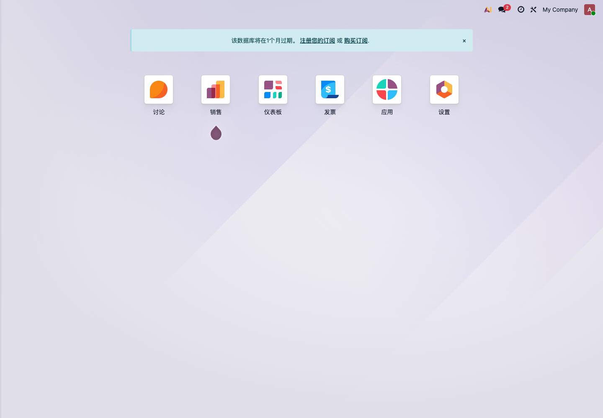

# 第一章 Odoo 简介

Odoo 是一套企业应用系统。它不是单一的进销存软件，也不是单一的财务软件，而是由很多应用模块组成的业务平台。

对小白客户来说，可以先把 Odoo 理解成一套可以逐步启用的企业管理工具：先把销售、采购、库存、财务跑起来，再根据业务需要扩展网站、POS、生产、项目、人事、审批和各种接口。

## Odoo 可以做什么

进入 Odoo 后，通常会看到应用首页。



常见应用包括：

| 应用 | 主要用途 |
| --- | --- |
| 销售 | 报价、销售订单、客户管理、销售报表 |
| 采购 | 询价、采购订单、供应商管理 |
| 库存 | 收货、发货、调拨、盘点、批次序列号 |
| 发票/会计 | 客户发票、供应商账单、付款、银行对账 |
| CRM | 线索、商机、销售跟进 |
| POS | 门店收银、退货、交班、会员和优惠 |
| 生产 | BOM、制造订单、工单、物料消耗 |
| 项目 | 任务、工时、项目交付 |
| 网站/电商 | 官网、商城、客户门户 |
| 员工 | 员工档案、请假、招聘、薪酬等 |

企业不需要第一天把所有应用都装上。第一次实施，应该围绕主业务流程选择最少模块。

## Odoo 的三个关键词

### 模块化

Odoo 的功能按应用模块组织。销售、采购、库存、财务可以独立使用，也可以连接成完整流程。

例如贸易企业常见流程：

```text
客户报价 -> 销售订单 -> 采购补货 -> 入库 -> 发货 -> 开票 -> 收款
```

这条流程会同时用到销售、采购、库存和财务。

### 集成

Odoo 的模块不是孤立的。一个产品资料可以同时用于销售、采购、库存、POS 和生产。一个客户资料可以同时用于报价、发票、门户和售后。

这也是为什么基础数据很重要。基础数据整理好，后面模块就顺；基础数据混乱，所有模块都会被拖累。

### 可扩展

Odoo 支持配置、第三方模块和定制开发。很多业务可以通过原生设置解决；少量行业差异可以通过模块或开发扩展。

自主实施时建议遵守一个顺序：

1. 先用原生功能跑通主流程；
2. 再判断哪些地方确实不适合；
3. 最后再考虑定制开发或接口。

不要一开始就要求 Odoo 和旧系统一模一样。这样会把项目拖进大量低价值定制。

## Odoo 的版本

Odoo 通常分为社区版和企业版。

| 版本 | 特点 |
| --- | --- |
| 社区版 | 开源免费，适合基础业务和可自行维护的团队 |
| 企业版 | 官方收费，包含更多高级功能、移动端、官方升级服务和企业应用 |

如果企业要使用完整会计、移动端、Studio、Odoo.sh、官方升级服务等，通常会考虑企业版。

具体价格会随官方政策变化，报价前应以 Odoo 官方网站或正式合同为准。

## Odoo 的部署方式

常见部署方式有三种：

| 部署方式 | 适合场景 |
| --- | --- |
| Odoo Online | 使用官方标准 SaaS，不安装第三方模块，适合标准化需求 |
| Odoo.sh | 官方托管开发平台，适合企业版加定制模块 |
| 自部署 | 自己服务器部署，适合需要深度控制、第三方模块或本地化运维的企业 |

国内客户还要考虑网络、邮件、短信、支付、物流、备案、服务器运维和备份策略。部署方式不要只看软件费用，还要看后续维护成本。

## 第一次实施应该从哪里开始

第一次实施不要从“我要装哪些模块”开始，而要从业务主线开始。

常见主线：

| 企业类型 | 优先主线 |
| --- | --- |
| 贸易批发 | 销售、采购、库存、财务 |
| 零售门店 | POS、产品、库存、收款 |
| 制造企业 | 产品、BOM、库存、采购、生产 |
| 服务公司 | CRM、销售、项目、工时、开票 |
| 电商企业 | 产品、订单、库存、物流、对账 |

第一期目标应该是主流程可用，而不是所有细节都完美。

## 学习 Odoo 的正确顺序

建议按下面顺序学习：

1. 基础数据：公司、用户、客户、产品；
2. 销售流程：报价、订单、发货、开票；
3. 采购流程：询价、采购、收货、供应商账单；
4. 库存流程：仓库、库位、调拨、盘点；
5. 财务流程：发票、付款、银行对账、报表；
6. 权限和报表：岗位权限、老板报表、部门统计；
7. 二期优化：自动化、接口、行业定制。

本手册也会按照这个思路展开。先打地基，再跑业务，再做优化。

## 常见误区

- 第一天就安装所有模块；
- 没有清洗客户和产品资料就开始导入；
- 只让管理员测试，不让真实岗位员工测试；
- 还没跑通原生流程就开始定制；
- 把中国税控发票和 Odoo 会计发票混为一谈；
- 长期让旧系统和 Odoo 同时录入同一类业务；
- 没有备份和上线切换计划。

Odoo 很灵活，但灵活不等于可以跳过实施顺序。对小白客户来说，最稳的方式是：先小范围跑通，再逐步扩展。
