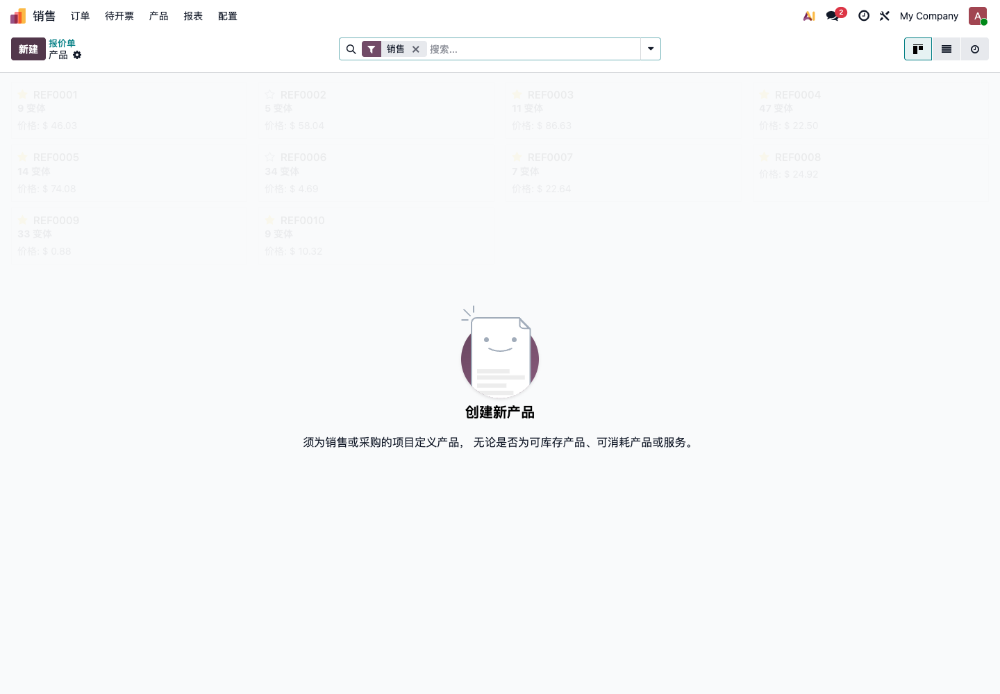
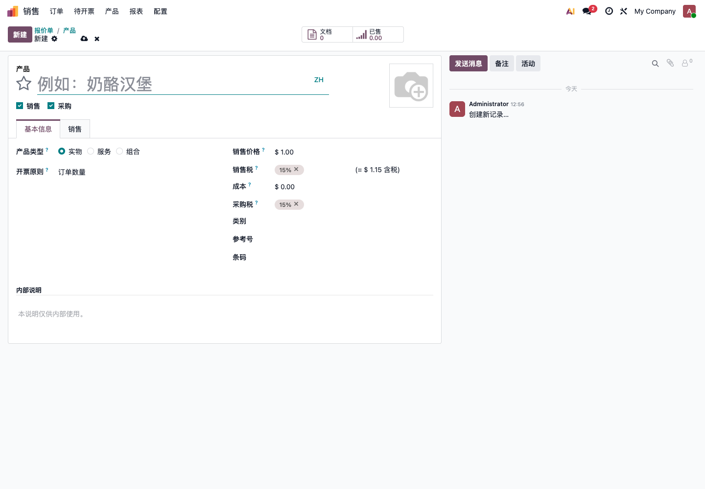

# 第五章 产品基础数据

产品是 Odoo 中连接销售、采购、库存、生产、POS 和财务的核心资料。产品建错了，后面的报价、库存、成本、发票都会受影响。

本章先讲自主实施最常用的产品配置，不展开复杂生产和库存规则。

## 进入产品列表

安装销售应用后，可以从 **销售 -> 产品 -> 产品** 进入产品列表。

也可以在采购、库存、POS、生产等模块中进入产品。不同模块看到的菜单入口不同，但背后使用的是同一套产品资料。

## 新建产品

点击 **新建** 可以创建产品。

第一期建议先维护必要字段，不要一开始就把所有字段都填满。

## 产品基础字段

| 字段 | 说明 | 建议 |
| --- | --- | --- |
| 产品名称 | 对内、对外显示的产品名称 | 必填，名称要稳定 |
| 销售 | 是否可以出现在销售订单中 | 可销售商品勾选 |
| 采购 | 是否可以出现在采购订单中 | 可采购商品勾选 |
| 产品类型 | 实物、服务、组合 | 会影响库存和业务流程 |
| 销售价格 | 销售订单默认价格 | 上线前抽查 |
| 成本 | 成本和毛利分析使用 | 财务或采购确认 |
| 销售税 | 销售发票税率 | 财务确认 |
| 采购税 | 供应商账单税率 | 财务确认 |
| 类别 | 产品分组和会计/库存规则 | 不要全部放默认类别 |
| 参考号 | 内部编码 | 建议唯一 |
| 条码 | 扫码、POS、仓库使用 | 有条码业务时必填 |

产品编码、名称和类别最好在导入前统一规则。不要让同一个产品同时出现“苹果手机壳”“iPhone Case”“IPHONE壳”三种写法。

## 产品类型

产品类型非常重要。

| 类型 | 适用场景 | 影响 |
| --- | --- | --- |
| 实物 | 有库存的商品、原材料、成品 | 会参与库存收发 |
| 服务 | 咨询、安装、运费、人工服务 | 通常不产生库存移动 |
| 组合 | 套餐、组合销售 | 适合特定组合场景 |

常见错误：

- 把实物商品建成服务，导致销售后库存不减少；
- 把服务建成实物，导致系统要求发货；
- 产品类型上线后频繁修改，造成历史单据口径混乱。

如果产品需要库存管理，一般应使用 **实物**。

## 可销售和可采购

产品表单上的 **销售** 和 **采购** 决定产品是否用于对应流程。

| 勾选方式 | 适用场景 |
| --- | --- |
| 只勾销售 | 只卖不买，例如服务产品 |
| 只勾采购 | 只采购不销售，例如办公用品 |
| 销售和采购都勾 | 贸易商品、可买可卖商品 |
| 都不勾 | 暂停使用或内部资料 |

如果产品无法在销售订单中选择，先检查是否勾选了销售。如果无法在采购订单中选择，先检查是否勾选了采购。

## 产品类别

产品类别不是简单的分类名称，它还可能影响库存估值、会计科目和报表统计。

第一期可以先设置几类：

- 成品；
- 原材料；
- 包材；
- 服务；
- 运费；
- POS 商品；
- 备件；
- 耗材。

不要所有产品都放在同一个“所有”类别里。后面做库存和财务分析时，会很难拆分。

## 单位和计量

产品单位影响销售数量、采购数量、库存数量和价格。

常见单位：

- 件；
- 箱；
- 公斤；
- 米；
- 套；
- 小时；
- 次。

上线前要确认：

| 问题 | 示例 |
| --- | --- |
| 销售单位和库存单位是否一致 | 按箱卖，按件库存 |
| 采购单位和库存单位是否一致 | 按公斤采购，按克库存 |
| 是否需要第二单位 | 布料按米和公斤双单位管理 |
| 是否需要包装单位 | 一箱 24 件 |

如果业务有复杂单位换算，不要只靠产品名称备注解决，应先评估 Odoo 单位、包装或定制方案。

## 产品变体

如果同一个产品有颜色、尺码、规格，可以使用产品变体。

适合变体的场景：

- 服装颜色和尺码；
- 手机容量和颜色；
- 食品规格；
- 材料厚度和尺寸。

不适合滥用变体的场景：

- 每个客户一个定制品；
- 每个订单规格都不同；
- 只是想把产品名称写短；
- 变体组合数量过多，实际很少使用。

变体会影响销售、采购、库存和条码。第一期如果不确定，可以先用普通产品跑通流程，再规划变体。

## 条码

条码常用于：

- POS 收银；
- 仓库扫码收货；
- 仓库扫码发货；
- 盘点；
- 快速搜索产品。

如果企业要使用 POS 或条码仓库，产品条码必须提前整理。一个条码不要对应多个产品，否则扫码会混乱。

## 产品图片

产品图片不是必填，但对 POS、网站商城、销售展示很有帮助。

建议：

- POS 和网站商品尽量上传图片；
- 内部耗材可以不上传；
- 图片大小适中，不要上传特别大的原图；
- 同类产品图片风格尽量统一。

## 产品验收清单

产品资料导入或录入后，建议抽查：

| 检查项 | 通过标准 |
| --- | --- |
| 名称 | 命名统一，没有明显重复 |
| 编码 | 关键产品有唯一内部编码 |
| 类型 | 实物和服务区分正确 |
| 销售/采购 | 能在正确单据中选择 |
| 价格 | 售价和成本已抽查 |
| 税率 | 销售税和采购税正确 |
| 类别 | 产品分类能支持报表分析 |
| 单位 | 销售、采购、库存单位符合业务 |
| 条码 | 需要扫码的产品条码唯一 |

产品是后续模块的共同基础。宁可第一期少导入一些高质量产品，也不要一次导入大量脏数据。
