# 第四章 联系人与合作伙伴

联系人是 Odoo 中最基础、也最容易混淆的数据。客户、供应商、联系人、发票地址、送货地址，在 Odoo 里都属于联系人体系。

理解联系人，后面的销售、采购、库存、财务和门户都会轻松很多。

## 联系人是什么

在 Odoo 中，一个联系人可以代表：

- 客户公司；
- 供应商公司；
- 某个具体联系人；
- 发票地址；
- 送货地址；
- 员工关联的联系人；
- 门户用户关联的联系人。

所以不要把“联系人”理解成通讯录那么简单。它是 Odoo 业务单据的核心主数据。

## 进入客户列表

安装销售应用后，可以从 **销售 -> 订单 -> 客户** 进入客户列表。

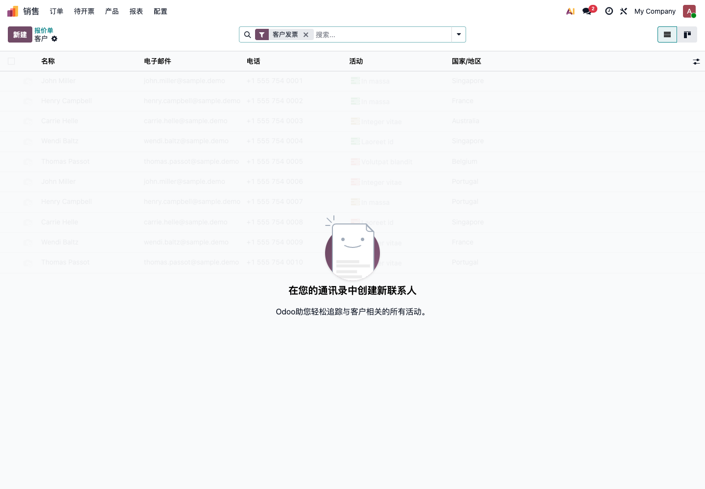

如果安装了 Contacts 应用，也可以从联系人应用统一维护客户、供应商和其他联系人。

## 新建公司客户

新建客户时，可以选择 **个人** 或 **公司**。

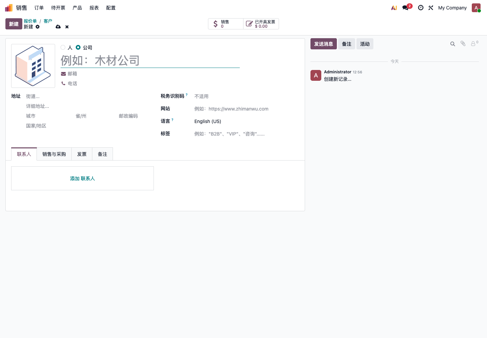

常见规则：

| 类型 | 适用场景 |
| --- | --- |
| 公司 | 客户主体、供应商主体、开票主体 |
| 个人 | 公司下的联系人、个人客户、业务联系人 |

如果客户是企业，建议先建公司，再在公司下面添加联系人。不要把同一家公司的采购、财务、老板分别建成三个独立客户。

## 客户和供应商不是两张表

Odoo 中客户和供应商本质上都是联系人。一个公司可以既是客户，也是供应商。

例如：

- A 公司向我们采购商品，所以它是客户；
- A 公司同时给我们提供维修服务，所以它也是供应商。

在销售订单中使用过的联系人，会表现为客户；在采购订单或供应商账单中使用过的联系人，会表现为供应商。不要为了区分客户和供应商，重复创建两条公司资料。

## 发票地址和送货地址

很多企业会遇到这种情况：客户总部负责付款，但货物送到不同仓库或门店。

正确做法是：

1. 建立客户公司；
2. 在客户公司下面添加联系人或地址；
3. 把地址类型设置为发票地址、送货地址或其他地址；
4. 在销售订单中选择正确的客户和送货地址。

常见地址类型：

| 类型 | 用途 |
| --- | --- |
| 联系人 | 公司下的联系人 |
| 发票地址 | 开票、对账、账务联系人 |
| 送货地址 | 仓库发货、物流配送 |
| 其他地址 | 备用地址、门店、临时地址 |

不要把同一个客户的不同送货地址都建成独立客户，否则应收账款和销售统计会被拆散。

## 联系人字段说明

建议至少维护这些字段：

| 字段 | 用途 |
| --- | --- |
| 名称 | 客户或供应商名称 |
| 邮箱 | 发送报价、订单、发票、门户邀请 |
| 电话 | 日常联系 |
| 地址 | 报价、发票、送货 |
| 税务识别码 | 财务和发票资料 |
| 网站 | 客户或供应商资料 |
| 语言 | 客户收到邮件和门户内容时使用 |
| 标签 | 客户分类、行业、等级、渠道 |

邮箱非常重要。没有邮箱，就无法顺利发送报价、发票、重置密码和门户邀请。

## 标签和分类

联系人标签适合做轻量分类。

常见标签：

- VIP；
- 批发客户；
- 零售客户；
- 代理商；
- 供应商；
- 门店客户；
- 海外客户；
- 需要月结；
- 需要特殊价格。

标签适合筛选和统计，但不要把复杂权限寄托在标签上。如果要按业务员、部门、公司隔离数据，需要进一步评估权限规则。

## 联系人去重

联系人重复会导致很多问题：

- 同一客户的销售订单分散在不同资料下；
- 应收账款统计不完整；
- 客户门户看到的资料不一致；
- 财务对账时找不到完整历史；
- 邮件沟通记录分散。

导入客户前必须先去重。

去重时重点检查：

| 检查项 | 示例 |
| --- | --- |
| 名称重复 | 青岛欧姆、青岛欧姆网络、欧姆网络科技 |
| 电话重复 | 同一个电话出现在多个客户 |
| 邮箱重复 | 同一个邮箱绑定多个客户 |
| 税号重复 | 同一税号对应多个公司 |
| 地址重复 | 同一地址建成多个送货客户 |

如果发现重复联系人，优先合并或停用，不要继续在重复资料上创建新订单。

## 用户、联系人和员工的关系

这三个概念经常被混在一起。

| 概念 | 说明 |
| --- | --- |
| 用户 | 可以登录 Odoo 的账号 |
| 联系人 | 公司、个人、客户、供应商、地址等资料 |
| 员工 | 人力资源模块中的员工档案 |

一个用户通常会关联一个联系人。安装员工模块后，一个员工也可以关联一个用户。

简单理解：

- 用户解决“谁能登录系统”；
- 联系人解决“业务单据上的客户、供应商和地址是谁”；
- 员工解决“公司内部人员的人事资料是谁”。

## 门户用户

门户用户也是基于联系人产生的。客户收到报价、订单或发票后，可以通过门户查看相关文件。

门户用户适合：

- 客户查看报价；
- 客户确认订单；
- 客户查看发票；
- 客户查看项目、工单或订阅；
- 供应商查看部分协作资料。

门户用户不是内部员工账号。门户用户不能像销售、仓库、财务那样进入后台处理业务。

## 地址和国家

Odoo 会根据国家显示不同的地址格式。国内客户通常需要注意：

- 国家/地区是否填写；
- 省份、城市、详细地址是否分开维护；
- 邮编是否需要；
- 发票地址和送货地址是否不同；
- 客户英文地址是否需要用于外贸单据。

如果企业对中国省市区联动、地图、物流面单有要求，通常需要本地化模块或定制模块支持。

## 联系人验收清单

联系人资料整理完成后，可以用下面标准验收：

| 检查项 | 通过标准 |
| --- | --- |
| 客户主体 | 同一个客户只有一个公司主体 |
| 联系人 | 公司下面有采购、财务、收货等联系人 |
| 地址 | 发票地址和送货地址区分清楚 |
| 邮箱电话 | 关键联系人有邮箱和电话 |
| 税务资料 | 需要开票的客户税务资料完整 |
| 标签 | 客户分类清晰，不滥用标签 |
| 门户 | 需要门户访问的联系人邮箱正确 |
| 去重 | 没有明显重复客户或供应商 |

联系人是后续业务的入口。只要联系人清楚，销售、采购、财务和门户都会顺很多。

## 客户和供应商为什么会在一起

很多新用户会问：为什么客户、供应商、联系人都在一个地方？这是 Odoo 联系人设计的核心。客户和供应商都基于 `res.partner`。早期版本曾经使用字段区分客户和供应商。

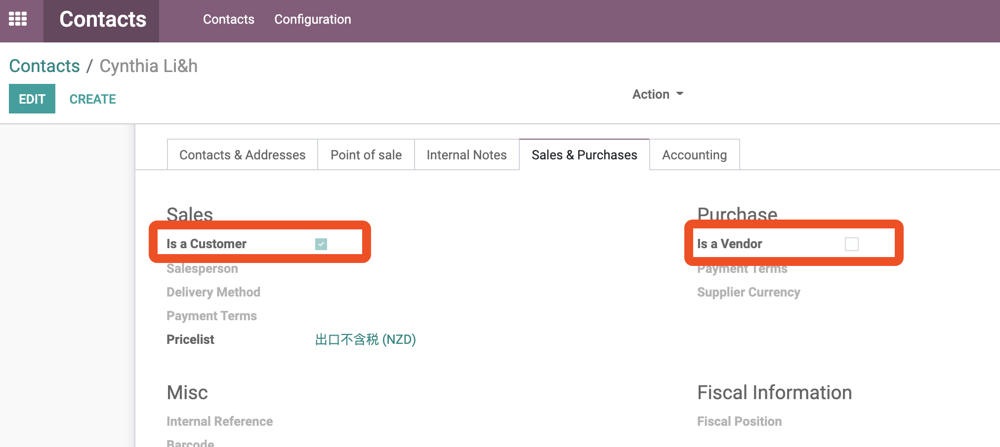

后来版本中，客户和供应商更多通过业务使用关系、客户排名、供应商排名等方式体现。

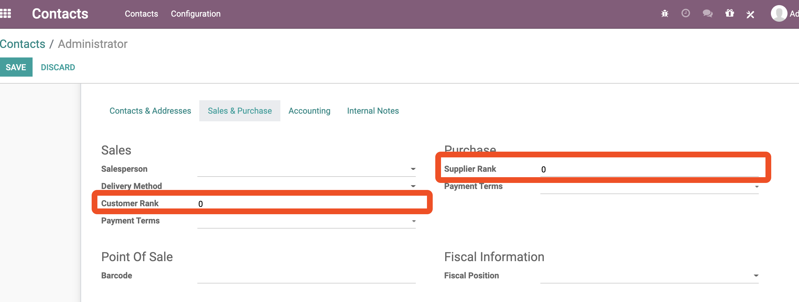

这意味着同一个合作伙伴可以同时是客户和供应商。实施时不要为了“客户一条、供应商一条”重复建档，否则会影响应收应付和业务历史统计。

## 用菜单和筛选区分客户供应商

为了方便国内客户快速区分客户和供应商，也可以通过菜单或筛选条件做分类入口。

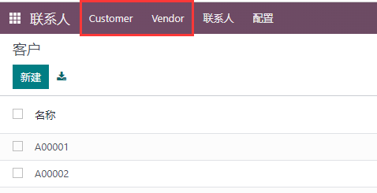

这种方式本质上是显示和筛选优化，不应该破坏 Odoo 原生联系人模型。

## 客户编码、别名和快速识别

如果客户数量很多，建议建立客户编码规则。Odoo 中常用字段是参考号或内部编码。

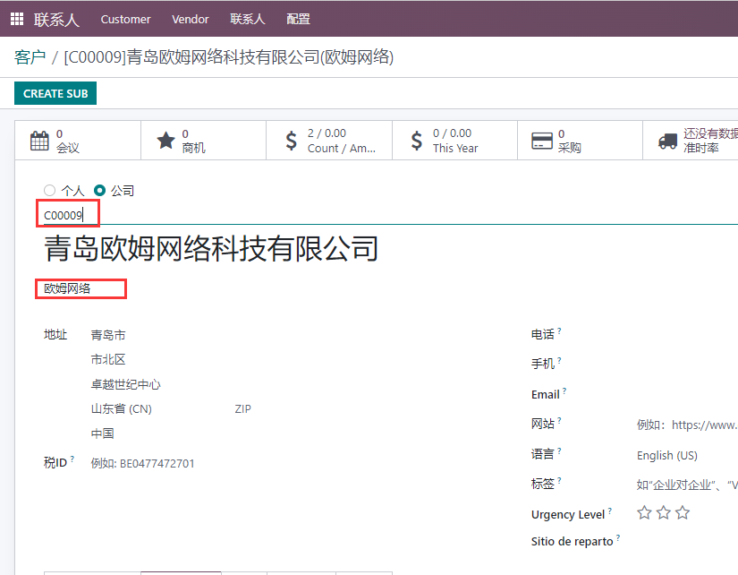

客户简称或别名可以帮助销售、仓库、财务快速识别客户。

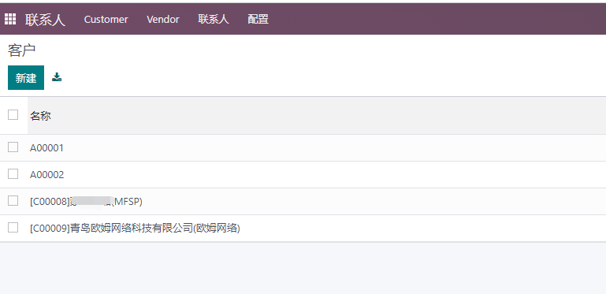

专业建议：

- 客户编码保持唯一；
- 不要把客户等级、地区、销售员都硬塞进编码；
- 编码用于识别，标签和字段用于分类；
- 编码规则上线前确定，后面不要频繁改。

## 公司和个人的隶属关系

客户可以是公司，也可以是个人。公司下面可以有多个联系人。

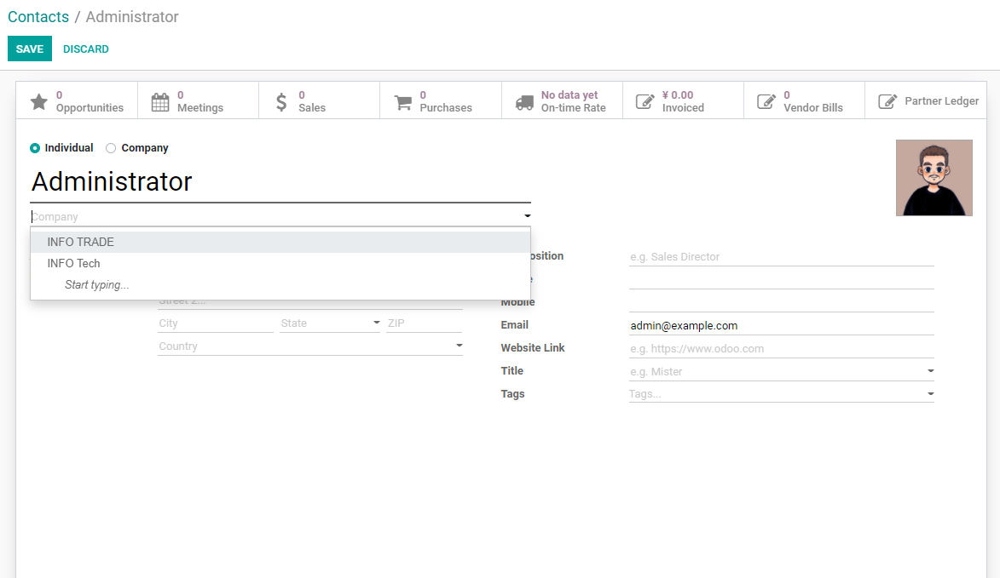

在业务单据中选择个人联系人时，Odoo 会体现其所属公司关系。

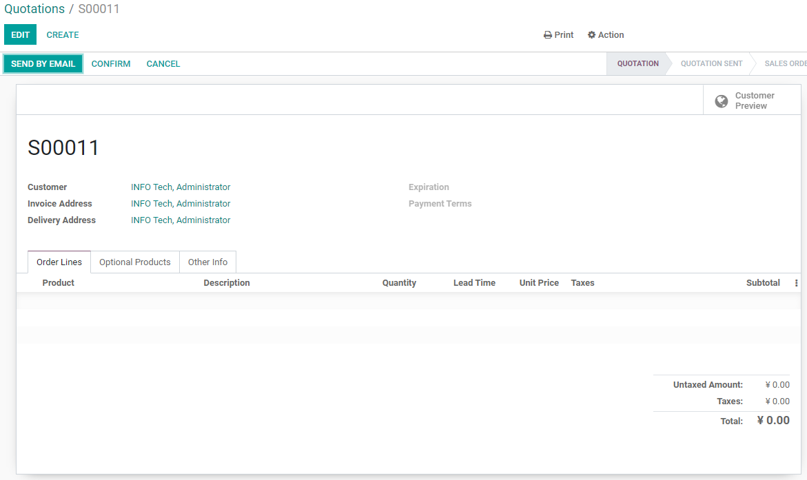

技术上常见字段包括 `is_company` 和 `company_type`。做开发时通常要注意公司和个人的判断逻辑，不要只按名称或标签判断客户类型。

## 地址类型如何影响业务单据

联系人不仅能表示客户主体，还能表示发票地址、送货地址、其他地址等。

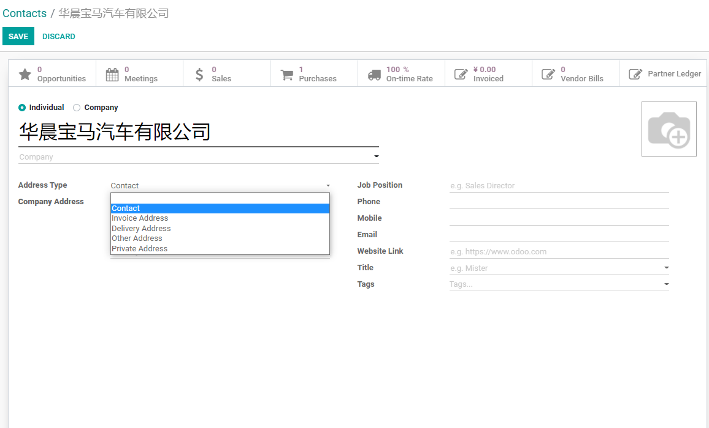

实施时要特别关注：

- 发票地址是否用于财务；
- 送货地址是否用于仓库和物流；
- 联系人是否只是沟通人；
- 私有地址是否涉及员工和隐私权限。

地址类型配置错误，会直接影响销售订单、发票和送货单。

## 用户、合作伙伴和员工不要混用

用户、联系人、员工是三个不同对象。

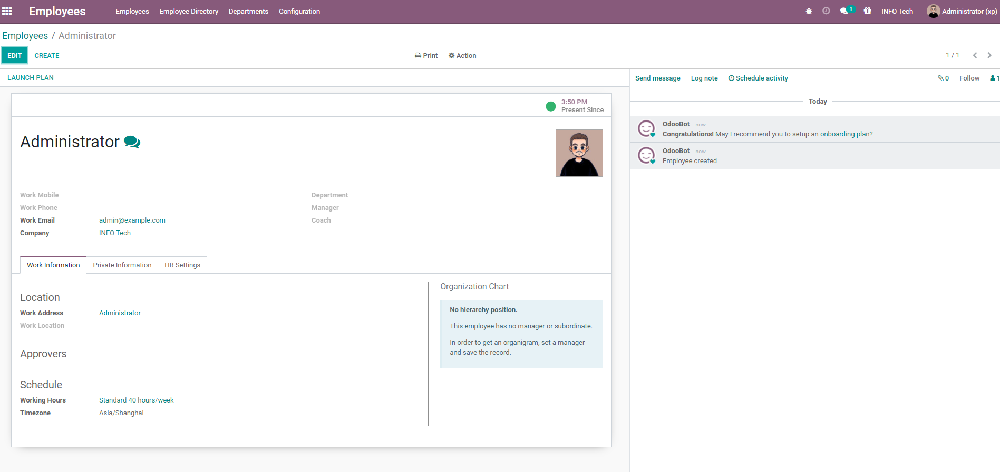

通常：

- `res.users` 表示登录账号；
- `res.partner` 表示联系人、客户、供应商、地址；
- `hr.employee` 表示员工档案。

一个用户通常关联一个联系人。安装 HR 后，员工也可以关联用户。权限通常跟用户有关，而不是直接跟员工部门自动绑定。

## 国家、城市和地址格式

联系人地址会受国家和地区配置影响。

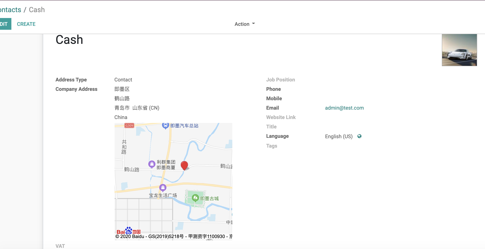

国家设置中可以定义地址输入视图和地址格式布局。

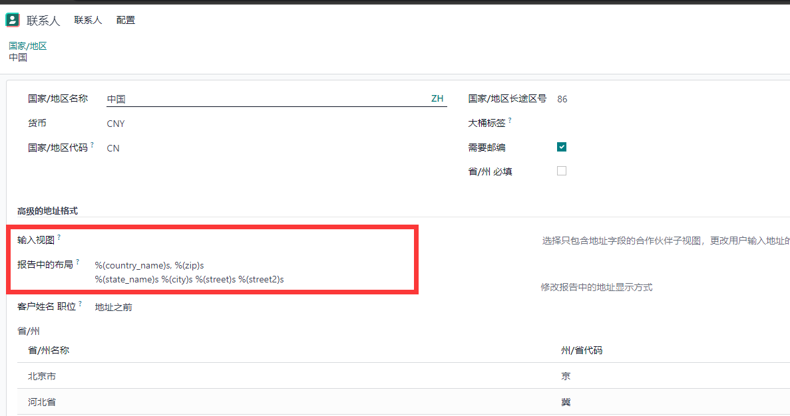

例如中国地址常见顺序更接近：

```text
国家 / 省份 / 城市 / 区县 / 街道 / 门牌号
```

而海外地址可能更重视邮编、州、省、城市顺序。外贸企业要特别关注中英文地址格式。

### 城市选择和扩展地址

Odoo 可以通过地址城市模块把城市从文本变为可选数据。

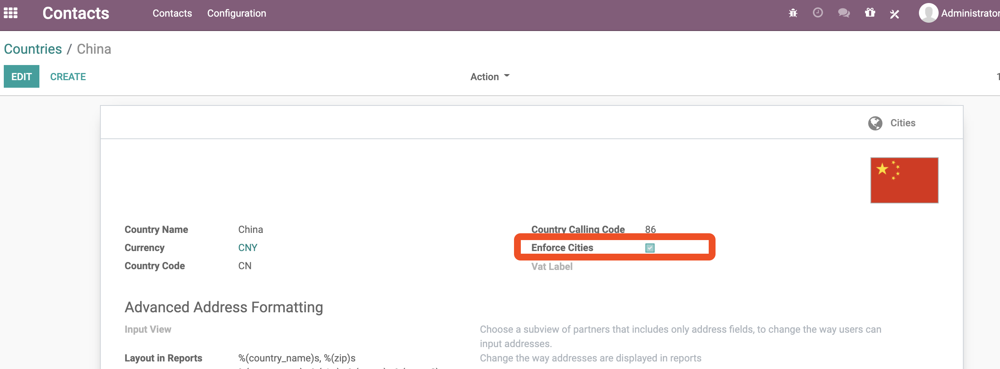

开启后，城市可以作为标准数据选择。

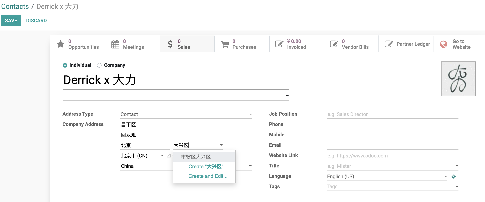

如果客户需要楼号、门牌号等更细地址，可以通过地址扩展模块实现。

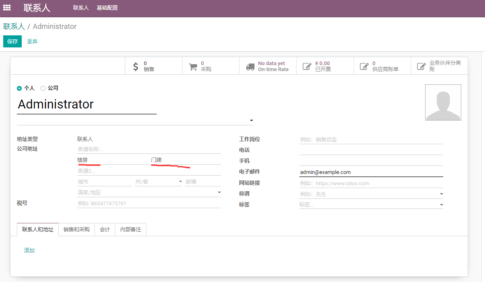

### 中国省市区联动

国内客户经常需要省、市、区县甚至乡镇联动。原生 Odoo 的地址能力不一定完全满足国内物流和发票要求。

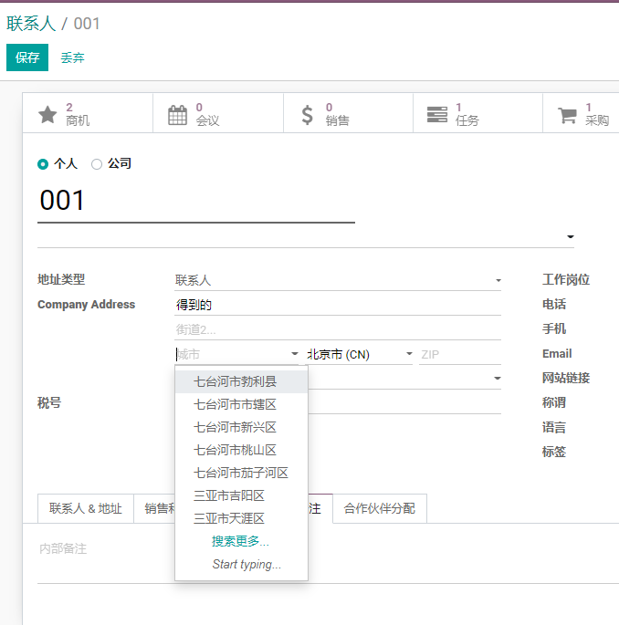

本地化模块可以提供更适合中国的行政区划联动。

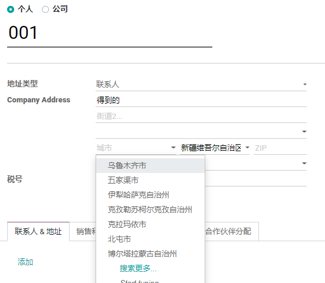

如果客户需要对接快递、电子面单、小程序地址、地图定位，这一块通常要提前评估。

## 地图模式适合什么场景

企业版中可能存在地图视图，用于按地理位置查看客户。

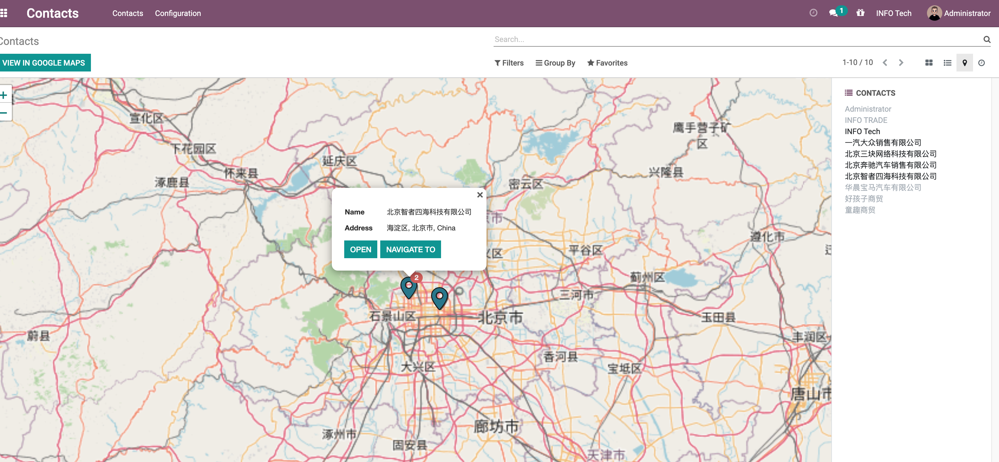

国内访问海外地图服务时可能不稳定，可以考虑本地地图服务替代方案。

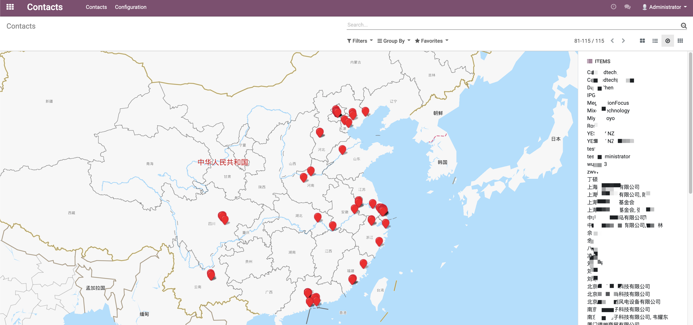

地图能力适合外勤、配送、客户拜访、区域销售等场景。

## VAT 校验和海外客户资料

Odoo 的本地化模块可能会启用不同国家的 VAT 税号格式校验。

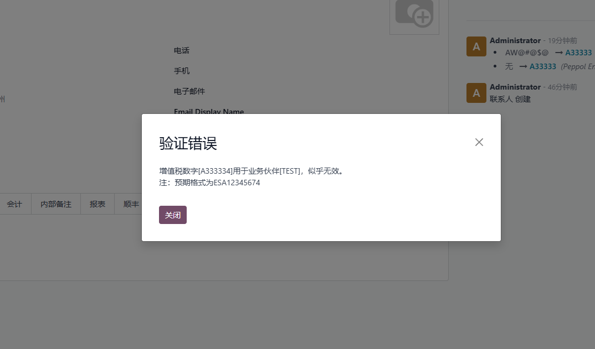

如果客户经常维护海外客户或供应商，VAT 格式校验可以减少错误。但如果客户数据来源复杂，也可能造成录入障碍。

部分方案可以提供 VAT 校验开关。

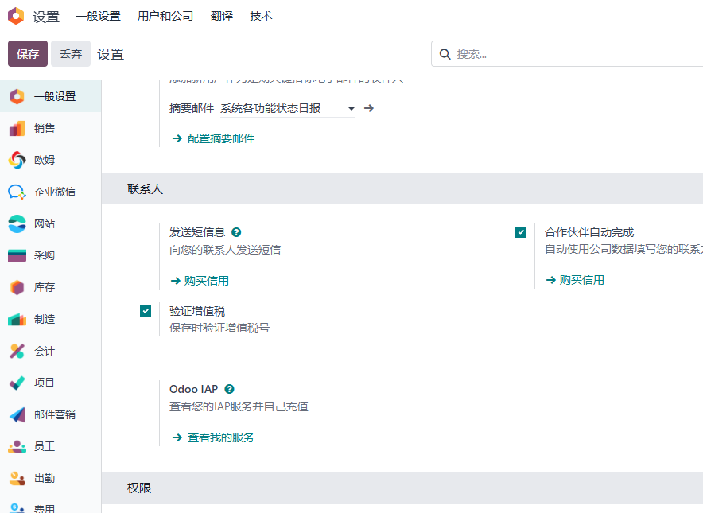

专业实施时要先确认：客户是否真的需要税号校验，哪些国家需要，错误数据如何清洗。
