# 第三章 公司与用户管理

创建数据库后，第一件事不是马上录订单，而是先设置公司、语言、用户和权限。这些资料会影响报价单、发票、邮件、报表和员工日常操作。

## 进入设置页面

在 Odoo 中，公司和用户通常从 **设置** 开始配置。

常用入口：

- **一般设置**：语言、公司、文档布局、计量单位、邮件等；
- **用户和公司**：管理用户、公司、多公司权限；
- **销售、发票等模块设置**：各应用自己的基础配置。

建议先完成公司和用户，再去配置销售、采购、库存和财务。

## 公司资料

公司资料会出现在对外文档中，例如报价单、销售订单、发票、交付单、邮件签名。

在 **设置 -> 一般设置 -> 公司** 中，可以点击 **更新信息** 或 **管理公司** 维护公司资料。

建议至少填写：

| 字段 | 用途 |
| --- | --- |
| 公司名称 | 报表抬头、单据主体 |
| 地址 | 报价单、发票、送货文件 |
| 电话和邮箱 | 客户联系、邮件模板 |
| 税务识别码 | 财务和发票相关资料 |
| 网站 | 对外文档和客户资料展示 |
| 银行账号 | 发票或付款说明中可能使用 |
| 公司 Logo | 报价单、发票、邮件模板 |

不要随便把分公司、门店、仓库都建成公司。Odoo 的“公司”通常代表独立核算主体。门店更适合在 POS 或仓库中配置，仓库应该在库存模块中配置。

## 文档布局

文档布局决定报价单、发票等 PDF 文件的外观。可以在设置中找到 **文档布局** 或 **设置文档外观**。

建议先选择一个简洁模板，确认：

- Logo 是否清晰；
- 公司名称和地址是否正确；
- 页脚联系方式是否正确；
- 报价单和发票打印后是否适合发给客户；
- 中英文显示是否正常。

文档布局不要在上线前频繁修改。已经发给客户的报价单和发票，最好保持前后一致。

## 语言和时区

国内客户通常需要中文界面。如果有外贸团队，也可以同时启用英文。

语言设置影响：

- 用户界面显示；
- 系统菜单翻译；
- 邮件模板语言；
- 客户门户显示；
- 部分 PDF 报表内容。

每个用户可以有自己的语言。公司默认语言不等于所有用户语言。给外贸员工配置英文界面，给国内员工配置中文界面，是可以同时存在的。

## 用户管理

用户是可以登录 Odoo 的账号。可以从 **设置 -> 用户和公司 -> 用户** 进入。

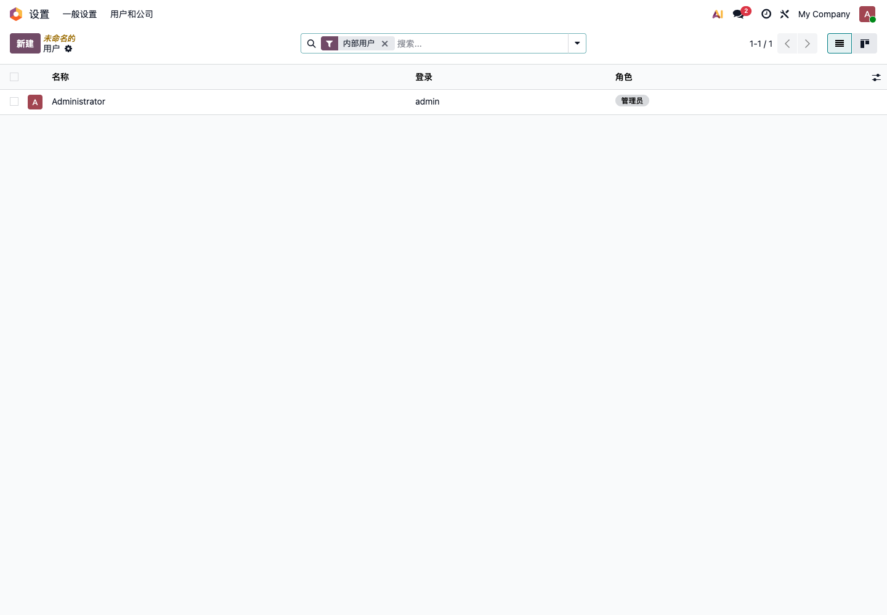

创建用户时，至少要确认：

| 字段 | 说明 |
| --- | --- |
| 姓名 | 员工显示名称 |
| 登录名 | 通常使用邮箱，也可以使用 admin 这类账号 |
| 邮箱 | 用于通知、重置密码、邮件发送 |
| 公司 | 多公司环境下尤其重要 |
| 权限 | 决定用户能访问哪些模块 |
| 语言 | 决定用户看到中文还是英文 |

不要让所有员工共用管理员账号。管理员账号只用于配置和排错，日常业务应该使用员工自己的账号。

## 用户类型

Odoo 中常见用户类型有三类：

| 类型 | 说明 | 典型用途 |
| --- | --- | --- |
| 内部用户 | 公司员工，可以访问后台应用 | 销售、采购、仓库、财务 |
| 门户用户 | 外部客户或供应商，只能访问门户 | 查看报价、订单、发票、工单 |
| 公共用户 | 未登录访客 | 网站访问、商城浏览 |

自主实施时，重点先配置内部用户。门户用户通常由客户邀请、网站注册或业务单据分享产生，不建议一开始手工大量创建。

## 权限设置原则

Odoo 的权限不是按“职位名称”自动决定的，而是由应用权限和用户组共同决定。

简单理解：

- 销售用户可以创建和处理自己的销售业务；
- 销售管理员可以看到更多销售配置和报表；
- 库存用户可以收货、发货、盘点；
- 财务用户可以处理发票、付款和对账；
- 系统管理员可以安装应用和修改系统设置。

权限建议按岗位设计，而不是按个人临时配置。

| 岗位 | 建议权限 |
| --- | --- |
| 销售 | 销售用户，客户资料维护 |
| 销售经理 | 销售管理员，销售报表和配置 |
| 采购 | 采购用户，供应商和采购订单 |
| 仓库 | 库存用户，收货、发货、盘点 |
| 财务 | 发票、付款、银行对账 |
| 老板 | 关键报表查看，必要审批 |
| 管理员 | 系统设置、模块安装、权限维护 |

权限不要一次给太大。给大了容易误删、误改；给小了员工做不了事。正确做法是先给岗位需要的权限，再用测试流程验证。

## 多公司

Odoo 支持多公司，但多公司会影响会计、库存、销售、采购、权限和报表。

适合启用多公司的场景：

- 有多个独立法人；
- 需要分别出财务报表；
- 不同公司之间有内部交易；
- 员工需要切换不同公司处理业务。

不建议启用多公司的场景：

- 只是多个门店；
- 只是多个仓库；
- 只是多个部门；
- 只是想把客户分类管理。

如果只是门店或仓库，优先使用 POS、仓库、库位、分析账户或标签，不要急着上多公司。

## 上线前检查

公司和用户配置完成后，可以用下面清单检查：

| 检查项 | 通过标准 |
| --- | --- |
| 公司资料 | 名称、地址、电话、邮箱、税号正确 |
| 文档布局 | 报价单和发票打印样式可接受 |
| 语言 | 中文用户能看到中文界面 |
| 用户 | 每个岗位都有自己的账号 |
| 权限 | 员工能完成自己的流程，不能越权操作 |
| 管理员 | 管理员账号只用于配置和维护 |
| 多公司 | 已确认是否真的需要启用 |

这些设置完成后，再进入联系人和产品资料配置会更稳。

## 公司资料会影响哪些地方

前面已经知道公司资料要先填完整。这里再往深一层看：公司资料不仅影响界面显示，也会影响报表抬头、邮件模板、发票主体和多公司业务。

公司设置界面示例：

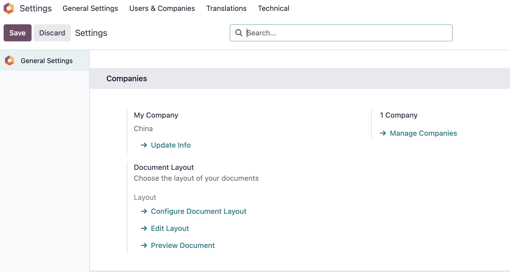

公司基础资料示例：

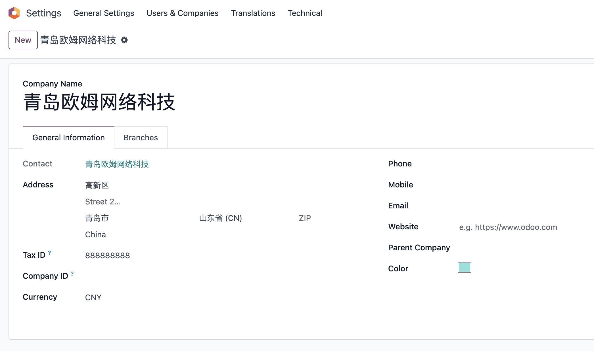

### 报表样式

Odoo 原生提供多种文档布局风格，例如 Light、Boxed、Bold、Striped。客户可以根据品牌风格选择。

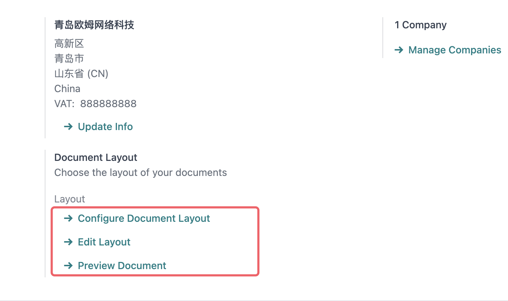

文档布局预览示例：

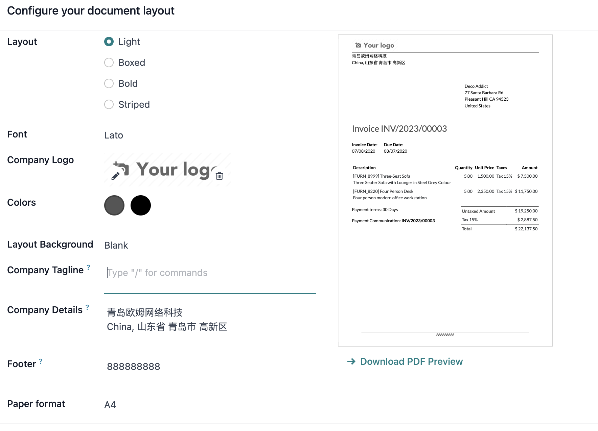

如果客户对报表字体、字号、页眉页脚有更细要求，原生能力可能不够，需要通过报表模板或扩展模块处理。

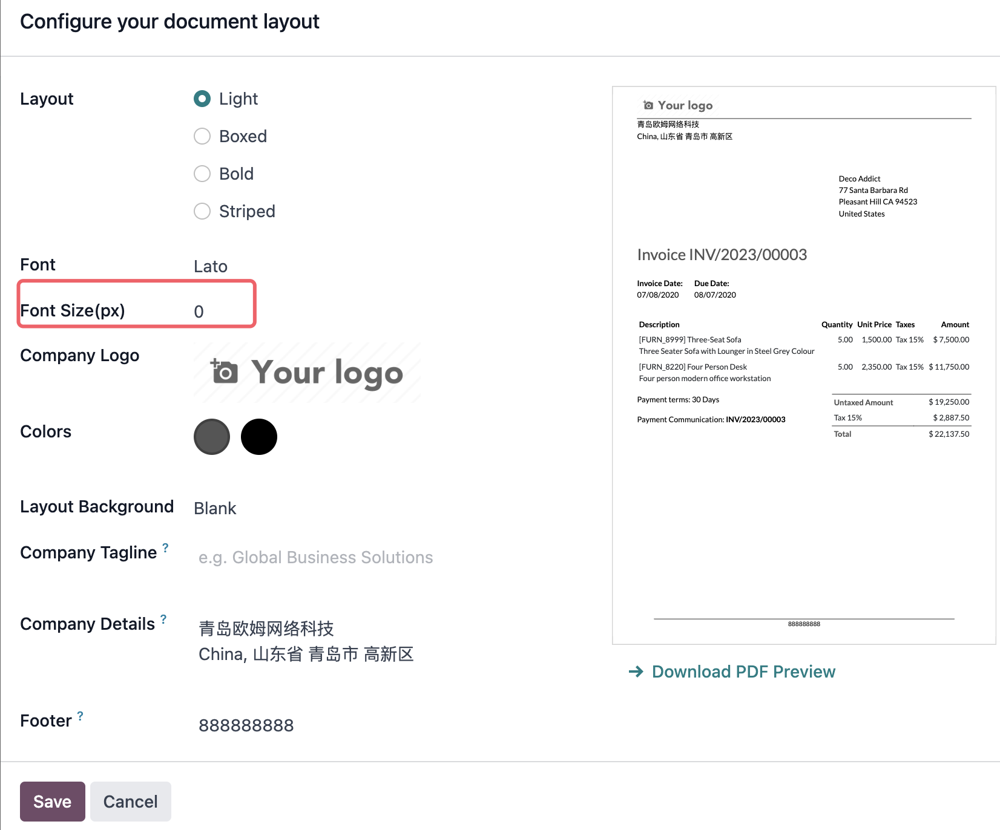

### 会计本地化包

公司正式启用财务前，需要确认财务本地化包。

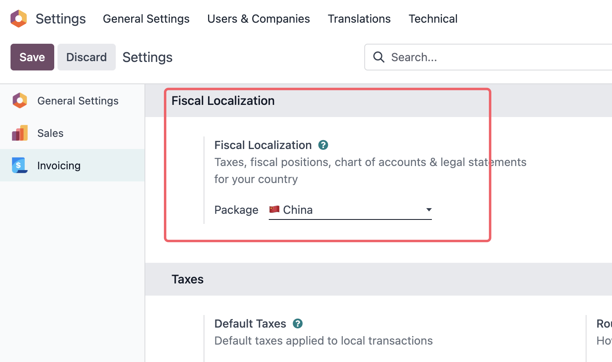

会计包选择要非常谨慎。一旦已经产生正式会计业务，再修改本地化和科目体系会很麻烦，通常需要顾问或财务共同评估。

## 权限为什么不是简单角色

如果只是小团队使用，按岗位分配应用权限通常就够了。但只要客户提出“只能看自己的客户”“不能看到成本价”“门店之间数据隔离”这类要求，就必须理解 Odoo 的权限结构。Odoo 的权限不是一个简单角色字段，而是由用户类型、应用权限、用户组、访问权限和记录规则共同组成。

在开发者模式下，可以看到用户类型和更细的权限信息。

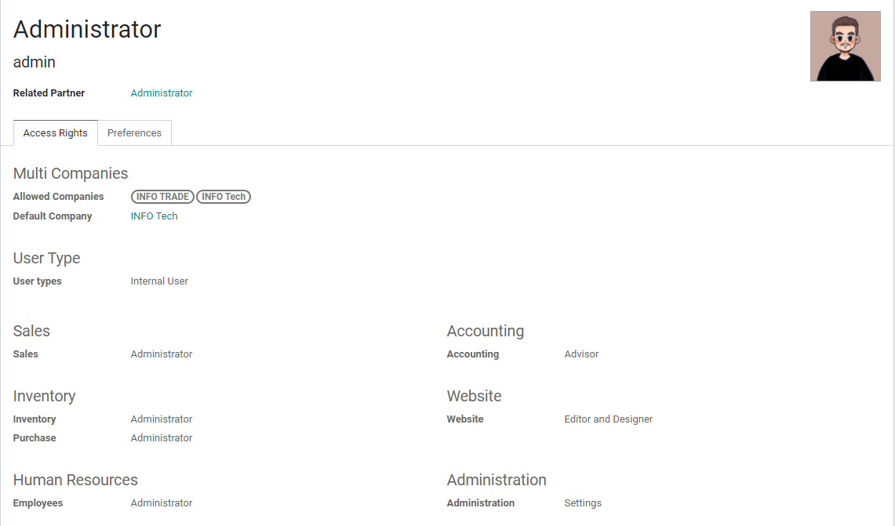

管理员可以重置用户密码。

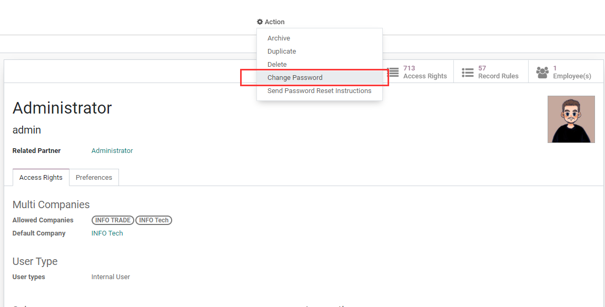

重置密码弹窗示例：

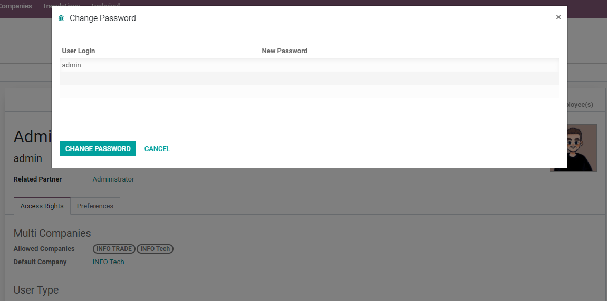

应用权限通常会按模块展示，例如销售、采购、库存、会计等。

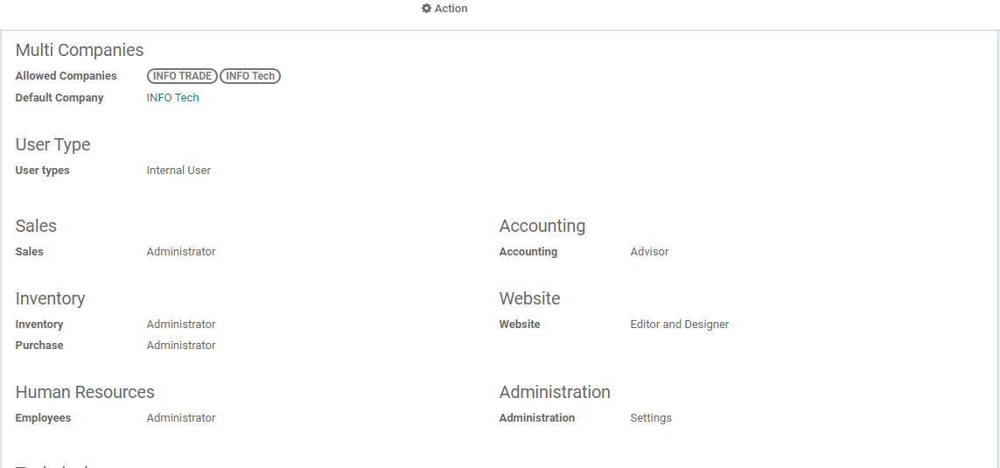

同一个应用下的权限组通常存在继承关系。高权限组往往包含低权限组的能力。

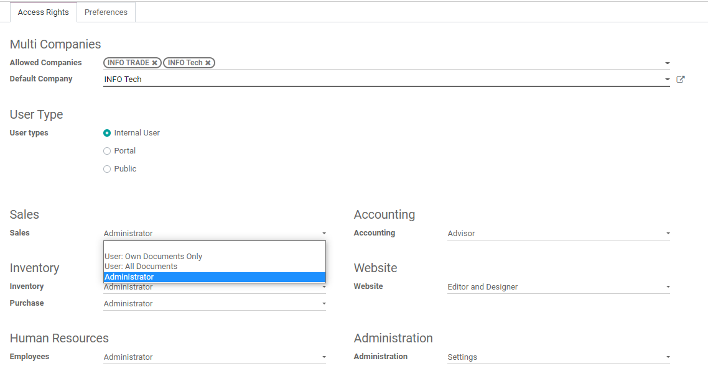

如果某些用户组不存在继承关系，界面可能会以多个独立勾选项的方式展示。

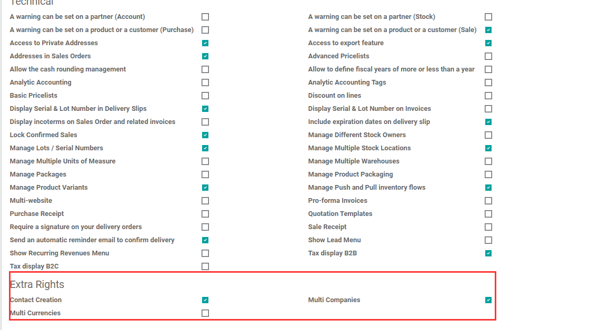

用户组本身由菜单、视图、访问权限、记录规则等组成。

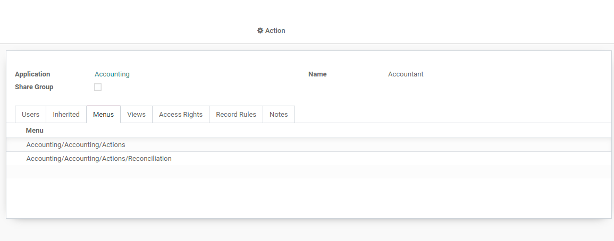

专业实施时要记住四层权限：

| 层级 | 作用 |
| --- | --- |
| 模型访问权限 | 控制能否创建、读取、写入、删除某类记录 |
| 记录规则 | 控制能看到哪些记录，例如只能看自己的客户 |
| 菜单和视图权限 | 控制菜单入口和视图是否可见 |
| 字段权限 | 控制具体字段是否可见或可编辑，通常需要开发 |

如果客户要求“销售只能看自己的客户”“门店只能看自己的订单”“员工不能看到成本价”，就不是简单勾选用户组能完全解决的事情，需要做权限规则或定制评估。

## 个性化 Odoo 界面

公司、用户和权限稳定后，部分客户会希望继续调整界面细节，例如隐藏 Odoo 品牌、修改浏览器标题、关闭快速创建、隐藏帮助菜单等。这类需求属于界面个性化，不是核心业务流程。

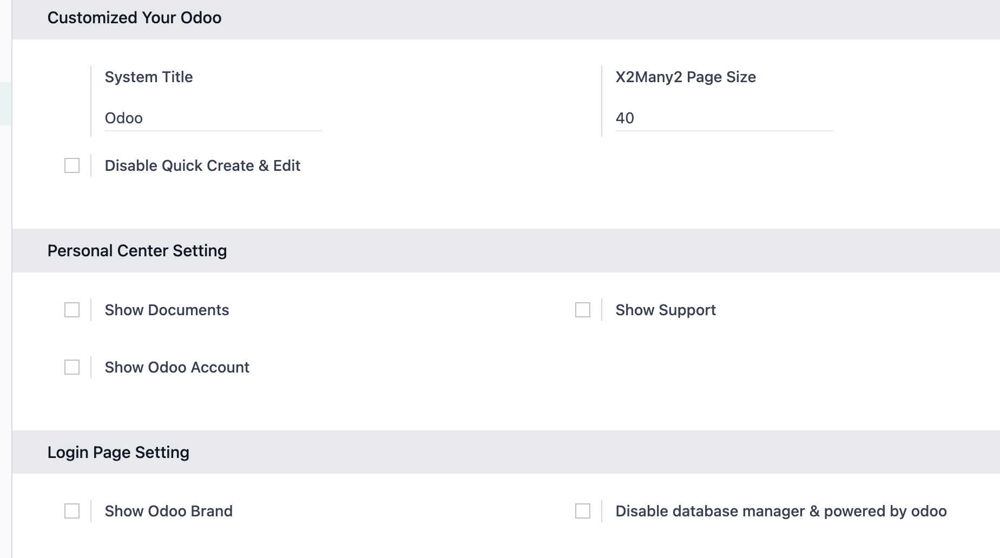

建议第一期先保证业务流程正确，再处理品牌和界面细节。界面个性化可以作为服务商的增值方案，但不应该阻塞上线。
