# 第五章 邮箱配置

* [原生原生系统的邮箱使用](#原生系统的邮箱使用)
* [国内免费邮箱的使用](#国内免费邮箱的使用)
* [多公司下的邮箱配置](#多公司下的邮箱配置适用于外贸行业)
* [其他](#其他)
  * [OFFICE365](#office365配置步骤)
  * [腾讯企业邮](#腾讯企业邮)
  * [Gmail](#gmail)


odoo的邮箱配置从很早的版本时就是一个问题，可能在国外用的很丝滑的功能，在国内就水土不服。本文就试图将邮箱配置的问题一次说个清楚。

## 原生系统的邮箱使用

本着知其然又知其所以然的标准，我们应该先理一下原生的功能，知道它原本的样子之后，我们才能知道问题在哪，再想办法去解决这些问题。

### 发送

我们先来看一下原生系统的发送方法，首先我们要在系统中开启发件箱服务，位置：设置-一般设置-自定义邮件服务器，勾选发件服务器。


一个典型的发件箱配置如下图：

> 这里我们使用的是Exchange的共享邮箱。


* 描述：邮箱的名称
* SMTP Server： 发送邮件的SMTP的服务器地址
* SMTP 端口： 发送邮件的服务器端口
* 连接安全性：可以选TLS/SSL或TLS(STARTSSL)
* 用户名： 邮箱的用户名
* 密码： 邮箱密码

> 国内使用网易企业邮箱时，会碰到启用邮件授权码的情况，此时用户的密码失效，需要讲授权码填入密码处才能使用。

配置完成以后，点击测试连接按钮，测试配置知否正确。

如果邮箱配置正确，则会看到下面的提示：

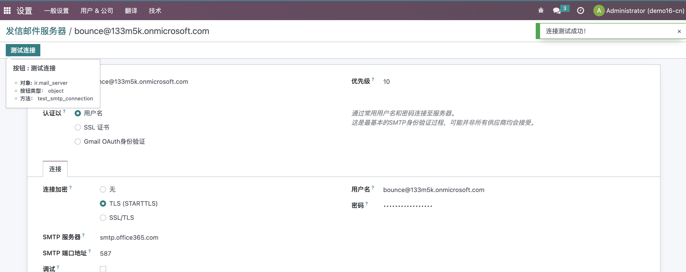

也可以打开开发者模式，在设置-技术-邮件-邮件中新建一个邮件测试是否可以发送成功。


用户收到的邮件是这样的：


默认情况下的邮件是由bounce账号代发。

#### 什么是Bounce账号

我们先来思考一个问题，如果系统中有10个用户，那么我们怎样才能让每个用户都能够正常发送邮件呢？

一个最简单的想法就是给每个用户配置一个发件箱。这么做的缺点很明显，每添加一个用户我们都要配置一遍发件箱，用户少还好，如果用户数量多了，那么企业的IT就会很头疼。

而Bounce账号就是用来解决这个问题的。Bounce账号通常是用户邮件系统中的一个共享邮箱，大家都可以使用这个邮箱发送自己的邮件。而由Bounce账号发出来的邮件，就会像我们上面的图示一样，写着由xxx代发字样。例如，我们系统中有一个用户叫Kevin，他的邮箱是<kevin@133m5k.onmicrosoft.com>，而我们在系统中发送的邮件使用Bounce账号代发，用户收到我们的邮件，就会显示：

```sh
Kevin@133m5k.onmicrosoft.com<kevin@133m5k.onmicrosoft.com>(由 Bounce <bounce@133m5k.onmicrosoft.com> 代发)
```

这样做的好处就是，大家都使用同一个邮箱对外发送邮件，同时声明了该邮件是替谁发出的。

很显然，用户不应该也不能直接回复代发邮箱，没有人会从代发邮箱中收到邮件。（如何处理这个问题？这是我们后面讲到收件时要讲到的）

Odoo中没有默认的Bounce邮箱是bounce+邮箱别域名组成的，比如我们例子中的<bounce@133m5k.onmicrosoft.com>。如果用户在设置中没有设置邮箱别域名，那么默认的名称将是postmaster-odoo。

Bounce的别名没有直接设置的地方，但是可以在开发者模式下的设置-技术-系统参数中的mail.bounce.alias进行修改。


### 收件

讲完了发件，那么接下来我们就来看一下收是如何收取的。我们在前面卖了一个关子，多个用户可以使用一个共同的邮箱发送邮件，那么对于收件，也是一样的道理，我们可以设置一个邮箱，用来收取客户的回复邮件，然后根据一定的规则进行转发。

#### Catch-All

这里就要提到邮箱应用中的一个重要的概念，catch-all。**catch-all邮箱**：又叫全收邮件，就是把发给邮件服务器上不存在账户的邮件都重定向到某个邮箱，而不是直接退回。

> 国内常见的邮箱虽然支持catch-all，但是大多都属于收费功能，免费版不能使用。

### 收件邮箱配置

与发件箱配置类似，我们配置一个收件箱服务器，这里我们命名为<catch-all@133m5k.onmicrosoft.com>。


> 由于微软于2022.10月关闭了基本身份验证，目前仅保留了SMTP的基本身份验证，因此我们这里虽然用户和密码写对了，验证的结果依旧是登录失败。关于Office365登录的设置(新式身份认证)步骤，参考[odoo官方教程](https://www.odoo.com/documentation/16.0/administration/maintain/azure_oauth.html)或本章最后的附录。

设置好用户名和密码，点击测试认证完成以后，就可以收取邮件了。

### 邮件发送测试

接下来，我们在销售订单中创建一个订单，然后向客户发送邮件报价。


点击发送，我们会在消息列表中看到我们发出去的邮件。

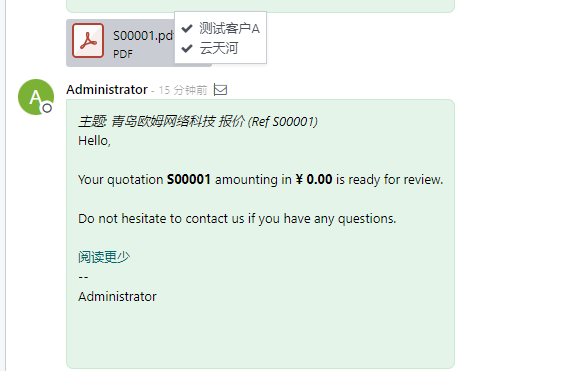

客户也会正常收到我们的邮件：


如果可会直接回复我们的邮件，我们可以看到客户将默认回复到catch-all这个邮箱。


> 如果想要修改默认的回复地址，则需要打开开发者模式修改设置-技术-系统参数中的mail.catchall.alias。

下面我们来看一下我们发出去的邮件的具体参数，我们打开设置-技术-Email-消息，找到我们发出去的邮件：


这里边的一个需要关注的点就是我们可以从消息ID中看出来，该邮箱是由id为1的销售订单(sale.order)发出来的，这也是客户回复给我们邮件，能够显示在SO0001订单下的依据。

## 国内免费邮箱的使用

由于国内邮箱大多需要声明的邮箱发送者和实际的邮箱发送者保持一致，因此odoo默认设置就会导致邮件服务器虽然认证成功，但是发不出邮件的尴尬场面，其报错通常如下：

```sh
'Mail Delivery Failed', "Mail delivery failed via SMTP server 'None'.
SMTPSenderRefused: 553
Mail from must equal authorized user
bounce+20-res.users-6@xxx.com"
```

接下来我们使用免费版的腾讯企业邮箱来具体演示一遍。为了跟之前的设置区分开来，这次我们新建一个公司，使用多公司来完成这个任务。我们使用青岛欧姆信息技术作为第二家公司，它的域名为odoomommy.com。


由于免费版的腾讯企业邮箱并没有catch-all功能，因此我们这里使用一个普通的邮箱账号作为整个公司发送邮箱的替代方案。

这里我们新建一个用户韩菱纱(<lingsha.han@odoomommy.com>)作为发件人，给客户发送销售邮件。


我们可以看到，由于邮箱不支持声明的邮箱与实际发件人不匹配的问题，我们的邮件没有发送成功。报错信息是:

```sh
SMTPSenderRefused: 501 mail from address must be same as authorization user bounce@odoomommy.com
```

如果想要解决这个问题，可以使用的方案有：

### 删除Catchall设置

第一种方案就是在系统参数中将catchall相关的参数删除，然后在把当前公司的邮箱地址改为邮件服务器发送的地址。 这种方式可以解决管理员发送邮件的问题，但是解决不了其他普通账号发送邮件的问题。

### 安装第三方模块

为了解决这个问题，我们写了一个专门的模块来处理这个问题。


安装以后在通用设置中会多出一个Catch All的选项：


如果你的邮箱不支持Catch All，那么将这个勾取消。如果你的邮箱要求声明的发送人和实际发送用户名要一致，那么勾上限制用户名这个选项。

在这里，我们只勾选这个Restrict Username选项，然后保存。之后，我们再次尝试发送邮件：


这一次我们收到了邮件：

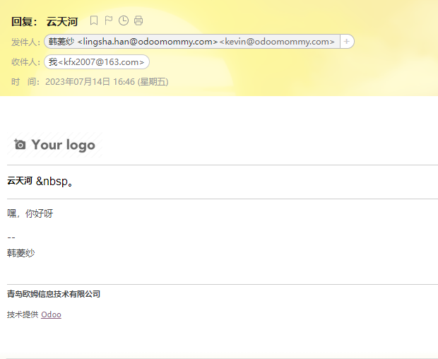

注意看，我们这里的发件人实际是<kevin@odoomommy.com>，虽然声明的发件人是韩菱纱(<lingsha.han@odoomommy.com>)。

> 与原生odoo逻辑不同的地方在于我们的邮件不是通过代发出去的。

需要注意的是，由于邮箱不支持catch-all功能，因此我们配置的收件箱参数其实与发件箱相同，只不过使用的协议不同。因此，我们这里不再赘述收件箱的配置。

## 多公司下的邮箱配置(适用于外贸行业)

其实我们在前面的过程中，就已经涉及到了这个问题，当多个公司的条件下，每个公司都想要拥有自己的发件箱和收件箱，相互独立互不干扰，怎么实现呢？（对于外贸行业的客户很常见)
 接下来我们就来看看这个问题的解决方案。

首先，明确的一点是，**原生系统并不支持多个公司的邮箱配置**。这点从多个公司使用的是同一个邮箱别名就可以看出来了。现在我们要讲的这个方案，同样基于我们上面提到的第三方模块。

安装了该模块以后，用户可以根据公司匹配对应的发件箱进行邮件发送。客户收到邮件后的默认回复地址，也可以根据公司进行匹配。下面我们就详细介绍一下该方案。

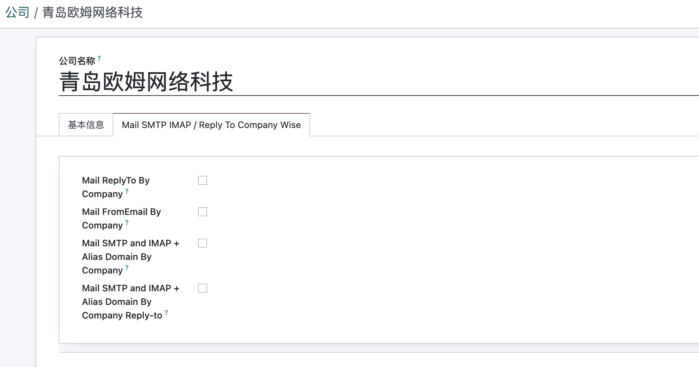

启用了该模块以后，会在公司设置里显示出以下几个选项：

* MailReplyTo By Company: 邮件的回复地址根据公司进行匹配
* MailFromEmail By Company: 发件人邮箱根据公司进行匹配
* Mail SMTP and IMAP + Alias Domain By Company: SMTP和IMAP通过Alias Domain进行公司匹配。
* Mail STMP and IMAP + Alias Domain By Company Reply-to: SMTP和IMAP + Alias Domain通过公司Reply To设置进行匹配。

如果勾选了MailReplyTo By Company，则在公司也页面会多出一个设置选项:

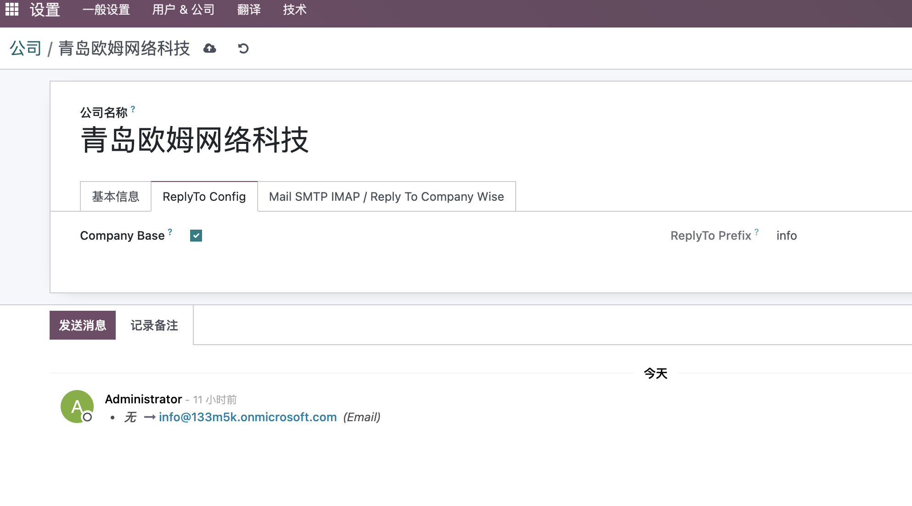

该选项的意思是，发出的邮件的地址，会根据当前公司的域名+ReplyTo前缀组成的地址。本例中组成的默认回复地址是<info@133m5k.onmicrosoft.com>。

### 别名域名的配置

外贸行业中存在的另外一种情形，就是可能一个人不仅在不同的公司中有账号，同一个公司中也同时存在多个域名。想象一下，慕容紫英是一家外贸公司的员工，他不仅在A公司任职，同时也在B公司任职，使用的邮箱也分别是<zy@a.com>和<zy@b.com>。这种情况使用我们前面讲过的设置可以完成，但是如果他在B公司同时还有另外一个域名的邮箱:<zy@c.com>, 这时我们该如何设置呢？

这就要用到这个模块中的另外一个功能了，Alias Domain。简单说，Alias Domain就像是维护了一张对照关系表，把<zy@c.com>关联到指定的公司，然后使用指定的公司发件箱进行发送。

别名域名的设置路径：设置-技术-邮箱-Alias Domain。

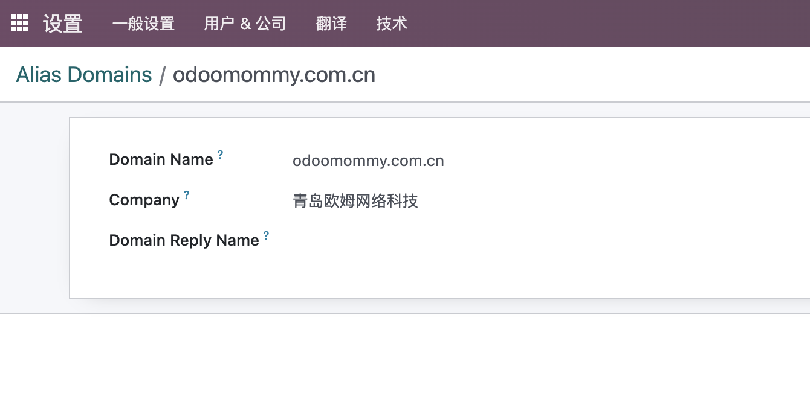

我们这里给慕容紫英创建一个账号，邮箱为<zy@odoomommy.com.cn>,然后我们要在设置中打开根据公司发送：


在用户设置这里指定用户发出去的邮箱域名，客户收到的邮件长这样:


可以看出来，我们的客户将收到名为<zy@odoomommy.com.cn>但实际是由<kevin@odoomommy.com>发出的邮件。

最后的一点，就是此时我们的客户回复给我们的邮件地址依旧是我们在公司设置中指定的回复邮件地址(<catch-all@odoomommy.com.cn>), 如果我们想要客户回复邮件到<catch-all@odoomomy.com>, 那么我们就需要在Alias Domian的最后一个参数中声明回复的域名。

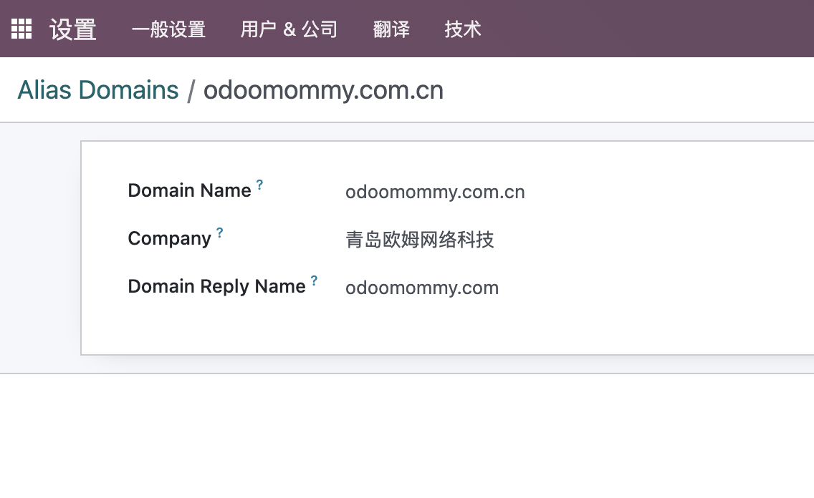

## 其他

### Office365配置步骤

> 仅支持HTTPS或<http://localhost，> 因此，你的odoo要先配置好证书。

#### 注册应用

首先打开[Azure Active Directory](https://portal.azure.com/#view/Microsoft_AAD_IAM/ActiveDirectoryMenuBlade/~/Overview)，在这里新建一个注册应用：


名称新建一个，这里我们叫做odoo，支持的类型选 Accounts in any organizational directory (Any Azure AD directory - Multitenant) and personal Microsoft accounts (e.g. Skype, Xbox)。跳转链接类型选Web，地址写你的https://<odoo base url>/microsoft_outlook/confirm。


#### 设置应用权限

接下来我们给这个应用设置权限。

选择API权限，点击添加一个权限：


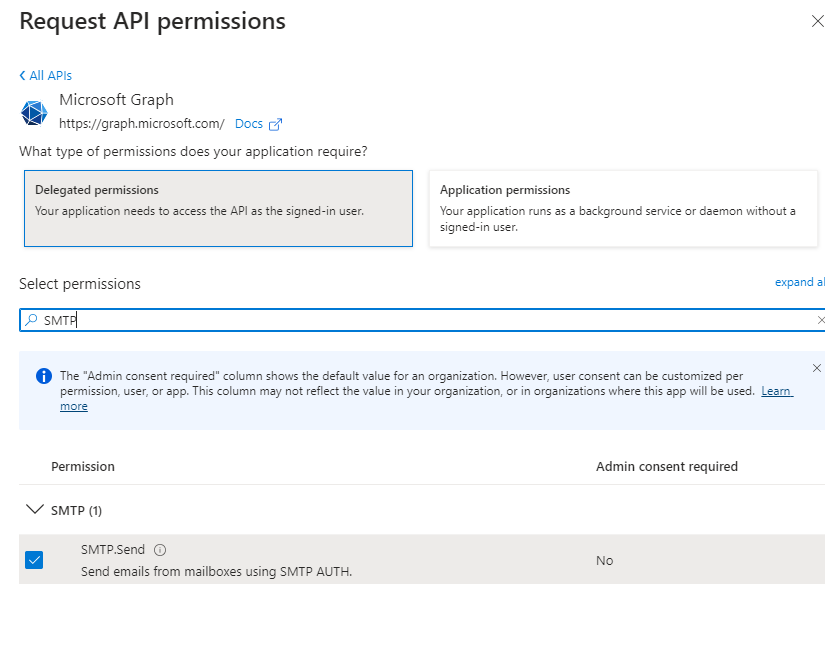

最终的权限界面如下：


#### 分配用户和用户组

然后返回应用概览页面，选择Essentials下面的Managed Application in Local Directory


然后选择用户和用户组菜单：


然后选择想要使用这个应用的用户和组。

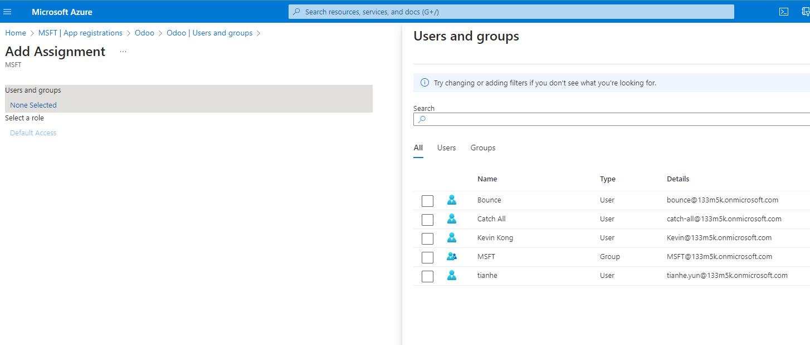

最后点击分配按钮完成分配。

#### 创建凭据

接下来要创建odoo可以使用的凭据了，odoo使用的凭据包含一个**Client ID**和一个**Client Secret**。

Client ID可以在应用的首页获取到:


Client Secret需要生成，点击左侧菜单中的 Certificates & Secrets生成一个。


这里可以设置密钥的名称和有效时间。

#### 在odoo中设置

获取到Client ID和Client Secret之后，我们就可以设置odoo的凭据了。

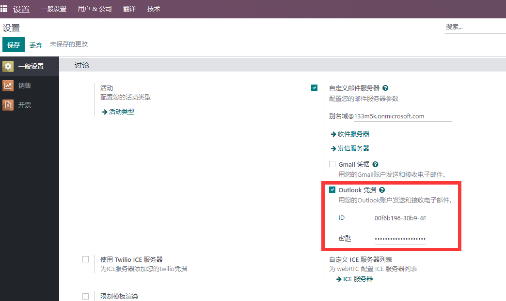

设置好凭据以后，我们就可以继续设置邮箱服务器了。


我们在服务器类型中选择Outlook OAuth认证，然后点击连接Outlook账号，按钮会打开一个页面，我们输入我们的账号和密码以后，完成认证。


最后，服务器邮箱会显示一个令牌有效的标识，这个时候，我们再点击测试和确认就会发现成功了。

### 腾讯企业邮

首先我们要创建要一个腾讯企业邮的公共邮箱： example@example.com

然后按照[配置指引](https://open.work.weixin.qq.com/help2/pc/19886?person_id=1)完成配置。

```sh
POP3/SMTP协议
接收邮件服务器：pop.exmail.qq.com ，使用SSL，端口号995
发送邮件服务器：smtp.exmail.qq.com ，使用SSL，端口号465

IMAP协议
接收邮件服务器：imap.exmail.qq.com ，使用SSL，端口号993
发送邮件服务器：smtp.exmail.qq.com ，使用SSL，端口号465
```


#### FAQ

```sh
Unknown error: Mail Delivery Failed Mail delivery failed via SMTP server 'None'. SMTPSenderRefused: 501 mail from address must be same as authorization user admin@example.com
```

安装前文提到的[欧姆邮箱解决方案](https://odoohub.com.cn)，打开**严格发件人匹配**选项。

### Gmail

下面我们来看一下如何使用Gmail来配置Odoo邮箱服务。


首先我们在设置中开启Gmail选项，可以看到系统要求我们输入**ID**和**密钥**。

#### ID和密钥的获取

我们打开[Google控制台](https://console.cloud.google.com/)，然后新建一个项目Odoo:


然后点击**API和服务**，在左侧的菜单那中点击OAuth权限请求页面：


> 测试时，将我们的用户添加到测试用户列表中。

然后点击菜单凭据，创建一个新的凭据:


* 应用类型选Web应用
* 名称写Odooo或自定义
* 已获授权的重定向 URI填写：

  ```sh
  https://demo.odoohub.com.cn/google_gmail/confirm
  ```

  将demo.odoohub.com.cn替换为你的URL

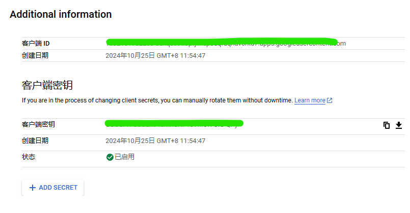

将生成的ID和密钥填写到前面Odoo的设置中。

#### 创建Gmail发件箱

接下来我们创建Gmail的发件服务，在设置-技术-邮箱-发件箱中新建一个发件箱：

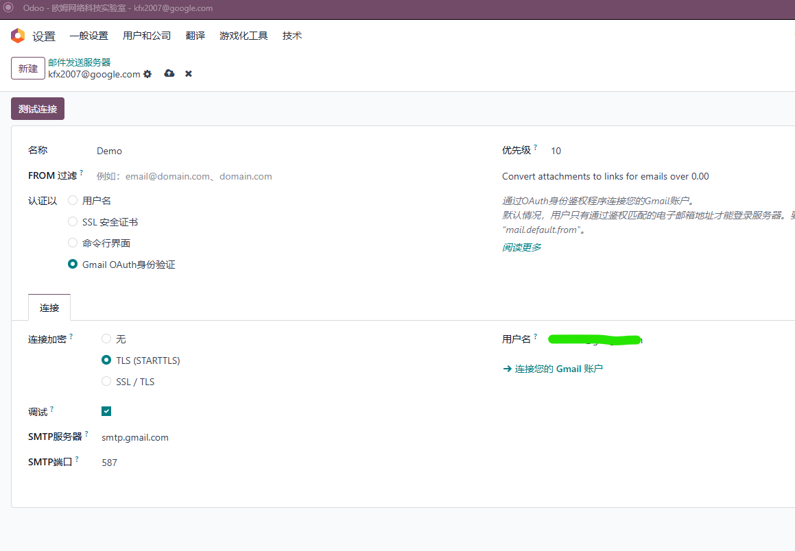

* 验证方式选择Gmail OAuth验证
* 加密方式选择TLS
* 用户名填写邮箱登陆名

点击连接您的Gmail账户链接进行OAuth认证。

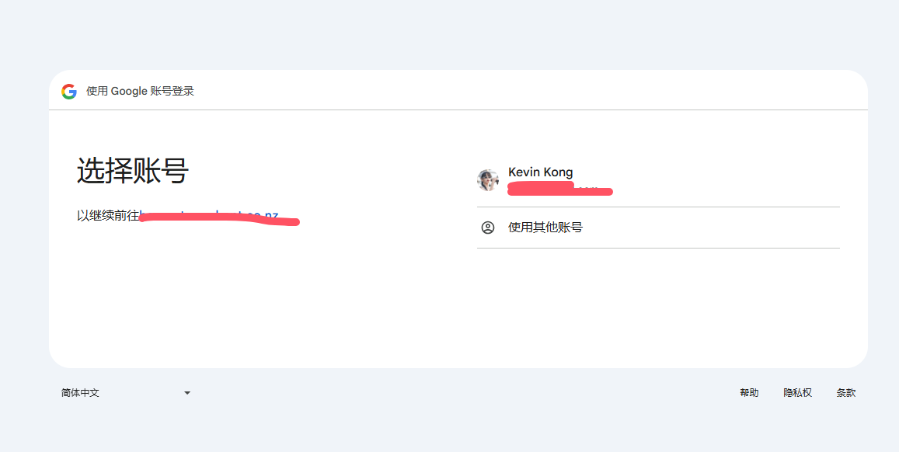

认证成功之后，邮箱下面会有绿色标志显示：


#### 问题

1.Redirect Uri Dismatch

  跳转URL跟后台设置的不一致， 检查跳转URL和Google后台是否一致，检查odoo后台参数中的base Url跟跳转URL是否一致。

2.认证后500错误

  由于不可公开的原因导致的账户访问受阻，请替换网络。
