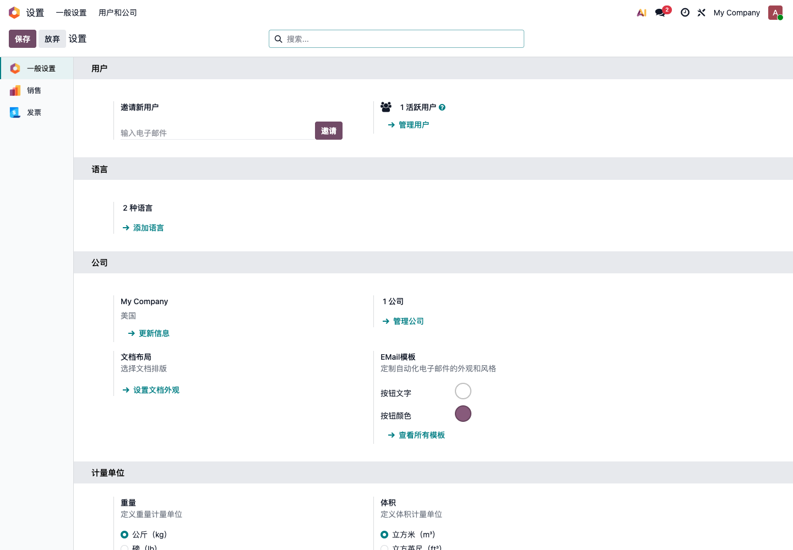
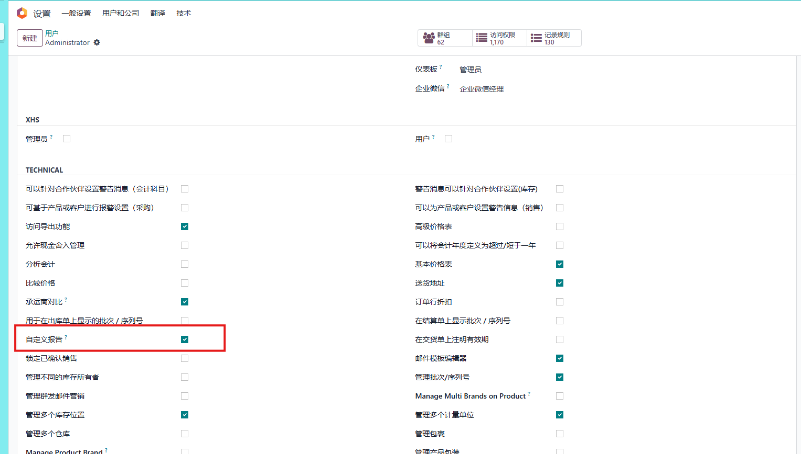
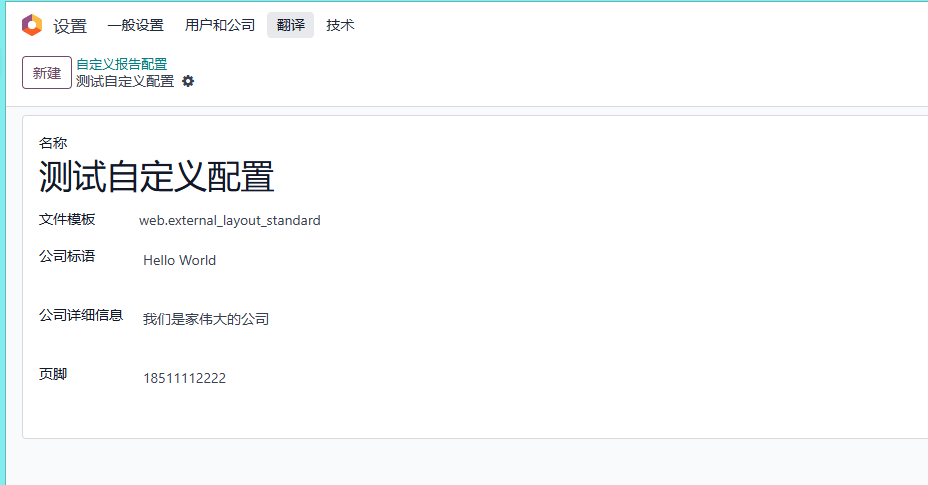
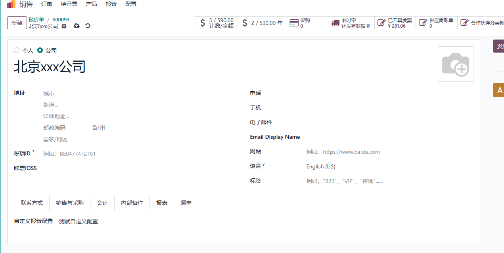
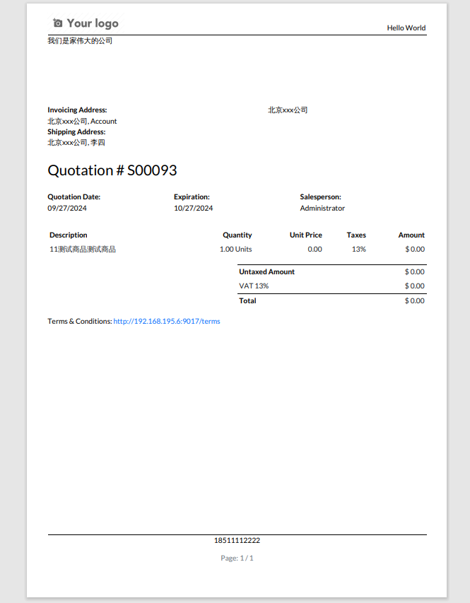

# 第九章 报表

Odoo原生提供了两类常用报表能力：一类是打印给客户或内部归档的PDF单据，例如报价单、发票、送货单；另一类是系统里的分析报表，例如销售分析、采购统计、库存分析、账龄报表、透视表和图表。

很多企业刚上Odoo时，会把“报表”理解成“把旧系统或Excel里的每张表都重新做一遍”。这通常不是最佳路线。Odoo更推荐先使用原生报表、筛选、分组、收藏、导出、透视图和图表，把数据口径跑清楚，再判断少数确实有价值的报表是否需要定制。本章我们就来看一下Odoo原生报表应该怎么用，以及为什么优先使用原生方案通常是更稳、更省钱、也更利于后续升级的选择。

## 先区分两类报表

在Odoo实施里，“报表”至少包含两种意思。

| 类型 | 示例 | 主要用途 |
| --- | --- | --- |
| 打印报表 | 报价单、销售订单、发票、送货单、采购订单、标签 | 对外发送、内部归档、随货打印 |
| 分析报表 | 销售分析、库存分析、采购分析、应收账龄、利润分析 | 管理决策、日常检查、经营复盘 |

两类报表的处理方式不同。

打印报表更关注版式、Logo、页眉页脚、条款、字段显示和PDF效果。分析报表更关注数据口径、筛选条件、分组维度、时间范围和权限。

如果客户说“我要做一张报表”，实施顾问不要马上进入开发报价。要先问清楚：这是打印给客户看的单据，还是内部经营分析？是每天固定看，还是偶尔查一次？是原生列表能筛出来，还是必须跨模块计算？

## Odoo原生报表能做什么

Odoo原生报表能力比很多客户想象得更完整。常见能力包括：

| 能力 | 用途 |
| --- | --- |
| 各模块Reporting菜单 | 查看模块内置统计，例如销售、采购、库存、财务分析 |
| 搜索 | 按客户、产品、状态、日期等快速查找记录 |
| 筛选 | 只看满足条件的数据，例如本月订单、未付款发票 |
| 分组 | 按销售员、客户、产品类别、月份等维度汇总 |
| 收藏 | 保存常用筛选条件，下次快速打开 |
| 列表视图 | 查看明细数据，可导出Excel或CSV |
| 透视视图 | 类似数据透视表，适合多维度汇总 |
| 图表视图 | 用柱状图、折线图、饼图快速看趋势 |
| PDF打印 | 输出报价单、发票、送货单等标准单据 |
| 文档布局 | 管理公司Logo、页眉、页脚、颜色和基础版式 |

自主实施时，建议先把这些原生能力用熟。很多“定制报表需求”，实际上只是没有学会筛选、分组、透视和收藏。

## 常见打印报表

不同模块会有自己的打印报表。

| 模块 | 常见报表 |
| --- | --- |
| 销售 | 报价单、销售订单 |
| 采购 | 采购订单、询价单 |
| 库存 | 送货单、收货单、拣货单、库存标签 |
| 财务 | 客户发票、供应商账单、付款收据、账龄报表 |
| POS | 小票、交班报表 |
| 生产 | 生产订单、工单、物料清单 |

第一次上线时，不建议一开始就把所有单据都按旧系统重做。更稳的做法是先确认最常用的3到5张单据，例如报价单、发票、送货单、采购订单、收货单。

这些单据先满足“能看懂、字段正确、公司信息正确、客户能接受”，后续再逐步优化版式。

## 文档布局

文档布局决定PDF单据的基础外观，例如报价单和发票的Logo、颜色、页眉、页脚。

可以从 **设置 -> 一般设置 -> 公司 -> 文档布局** 设置。

文档布局通常要确认：

- Logo是否清楚；
- 公司名称、地址、电话、邮箱是否正确；
- 单据颜色是否适合公司品牌；
- 页脚信息是否正确；
- 中英文显示是否正常；
- 报价单、发票、送货单打印后是否可读。

文档布局是全局基础设置，不建议频繁修改。尤其是已经发给客户的报价单、发票，最好保持对外形象稳定。

## 分析报表在哪里

Odoo官方文档也说明，大多数应用中都可以通过Reporting菜单查看报表，用来分析和可视化业务数据。

常见入口包括：

| 模块 | 常见分析内容 |
| --- | --- |
| 销售 | 销售额、销售员业绩、产品销售、客户销售 |
| CRM | 线索数量、商机阶段、赢单率、销售团队表现 |
| 采购 | 采购金额、供应商采购、采购交期 |
| 库存 | 库存数量、库存价值、出入库、产品移动 |
| 财务 | 应收应付、账龄、利润表、资产负债表、现金流 |
| POS | 门店销售、收银员、产品销售、付款方式 |
| 项目 | 任务状态、工时、负责人、项目进度 |

不同模块的报表名称不完全一样，但使用方式很相似：先进入报表，再通过筛选、分组、图表、透视和导出进行分析。

## 搜索、筛选、分组

使用原生报表前，要先熟悉搜索栏。

Odoo搜索栏通常支持三类操作：

| 功能 | 用途 | 示例 |
| --- | --- | --- |
| 搜索 | 输入关键字查找记录 | 搜客户名、产品名、订单号 |
| 筛选 | 限定数据范围 | 本月订单、未付款发票、已完成任务 |
| 分组 | 按维度汇总显示 | 按销售员、客户、月份、产品类别 |

例如老板问“本月每个销售员的销售额”，不一定要开发报表。可以进入销售分析，筛选本月，按销售员分组，再查看金额汇总。

例如财务问“哪些客户还有未付款发票”，可以进入发票列表，筛选未付款，再按客户分组。

这类分析的关键不是开发，而是知道数据在哪个模型里、用什么条件过滤、按哪个维度分组。

## 收藏常用查询

很多客户每天看的报表并不复杂，只是条件固定。

例如：

- 本月销售订单；
- 我的待跟进商机；
- 逾期未付款发票；
- 今日待发货订单；
- 库存低于安全数量的产品；
- 某个销售团队的报价单；
- 某个门店的POS销售。

这类场景可以使用收藏保存查询条件。下次打开时，不需要每次重新筛选。

收藏查询的价值很大：它把“顾问教客户怎么点”变成“客户以后自己点一下就能看”。对自主实施客户来说，这是最容易被低估的原生能力。

## 透视表和图表

如果列表只是明细，透视表和图表更适合做汇总。

透视表适合回答：

- 按月份、销售员、产品类别汇总销售额；
- 按供应商和产品统计采购金额；
- 按客户和账期查看应收；
- 按仓库和产品类别看库存价值；
- 按项目和负责人看工时。

图表适合回答：

- 销售趋势是上升还是下降；
- 哪个产品类别贡献最大；
- 哪个销售团队表现更好；
- 哪些月份库存变化异常；
- 哪些付款方式占比最高。

如果客户习惯Excel数据透视表，可以先把Odoo透视视图理解成“系统内的数据透视表”。很多场景不需要导出到Excel，直接在Odoo里就能看。

## 导出到Excel

Odoo支持从列表导出Excel或CSV。

适合导出的场景：

- 临时分析；
- 给外部人员查看；
- 和旧系统对比；
- 财务核对；
- 批量检查基础数据；
- 上线前做数据清洗。

不建议长期依赖导出做日常管理。如果每天都要导出同一张表，再手工加工成管理报表，通常说明有两种可能：

- 原生筛选、分组、收藏、透视表还没有用起来；
- 这个报表确实已经变成固定管理需求，需要重新设计成系统内报表或仪表板。

导出是很好的辅助工具，但不应该成为每天管理公司的主流程。

## 报表口径比样式更重要

报表最重要的不是样式，而是口径。

例如“销售额”可能有不同含义：

- 报价金额；
- 已确认销售订单金额；
- 已开票金额；
- 已收款金额；
- 不含税金额；
- 含税金额；
- 按订单日期；
- 按发票日期；
- 按收款日期；
- 排除取消订单；
- 是否包含运费和折扣。

如果不先定义口径，报表做得再漂亮也会被认为“不准”。

实施时建议把关键指标先说清楚：

| 指标 | 需要确认的问题 |
| --- | --- |
| 销售额 | 看订单、发票还是收款？含税还是不含税？ |
| 毛利 | 成本从哪里来？标准成本、平均成本还是实际成本？ |
| 库存价值 | 按哪个成本方法计算？是否启用库存估值？ |
| 应收账款 | 看发票余额还是客户余额？账龄按什么日期算？ |
| 采购金额 | 按采购订单还是供应商账单？是否含税？ |

老板、销售、财务、仓库对同一个词的理解可能不一样。报表实施的第一步，是统一语言。

## 原生方案为什么优先

报表的最佳方案，通常是优先使用Odoo原生能力。

原因很现实：

| 原生方案优势 | 说明 |
| --- | --- |
| 升级风险低 | Odoo原生视图、搜索、报表菜单、QWeb报表更容易跟随版本升级 |
| 权限一致 | 原生报表天然遵循Odoo模型权限、记录规则和公司权限 |
| 数据实时 | 直接基于业务数据，不需要额外同步 |
| 学习成本低 | 用户掌握筛选、分组、收藏后，多模块都能复用 |
| 维护成本低 | 不需要额外维护第三方报表引擎或插件 |
| 问题更容易排查 | 数据来源、字段、权限都在Odoo体系内 |

市面上有很多报表插件、BI插件、拖拽报表设计器、外部看板工具。它们并不是不能用，但不应该成为第一选择。

常见问题包括：

- 需要额外安装插件，增加维护成本；
- 插件兼容性依赖特定Odoo版本；
- 可能改写原生报表引擎或前端组件；
- 升级时需要单独迁移和测试；
- 权限、公司、币种、语言、多网站等规则可能和Odoo原生逻辑不一致；
- 外部BI需要数据同步，容易出现“系统里一个数，报表里另一个数”；
- 插件作者停止维护后，后续升级会被卡住。

所以我们建议：先用原生，原生不够再定制；能用QWeb和原生视图解决，就不要先引入重型报表插件；能用筛选分组解决，就不要马上开发。

## 什么时候需要定制报表

以下情况可以考虑定制：

- 客户有固定格式要求；
- 政府、海关、平台要求特定格式；
- PDF单据必须符合行业版式；
- 老板需要跨模块管理驾驶舱；
- 原生字段无法满足统计口径；
- 需要复杂计算，例如返利、佣金、毛利分摊；
- 需要合并多个系统的数据；
- 需要按客户、渠道、国家或业务类型输出不同模板。

定制前要先确认：

| 问题 | 说明 |
| --- | --- |
| 谁看 | 老板、财务、销售、仓库还是客户 |
| 看什么 | 指标和字段 |
| 怎么算 | 统计口径 |
| 多久看 | 实时、每日、每月 |
| 数据来源 | 销售、库存、财务还是外部系统 |
| 输出形式 | PDF、Excel、图表、仪表板 |
| 权限边界 | 谁能看，谁不能看 |
| 升级影响 | 是否改动原生报表、是否依赖第三方插件 |

没有口径的报表需求，不建议立即开发。先把口径写清楚，再评估原生能力、QWeb定制、服务器动作、视图扩展或外部BI。

## 打印报表定制的边界

打印报表通常基于QWeb模板。QWeb是Odoo原生的PDF报表技术路线，适合做报价单、发票、送货单、采购单等文档。

适合轻度调整：

- 增加字段；
- 调整表头文字；
- 修改页脚条款；
- 调整Logo和公司信息；
- 增加客户参考号、联系人、交付说明。

需要谨慎评估：

- 完全重做版式；
- 一个客户一套报表；
- 多语言、多币种、多公司复杂模板；
- 大量条件判断和复杂计算；
- PDF合并、加密、预览、盖章、云打印等扩展。

轻度调整可以比较稳。重度改造要考虑后续升级和维护，不要为了把旧系统一模一样搬过来，把原生升级路径堵死。

## 按客户使用不同报表样式

标准Odoo通常按公司配置文档布局。第一期这样做最稳。但在一些项目中，客户会希望同一个公司下，对不同客户打印不同的报表样式、公司标语、页眉页脚或特殊条款。

这类需求通常属于报表增强或定制范围。

在欧姆网络基础解决方案中，可以通过自定义报表配置实现更细的报表样式控制。这不是替代Odoo原生报表，而是在原生报表机制上做增强。

首先，可以在用户设置中开启自定义报表配置权限。

开启后，可以在技术设置中创建自定义报表配置。

然后在客户资料中指定该客户使用的报表配置。

打印该客户单据时，就可以使用指定样式。

这种方案适合：

- 一个公司服务多个品牌客户；
- 不同客户要求不同页脚或条款；
- 外贸客户需要不同语言和风格；
- 集团公司需要统一系统但差异化对外文件；
- 代理商、渠道客户要求专用单据格式。

实施建议仍然是：先用原生报表跑通流程，再把确实有价值的客户差异报表做成配置或定制，不要一开始为所有客户都做单独报表。

## 实施建议

报表实施可以按下面顺序推进：

| 阶段 | 建议 |
| --- | --- |
| 第一阶段 | 使用原生PDF单据和文档布局，确认报价、发票、送货单等关键单据可用 |
| 第二阶段 | 教会用户搜索、筛选、分组、收藏和导出 |
| 第三阶段 | 使用各模块Reporting菜单、透视表和图表回答日常经营问题 |
| 第四阶段 | 和老板、销售、财务确认关键指标口径 |
| 第五阶段 | 只对原生无法满足且价值明确的报表做定制或增强 |

对自主实施客户来说，报表不要一开始追求“大屏”“驾驶舱”“拖拽设计器”。先让每个岗位能从Odoo中看到自己每天需要的数据，再让管理层确认几个核心指标，最后再谈复杂报表。

本章我们把Odoo原生报表、PDF文档、搜索筛选、分组收藏、透视图、图表、导出、报表口径和定制边界串了一遍。到这里，第二部分的基础数据、邮箱、消息和报表已经基本铺好；下一部分会进入销售管理，开始看客户从报价到订单的完整业务流程。
