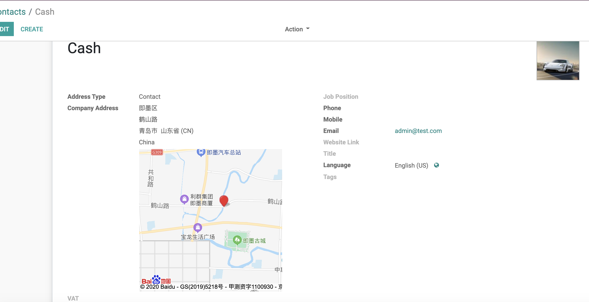
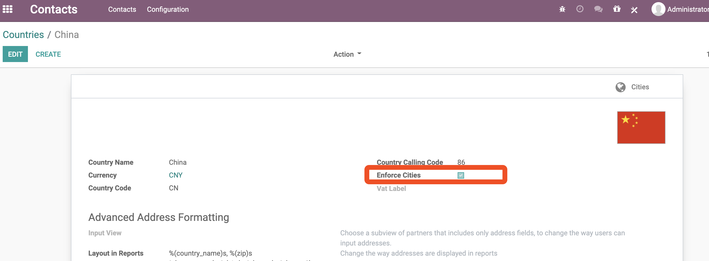
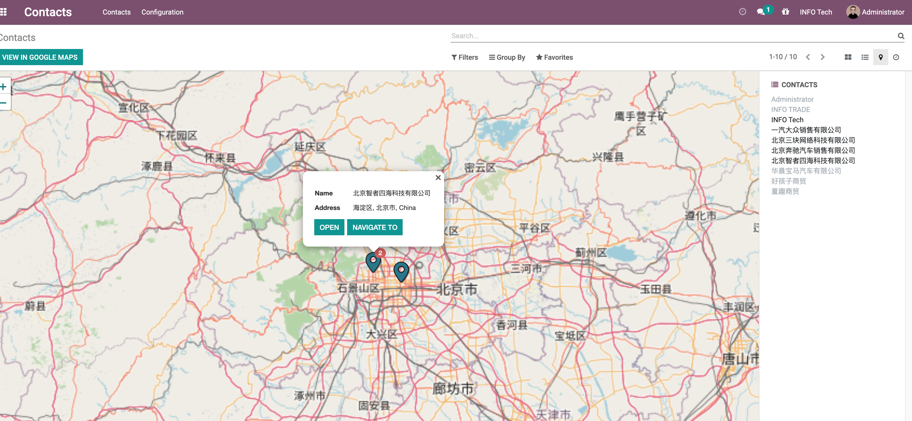

# 第四章 联系人与合作伙伴

在odoo中，合作伙伴(res.partner)是一个非常广泛的概念，它可以指客户、供应商，也可以是某个具体的人、公司，甚至收货地址、发票地址也属于合作伙伴的范畴。这里不讨论系统为何要这样设计，但是这也设计的的确会把上面这些概念的界限变得模糊。因此，我们这里单独列出了一章，详细讲解如何区分上面的这些概念。

## 客户和供应商

首先，我们先来看最重要的两个概念，客户和供应商。前面我们说过，从技术角度上讲，客户和供应商都是同一个对象: res.partner，在数据库中都是同一张表。那么我们应该如何区分它们呢？

对于13.0之前的版本，odoo专门设计了两个字段用来标识客户和供应商。

但是从13.0开始，官方重新设计了这个特性，取消了这两个字段，取而代之的是客户比重、供应商比重。

如此设计的含义是暗示此合作伙伴的客户属性和供应商属性的比重，因为存在一种可能，此合作伙伴即是客户又是供应商。当客户比重大于1时，此合作伙伴即是客户。当供应商比重大于1时，即为供应商。对于内部用户的关联业务伙伴、地址等其他类型的合作伙伴，其客户比重和供应商比重均为0。

## 国家和城市

联系地址也是合作伙伴的一种，对于客户和供应商，通常我们会记录它们的联系电话和地址。一个常规的联系人界面如下图:

我们可以在此表单上选择国家、省份，然后填写城市和详细地址。一般来说，当我们确定了国家时，省份信息会自动加载，有一种联动的效果。默认情况下，城市是一个文本框，需要手动填写城市名称。从13.0开始，城市也支持了联动效果，但是默认情况下是关闭状态。

### 开启城市选择

要开启城市选择效果，需要到菜单联系人-设置-本地化-国家，找到你要更改设置的国家，然后激活城市：

激活以后，我们的城市将变为下面的状态:

## 地图模式

与社区版不同的一点是，企业版内置了一种地图视图，可以很方便地在地图上查看客户的位置信息。

比较遗憾的是，由于某些原因，国内访问的时候不是很稳定，时常出现加载不出来的问题，显得不是那么很接地气。因此，笔者开发了一个百度地图的模块，用来替代这个模块。有需要的同学可以到我的[淘宝](opensoft.taobao.com)进行选购，这里仅提供一张截图，详细的功能可以参考我的[博客](mixoo.cn)的百度地图一文来了解更多。

