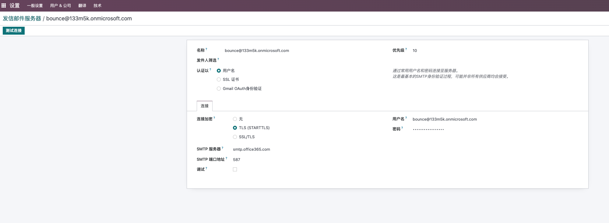

# 第六章 邮箱配置

邮箱配置从7.0时代就是一个问题，到现在依旧没有一个完美的解决方案，本章将就邮箱的问题的现状给出笔者的解决方案。

## 原生系统的邮箱使用


### 发送

我们先来看一下原生系统的发送方法，首先我们要在系统中开启发件箱服务，位置：设置-一般设置-自定义邮件服务器，勾选发件服务器。


一个典型的发件箱配置如下图：

>  这里我们使用的是Exchange的共享邮箱。



* 描述：邮箱的名称
* SMTP Server： 发送邮件的SMTP的服务器地址
* SMTP 端口： 发送邮件的服务器端口
* 连接安全性：可以选TLS/SSL或TLS(STARTSSL)
* 用户名： 邮箱的用户名
* 密码： 邮箱密码

> 国内使用网易企业邮箱时，会碰到启用邮件授权码的情况，此时用户的密码失效，需要讲授权码填入密码处才能使用。

配置完成以后，点击测试连接按钮，测试配置知否正确。

如果邮箱配置正确，则会看到下面的提示：


也可以打开开发者模式，在设置-技术-邮件-邮件中新建一个邮件测试是否可以发送成功。


用户收到的邮件是这样的：


默认情况下的邮件是由bounce账号代发。

#### 什么是Bounce账号

我们先来思考一个问题，如果系统中有10个用户，那么我们怎样才能让每个用户都能够正常发送邮件呢？

一个最简单的想法就是给每个用户配置一个发件箱。这么做的缺点很明显，每添加一个用户我们都要配置一遍发件箱，用户少还好，如果用户数量多了，那么企业的IT就会很头疼。

而Bounce账号就是用来解决这个问题的。Bounce账号通常是用户邮件系统中的一个共享邮箱，大家都可以使用这个邮箱发送自己的邮件。而由Bounce账号发出来的邮件，就会像我们上面的图示一样，写着由xxx代发字样。例如，我们系统中有一个用户叫Kevin，他的邮箱是kevin@133m5k.onmicrosoft.com，而我们在系统中发送的邮件使用Bounce账号代发，用户收到我们的邮件，就会显示：

```sh
Kevin@133m5k.onmicrosoft.com<kevin@133m5k.onmicrosoft.com>(由 Bounce <bounce@133m5k.onmicrosoft.com> 代发)
```

这样做的好处就是，大家都使用同一个邮箱对外发送邮件，同时声明了该邮件是替谁发出的。

很显然，用户不应该也不能直接回复代发邮箱，没有人会从代发邮箱中收到邮件。（如何处理这个问题？这是我们后面讲到收件时要讲到的）

Odoo中没有默认的Bounce邮箱是bounce+邮箱别域名组成的，比如我们例子中的bounce@133m5k.onmicrosoft.com。如果用户在设置中没有设置邮箱别域名，那么默认的名称将是postmaster-odoo。

Bounce的别名没有直接设置的地方，但是可以在开发者模式下的设置-技术-系统参数中的mail.bounce.alias进行修改。


### 收件

讲完了发件，那么接下来我们就来看一下收是如何收取的。

这里的邮件服务器要求使用支持catchall功能的服务器，目前国内大多数的企业邮箱服务企业的catchall功能都是收费的，而免费的诸如阿里企业邮、腾讯企业邮的免费版本都不含此功能，导致了邮箱功能的缺陷。

> 国内某些邮箱厂商为了私利启用了邮箱授权码，需要把授权码填到上述密码框中才能认证通过。

> 默认情况下 邮箱服务启用了catchall功能，停用需要将参数中的mail.bounce.alias,	mail.catchall.alias,mail.catchall.domain等三个参数删除

## 国内邮箱的使用

由于国内邮箱大多需要声明的邮箱发送者和实际的邮箱发送者保持一致，因此使用了catchall功能的odoo默认设置就会导致邮件服务器虽然认证成功，但是发不出邮件的尴尬场面，其报错通常如下：

```sh
'Mail Delivery Failed', "Mail delivery failed via SMTP server 'None'.
SMTPSenderRefused: 553
Mail from must equal authorized user
bounce+20-res.users-6@xxx.com"
```

其大概的意思就是邮件中声明的发件人和实际的发件人并不匹配，因此邮箱服务器拒绝了这次发送请求。

同样的，在国内这种不支持catchall功能的邮箱环境中，如果是odoo中的其他账号想要发送邮件也会碰到同样的问题。

解决方案有多种：

### 删除Catchall设置

第一种方案就是在系统参数中将catchall相关的参数删除，然后在把当前公司的邮箱地址改为邮件服务器发送的地址。 这种方式可以解决管理员发送邮件的问题，但是解决不了其他普通账号发送邮件的问题。

### 安装第三方模块

为了解决国内邮箱的这个问题，笔者写了一个专门的模块来处理这个问题，模块名称Rex_Mail。安装以后在通用设置中会多出一个Catch All的选项：


如果你的邮箱不支持Catch All，那么将这个勾取消。如果你的邮箱要求声明的发送人和实际发送用户名要一致，那么勾上限制用户名这个选项。

> 国内使用尽量不要使用163.com或qq.com，在发送含有pdf文件的内容时容易被识别为垃圾邮件被拒绝发送。


