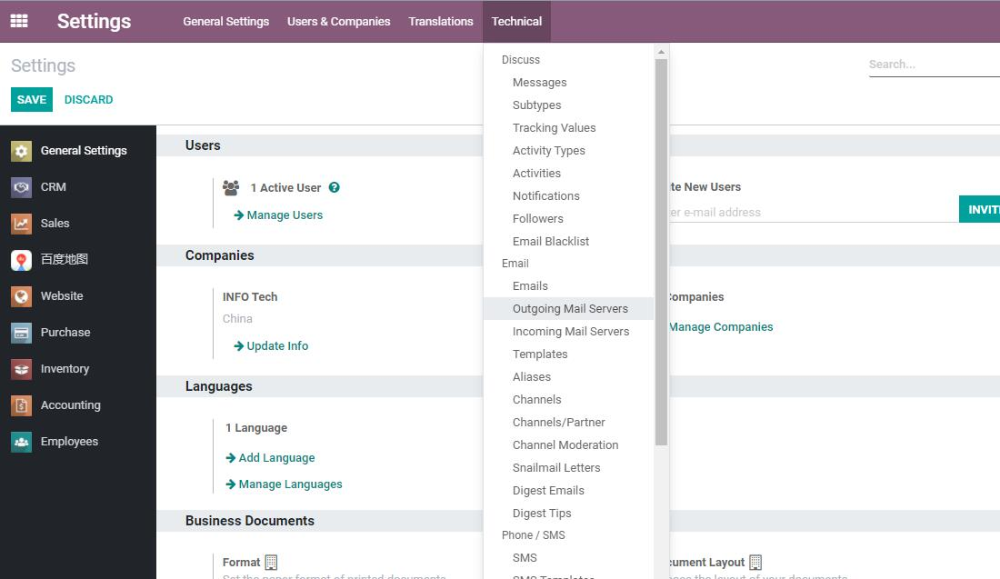

# 第六章 邮箱配置

邮箱配置从7.0时代就是一个问题，到现在依旧没有一个完美的解决方案，本章将就邮箱的问题的现状给出笔者的解决方案。

## 原生系统的邮箱使用

我们先来看一下原生系统的使用方法，首先用户需要打开开发者模式，然后在菜单设置-技术-Emai中设置发件服务器：



一个典型的发件箱配置如下图：


* 描述：邮箱的名称
* SMTP Server： 发送邮件的SMTP的服务器地址
* SMTP 端口： 发送邮件的服务器端口
* 连接安全性：可以选TLS/SSL或TLS(STARTSSL)
* 用户名： 邮箱的用户名
* 密码： 邮箱密码

配置完成以后，点击测试连接按钮，测试配置知否正确。

如果没有问题，可以在设置-技术-邮件-邮件中新建一个邮件测试是否可以发送成功。


用户收到的邮件是这样的：


默认清空下的邮件是由bounce账号代发。

这里的邮件服务器要求使用支持catchall功能的服务器，目前国内大多数的企业邮箱服务企业的catchall功能都是收费的，而免费的诸如阿里企业邮、腾讯企业邮的免费版本都不含此功能，导致了邮箱功能的缺陷。

> 国内某些邮箱厂商为了私利启用了邮箱授权码，需要把授权码填到上述密码框中才能认证通过。

> 默认情况下 邮箱服务启用了catchall功能，停用需要将参数中的mail.bounce.alias,	mail.catchall.alias,mail.catchall.domain等三个参数删除

## 国内邮箱的使用

由于国内邮箱大多需要声明的邮箱发送者和实际的邮箱发送者保持一致，因此使用了catchall功能的odoo默认设置就会导致邮件服务器虽然认证成功，但是发不出邮件的尴尬场面，其报错通常如下：

```sh
'Mail Delivery Failed', "Mail delivery failed via SMTP server 'None'.
SMTPSenderRefused: 553
Mail from must equal authorized user
bounce+20-res.users-6@xxx.com"
```

其大概的意思就是邮件中声明的发件人和实际的发件人并不匹配，因此邮箱服务器拒绝了这次发送请求。

解决方案有多种

### 删除Catchall设置

第一种方案就是在系统参数中将catchall相关的用户删除，然后在把当前公司的邮箱地址改为邮件服务器发送的地址

### 安装第三方模块

为了解决国内邮箱的这个问题，社区有人专门写了这么一个模块。需要的用户可以关注公众号odoohub回复smtp关键字获取。