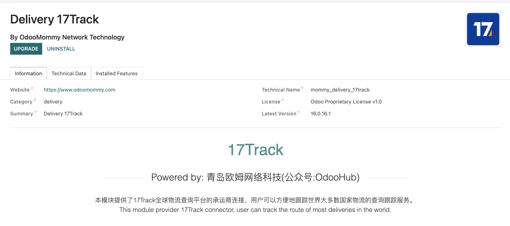

# 17Track对接

17TRACK是一家集全球物流快递包裹为一体的查询平台。本文将介绍如何使用odoo与17Track对接，完成物流单号的查询工作。

## 模块安装与配置

首先，我们在系统中安装17track模块。

安装完成后，我们需要在系统-设置-系统参数中设置从17Track官网申请的Access Token

## 激活承运商

因为17Track支持大量的承运商，考虑到用户一般来说只会使用常用的几个，因此本模块默认是把所有的承运商归档掉的。用户需要从已归档的列表中，激活自己需要的承运商。

## 配置web hook地址

17Track使用的是信息同步方式使用webhook推送，因此，我们需要在17Track后台设置webhook地址。

## 物流跟踪

配置完webhook地址后，我们就可以在odoo的调拨单中实现运单跟踪了。

## 技术支持

本模块已经上架odoo官方应用商店和公众号在线商城。有需要的同学可以自行选购。