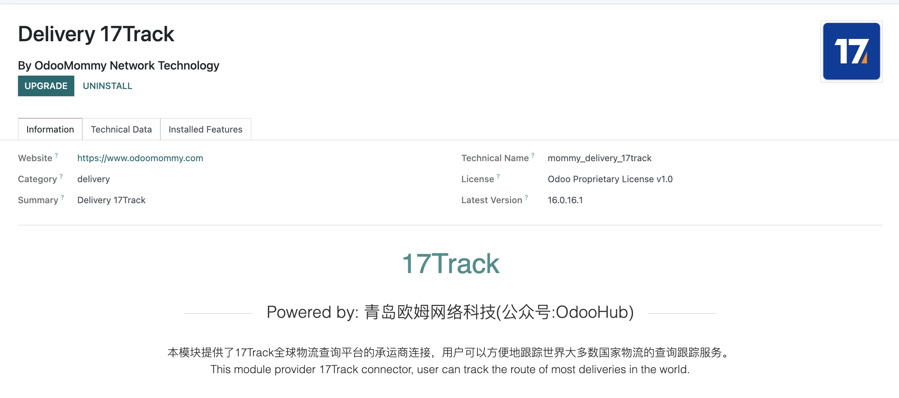
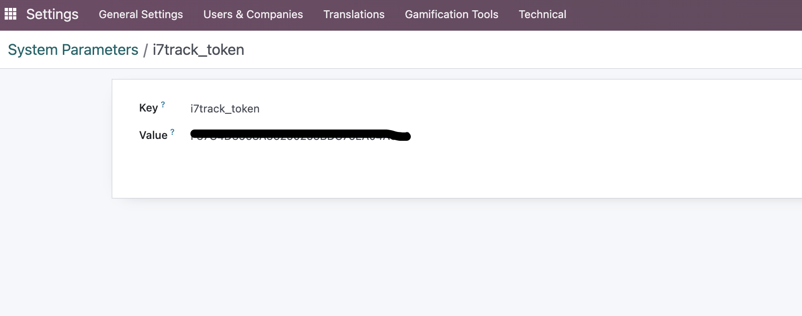
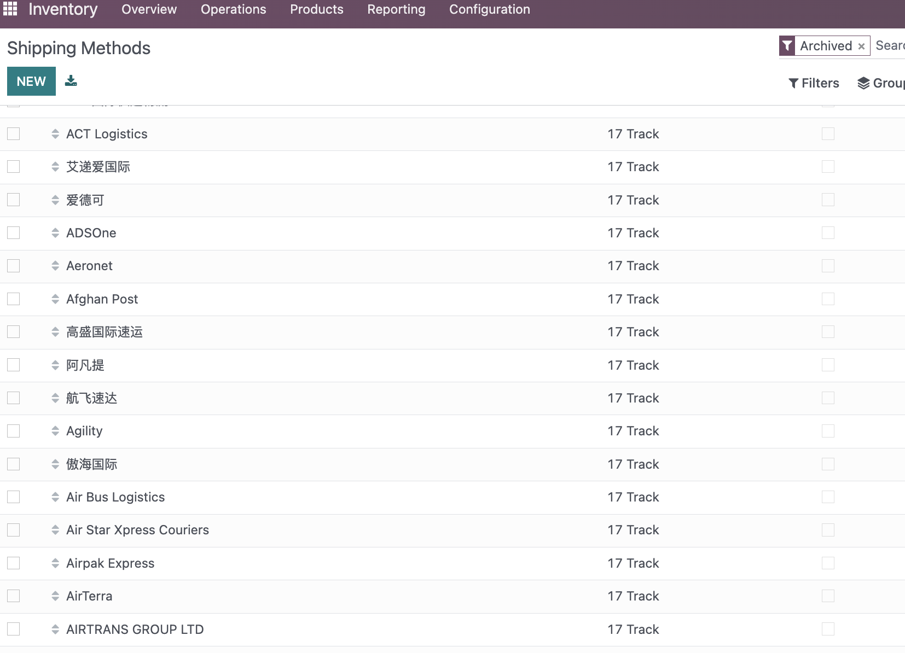
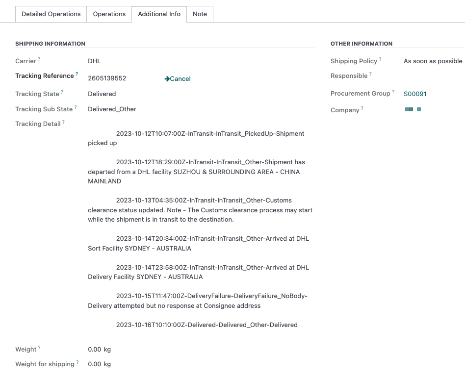

# 17Track集成

* [模块获取](#模块获取)
* [模块安装与配置](#模块安装与配置)
* [激活承运商](#激活承运商)
* [配置web hook地址](#配置web-hook地址)
* [物流轨迹](#物流跟踪)

17TRACK是一个全球包裹查询平台，核心能力是：**整合全球物流商接口，一站式查询物流轨迹**。

支持：

```sh
邮政：EMS、China Post、USPS
快递：DHL、FedEx、UPS
电商物流：Cainiao、Yanwen、4PX
```

一个单号，自动识别承运商并追踪。覆盖全球200+ 国家和1000+物流商。青岛欧姆网络科技基于客户真实需求率先推出了17Track的集成方案。

本文将详细介绍如何使用我们的17Track来完成Odoo的集成并使用17Track提供的服务。

## 模块获取

模块已经上架[AppStore](https://apps.odoo.com/apps/modules/19.0/mommy_delivery_17track)，需要的同学可以自行购买。

当前支持版本：15.0/16.0/17.0/18.0/19.0

## 模块安装与配置

首先，我们在系统中安装17track模块。



安装完成后，我们需要在系统-设置-系统参数中设置从17Track官网申请的Access Token



## 激活承运商

因为17Track支持大量的承运商，考虑到用户一般来说只会使用常用的几个，因此本模块默认是把所有的承运商归档掉的。用户需要从已归档的列表中，激活自己需要的承运商。



## 配置web hook地址

17Track使用的是信息同步方式使用webhook推送，因此，我们需要在17Track后台设置webhook地址。

## 物流跟踪

配置完webhook地址后，我们就可以在odoo的调拨单中实现运单跟踪了。


