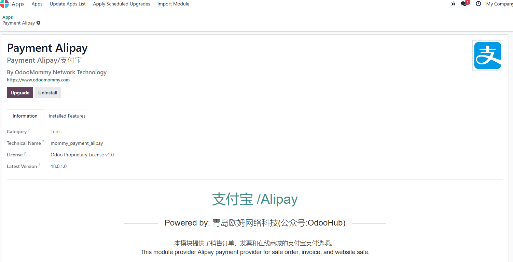

# 支付宝支付

odoo16.0官方将支付宝模块弃用了，但是需求还在，我们也不太可能去使用推荐的asipay，因此，我们决定，自己手动实现它。

## 安装与配置

首先，我们在应用中安装我们的支付宝模块:

安装好之后，我们进入配置界面：

这里对各个参数简单介绍一下：

* 支付宝APPID: 我们在支付宝开放平台申请的应用ID
* 支付宝卖家编号： 我们在支付宝平台的商家账号
* 商户私钥：由支付宝开放平台生成/自己上传的商家私钥。
* 支付宝公钥： 由支付宝开放平台生成/自己上传的支付宝公钥。
* 签名类型：RSA/RSA2

配置好之后，我们就可以使用支付宝完成支付了。

## 在web商城中使用支付宝支付

我们先来看商城中的例子，首先我们去下一单，然后进入付款页面。网站会引导我们跳转到支付宝网站进行支付，用户支付完成后，网页会自动跳回我们的网站并完返回支付状态。

## 在销售订单中支付

同样的，我们也可以在销售订单中使用支付宝让客户支付。首先，我们创建一个销售订单

然后，我们把订单通过邮件发送给客户，客户在收到邮件后，直接打开邮件中的链接，即可跳转到支付页面。

## 在invoice中使用支付宝支付

我们也可以先开invoice，然后把invoice发送给客户，客户同样也可以在页面上进行支付。

