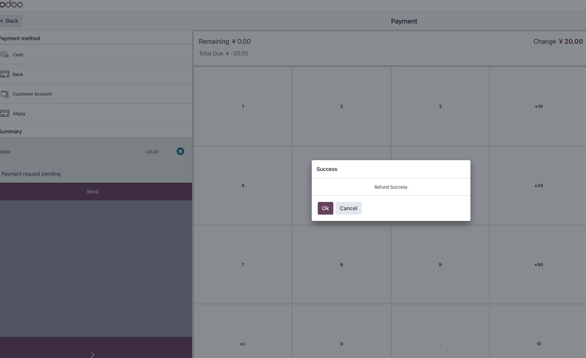

# POS支付宝

支付宝支付不仅可以使用在网站中，当然可以使用在销售点(POS)中，本节我们将介绍如何在Odoo17.0中使用支付宝进行收款。

## 模块安装

首先我们要在系统中激活POS支付宝支付，在设置-POS-支付终端中，勾选支付宝支付:

## 设置支付宝支付

然后我们在POS设置中设置支付终端：

## 使用支付宝收款

接下来，我们就可以使用支付宝进行收款了。

> POS支付宝使用的是跟网站支付宝相同的设置，因此这里无需额外设置。

我们开启一个POS收款终端，然后销售一个产品:

点击支付，在支付界面选择支付宝：

使用扫码枪扫码客户的支付条码/二维码，然后点击确认按钮，完成支付。

然后打印出小票即可。

## 使用支付宝退款

如果需要退款，在订单列表中选择我们要退款的订单，然后点击退款按钮：

在生成的退款界面中选择支付宝，进行退款:

点击确认完成退款

这样我们就完成了POS端的支付宝收/退款操作。