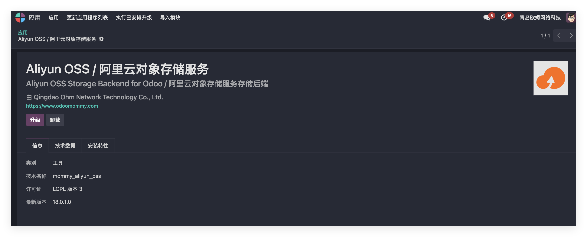
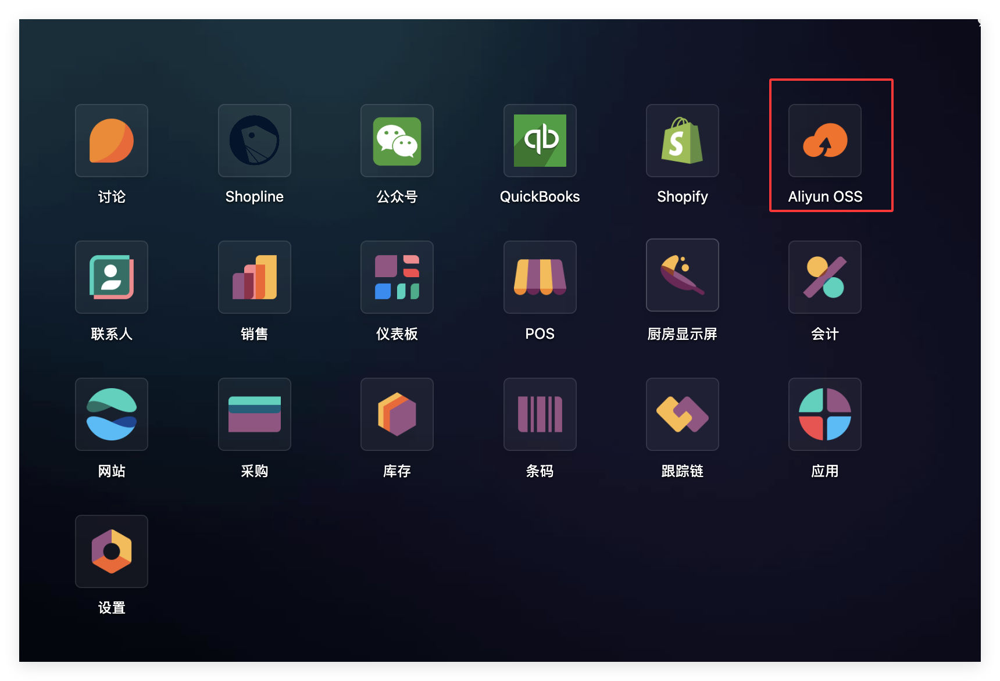
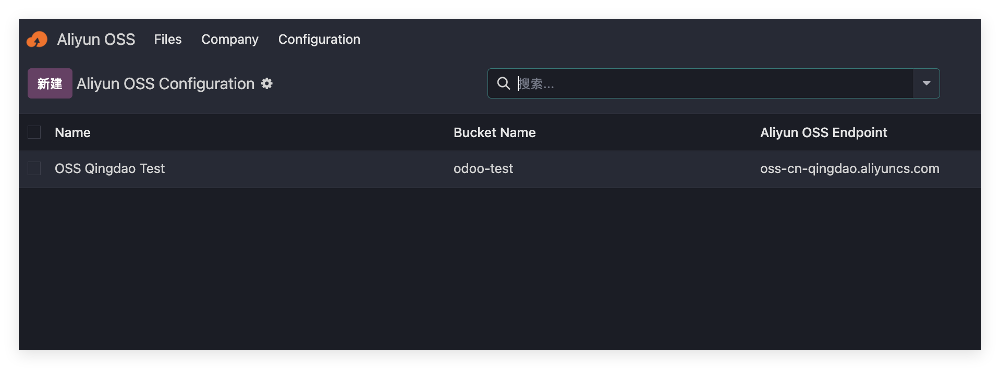
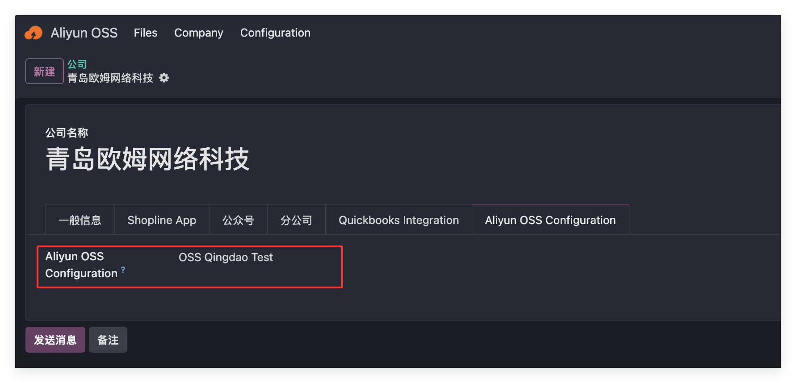
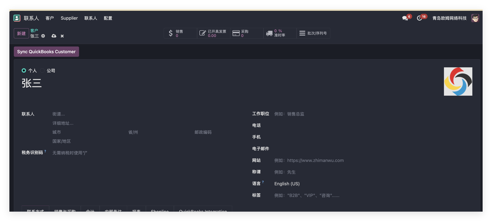
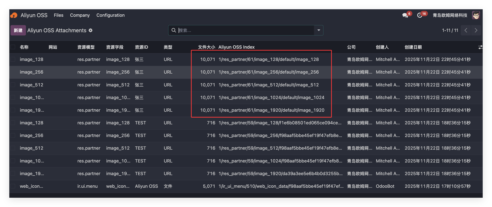
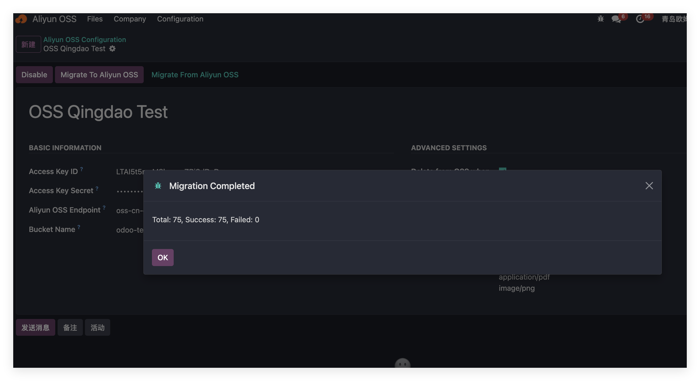
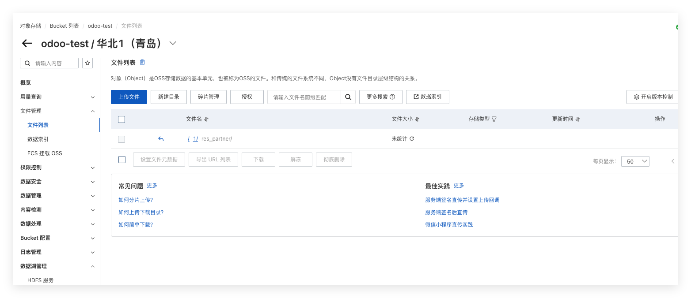

# 阿里云对象存储

* [什么是对象存储](#什么是对象存储)
* [对象存储的适用场景及优势](#对象存储适用场景及优势)
* [如何在odoo中使用对象存储服务](#如何在odoo中接入对象存储服务)
  * [注册阿里云OSS](#注册阿里云oss)
  * [安装阿里云OSS模块](#安装阿里云oss模块)
  * [文件同步到阿里云OSS](#文件同步到阿里云oss)
  * [管理阿里云OSS文件](#管理阿里云oss文件)
  * [从阿里云OSS取回文档](#从阿里云oss取回文档)
  * [删除文档](#删除文档)
  * [批量同步](#批量同步)

本章我们来看一下如何在odoo中使用阿里云对象存储(OSS)服务，将Odoo中的附件转存到阿里云对象存储上，以节省我们的服务器硬盘容量。

## 什么是对象存储

首先我们来了解一下什么是对象存储。

**对象存储(Object Storage)** 是一种用于保存海量非结构化数据的存储方式。它与常见的文件存储、块存储不同，具有更高的扩展性、可靠性和成本优势，广泛用于云计算环境。

对象存储把每个文件视为一个对象（Object），存储时不需要按传统目录结构来管理，而是通过一个**唯一 ID(对象键)和元数据(Metadata)**来识别和访问。

你可以把对象存储理解成一个超大号的“云硬盘”，每个文件都有唯一编号，你随时可以上传、下载，不用关心文件放在哪个目录或磁盘。

### 对象存储适用场景及优势

* 图片、视频等多媒体文件
* 网页静态资源（JS/CSS/图片）
* 数据库备份、日志
* 应用程序安装包
* 大规模数据归档
* 用户上传的文件（电商、社交媒体等）

对象存储的优势：

| 特性             | 说明                |
| -------------- | ----------------- |
| **海量存储**       | 可无限扩展（PB~EB 级）    |
| **成本低**        | 比传统存储便宜很多         |
| **高可靠性**       | 自动多副本备份，数据丢失概率极低  |
| **高可用性**       | 不依赖单一服务器，可随时访问    |
| **无需复杂目录结构**   | 使用 URL 或 Key 即可访问 |
| **支持 HTTP 访问** | 适合 Web 服务、App 使用  |

常见的对象存储服务有：

* Amazon S3（最经典）
* 阿里云 OSS
* 腾讯云 COS
* MinIO（自建对象存储）

## 如何在Odoo中接入对象存储服务

我们以国内比较常见的阿里云OSS为例来看一下如何在Odoo中使用阿里云存储服务。

### 注册阿里云OSS

首先，我们要去[阿里云OSS](https://www.aliyun.com/product/oss)官网开通服务，并注册一个OSS的存储桶(bucket):

然后拿到以下关键参数：

* AccessKey ID: 阿里云OSS访问密钥ID
* AccessKey Secret： 阿里云OSS访问密钥
* OSS Endpoint: 地域节点
* Bucket Name: 存储桶名称

### 安装阿里云OSS模块

然后我们在Odoo中需要安装由青岛欧姆网络科技完全自主开发的阿里云OSS对象模块：

安装完成后，我们将在主界面看到一个阿里云OSS应用的入口：

我们进入阿里云OSS应用，点击设置，创建一个阿里云OSS实例：

将我们在阿里云OSS创建的应用关键参数配置好:

然后点击激活按钮，将应用设置为激活状态。

最后，我们在当前公司信息中绑定此应用：

### 文件同步到阿里云OSS

默认情况下，当我们激活了应用，文件上传就已经开启。我们这里以联系人的头像为例，我们新建一个联系人：张三

并设置他的头像：

然后我们点击保存，之后可以看到已经上传到我们的OSS存储桶中:

### 管理阿里云OSS文件

为了方便用户管理已经上传到OSS的文件，我们在应用中添加了一个管理列表，用户可以方便地在Odoo中看到已经上传的文件及信息:

> 这里可以看到，我们虽然在客户头像中只上传的了一个图片，但Odoo后台自动生成了不同尺寸的图片，因此我们在同步的时候也要将不同尺寸的图片上传。

### 从阿里云OSS取回文档

当我们把文件储存到阿里云OSS上之后，Odoo内部只保留了一个链接。当我们想要从阿里云OSS上取回我们的文档时，我们需要简单地点击动作-从阿里云OSS同步文档即可。

### 删除文档

如果我们想要将不需要文档进行删除操作，我们只需要在Odoo中进行删除操作即可，阿里云OSS中的文档会自动一并删除。

### 批量同步

对于已有数据，我们的模块也做了处理，我们在OSS应用中提供了两个按钮：

* 同步到阿里云OSS： 点击此按钮可以将指定的文件批量同步到阿里云OSS

* 从阿里云同步回Odoo： 点击此按钮可以将阿里云OSS中的文件同步回Odoo

从阿里云OSS取回文件收，阿里云OSS上的文件将被自动删除:

