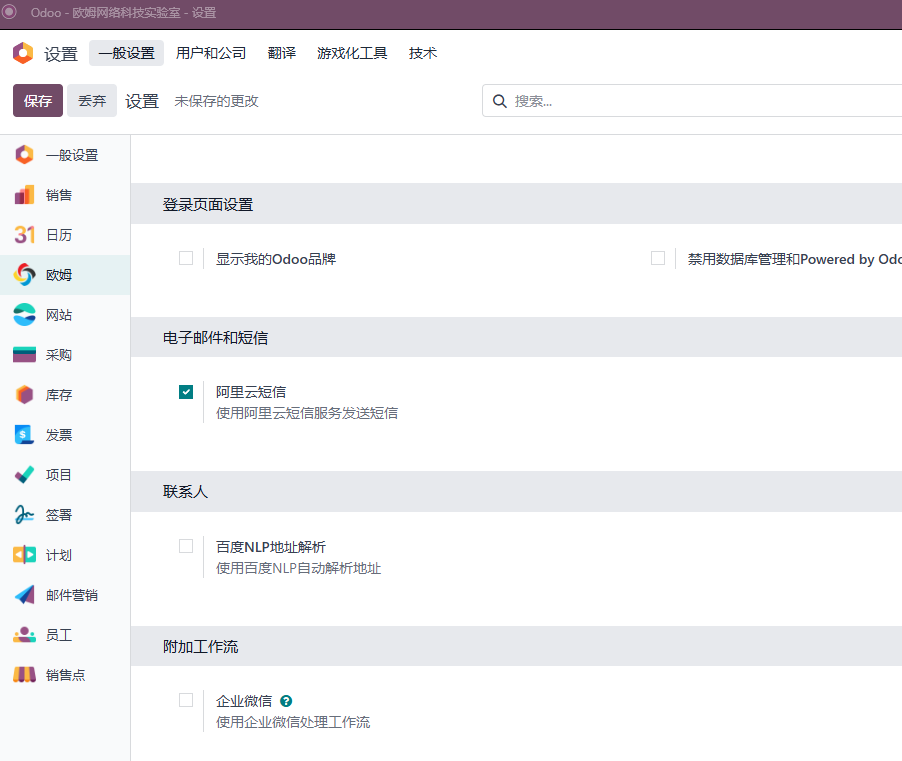
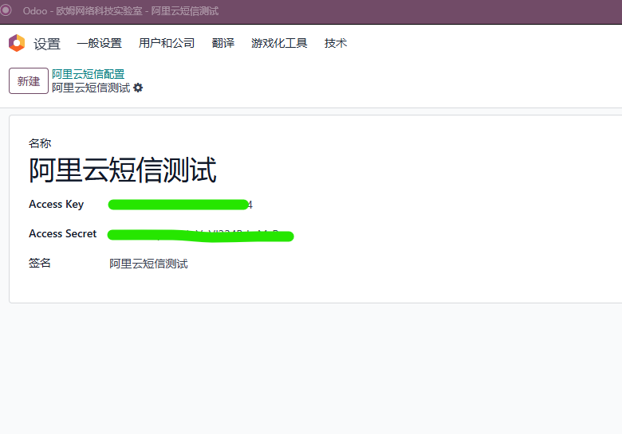
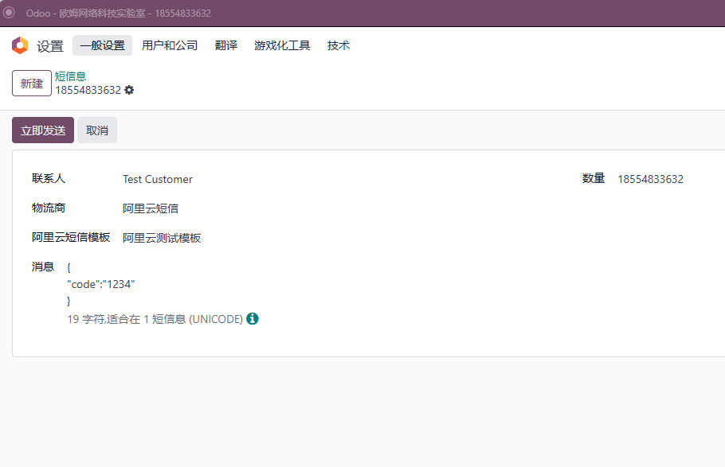
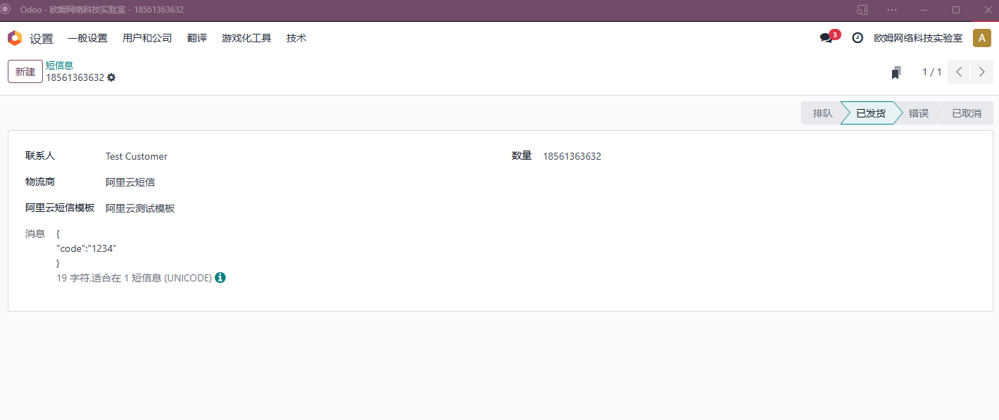

# 阿里云短信

由于国内短信发送的限制，我们无法使用odoo原生的短信服务，因此我们决定使用国内短信服务商来平替Odoo原生短信服务。本文介绍如何在Odoo中使用阿里云短信来发送消息。

## 阿里云端配置

我们要使用阿里云短信服务，就必须先注册一个阿里云账号，然后拿到API KEY和API SECRET两个参数。

然后我们创建短信消息模板：

创建完短信消息模板，之后我们拿到短信消息模板的签名备用。

## 在odoo中使用阿里云短信

### 1. 开启阿里云短信功能

首先，我们需要开启阿里云短信功能。在设置-欧姆-邮件和短信设置中，勾选阿里云短信：

然后点击保存，完成阿里云模块的安装。

### 2. 配置阿里云短信

安装完成之后，我们到设置-技术-阿里云短信菜单中，添加一个阿里云短信配置：

### 3. 在公司设置中配置阿里云短信

我们在公司设置中，绑定我们刚才设置的阿里云短信配置：

### 4. 创建阿里云短息模板

在设置-技术-阿里云短信-短信模板中添加一个短信模板，这里我们以阿里云测试短信模板为例：

这样我们就完成了发送短信的准备工作，下面我们发送一条测试短信。

### 4. 发送短信测试

打开设置-技术-电话和短信新建一个短信息：

点击发送按钮，完成发送。

成功后状态会更新为已发送：

失败后，会提示失败原因。