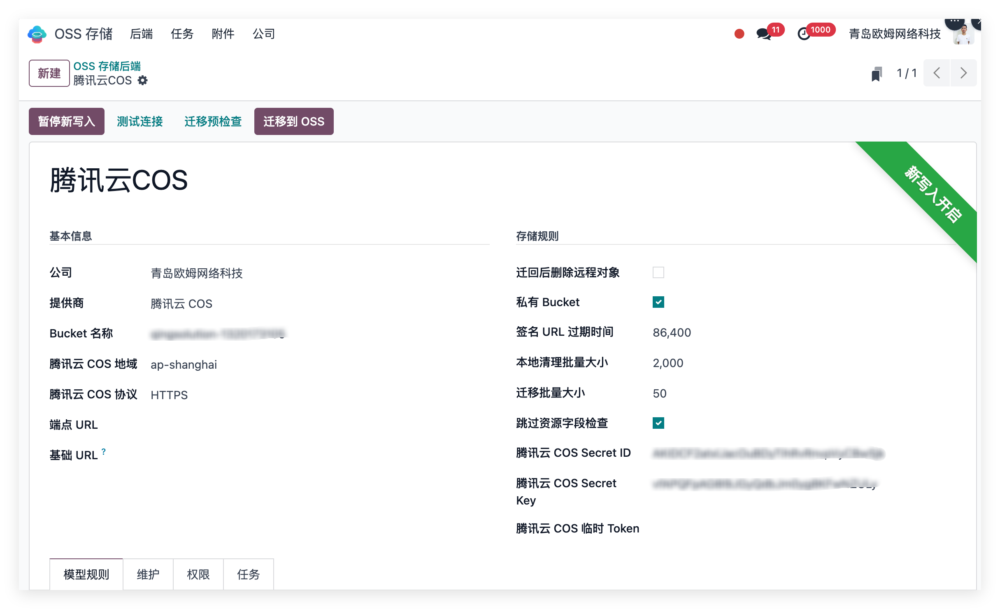
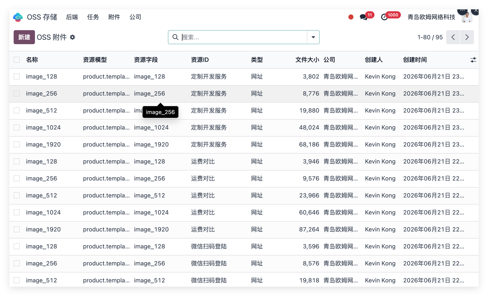
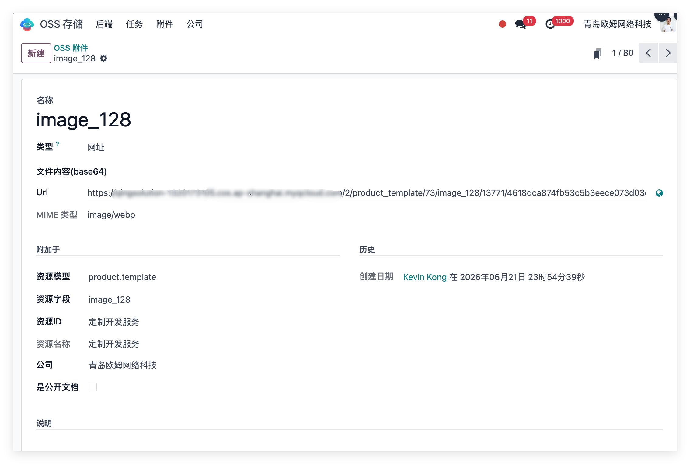
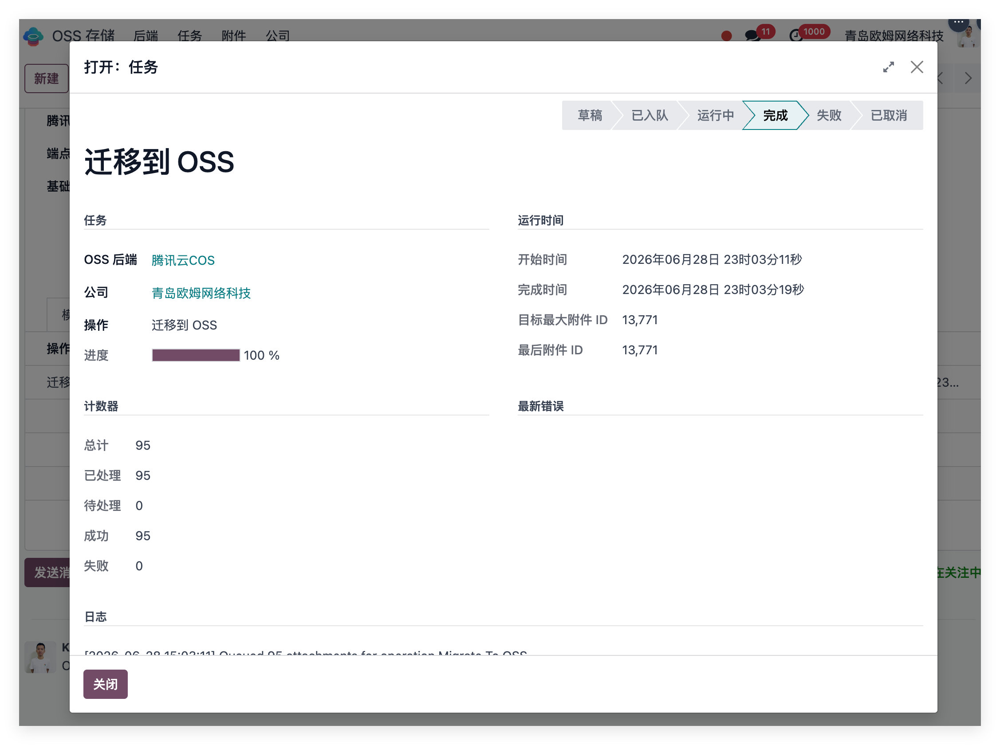

# 腾讯云COS

我们之前完成了AWS、阿里云 OSS、Google Cloud Storage 的对接方案，但当我们开始接入微信生态时，腾讯云COS就变成了一个很自然的选择。因为微信小程序、微信公众号、企业微信都在腾讯云上运行，腾讯云COS是腾讯云的对象存储服务，和微信生态天然集成。

因此，本文将介绍腾讯云COS的对接方案，帮助企业在Odoo中实现附件的云端存储和访问。

## 1. 腾讯云COS配置

实施时，管理员会先在 Odoo 中创建一个 COS 存储后端，配置腾讯云相关信息，例如：

* Bucket 名称
* 所属地域 Region
* Secret ID / Secret Key
* 公有或私有访问模式
* 签名 URL 有效期
* 可选的自定义域名或 CDN 地址
* 需要迁移到 COS 的业务模型

这些配置完成后，Odoo 就知道哪些附件应该交给 COS 存储，哪些附件继续保留在本地。
对于企业来说，这一步的价值是把“文件存在哪里、谁可以访问、访问多久”变成可管理的系统配置，而不是散落在服务器脚本和人工经验里。

## 2. Odoo 附件自动上传到 COS

当用户在 Odoo 后台上传符合规则的附件时，系统会自动将文件上传到腾讯云 COS。
例如：

* 商品主图
* 商品详情图片
* 产品说明书
* 报价 PDF
* 售后资料
* 小程序需要展示或下载的业务附件

上传完成后，Odoo 会保存 COS 对象路径，并将附件切换为远程存储模式。用户在后台仍然像以前一样查看和使用附件，不需要关心文件到底存在本地服务器还是云端。

这一步看似简单，真正的价值在于：业务人员不用改变操作习惯，系统底层却已经完成了存储架构升级。

## 3. 小程序和微信端获得稳定文件访问能力

在微信小程序场景中，商品图片、订单附件、资料下载等内容都需要稳定的 HTTPS 访问地址。

COS 模块可以根据配置生成文件访问地址：

* 如果是公开资源，例如商品展示图片，可以使用公有访问地址或 CDN 域名
* 如果是敏感文件，例如订单附件、合同、客户资料，可以使用带有效期的签名 URL
* 如果企业后续接入公众号、企业微信、H5 页面，也可以复用同一套 COS 文件访问能力

这样，小程序端不需要直接从 Odoo 服务器读取大量文件，访问链路更清晰，服务器压力也更小。Odoo 管业务，COS 管文件，小程序负责展示。三者各司其职，系统就不会“什么都压在一台服务器上”。

## 4. 支持历史附件批量迁移

对于已经运行一段时间的 Odoo 系统，很多附件早就存放在本地 filestore 里。

本方案支持将历史附件批量迁移到腾讯云 COS。迁移时可以按业务模型控制范围，比如先迁移商品图片和产品资料，再根据实际情况扩展到其他附件类型。
迁移流程通常包括：

* 迁移前预检，确认候选附件数量和大小
* 执行批量迁移任务
* 检查 COS 上传结果
* 验证附件读取和小程序访问效果
* 确认无误后清理本地 filestore 引用

这套流程不是“一键搬家就完事”，而是更适合企业系统的稳妥迁移方式。尤其是生产环境，文件可以慢慢迁，结果必须可验证。

## 5. 支持回滚和本地清理

对象存储方案最怕的是“上去了下不来”。因此本方案保留了回滚能力。

如果某些附件需要恢复到 Odoo 本地存储，可以从 COS 下载回来，重新写回 Odoo 本地 filestore。

在确认 COS 文件可正常读取、小程序访问正常、业务没有异常后，再执行本地清理。清理时系统会检查本地文件是否仍被其他附件引用，避免误删共享文件。
这也是我们设计这套方案时比较重视的一点：节省空间很重要，但数据安全永远排在前面。

